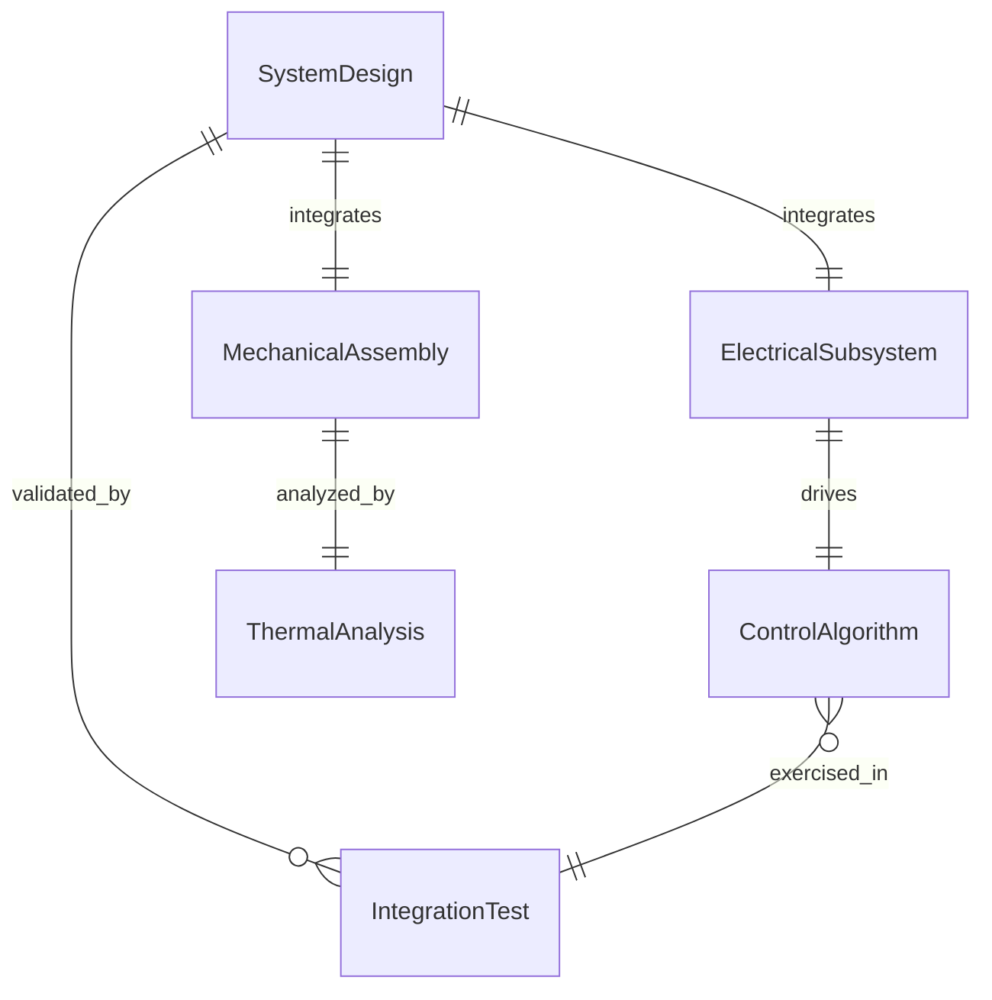
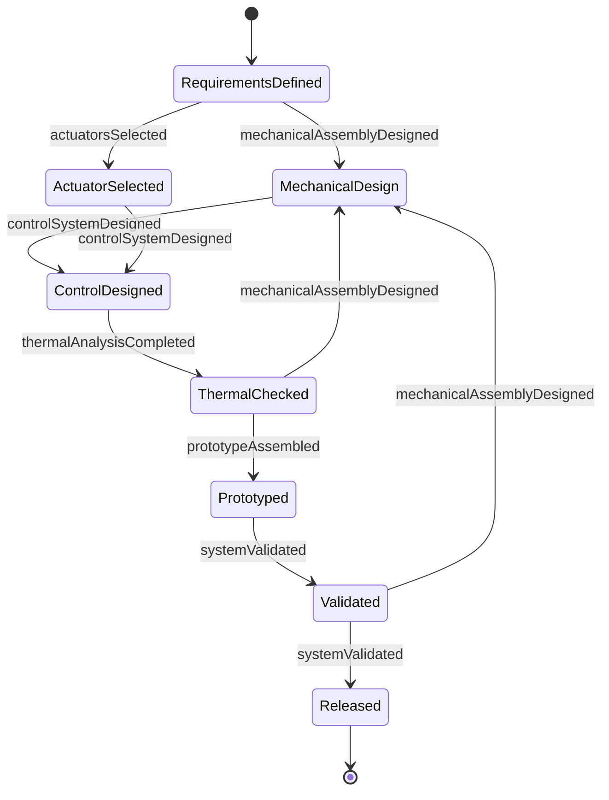
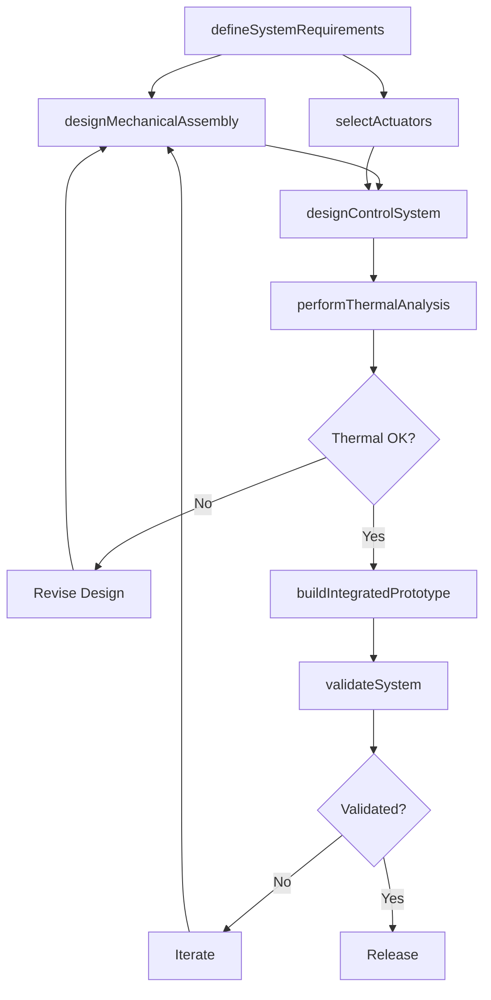
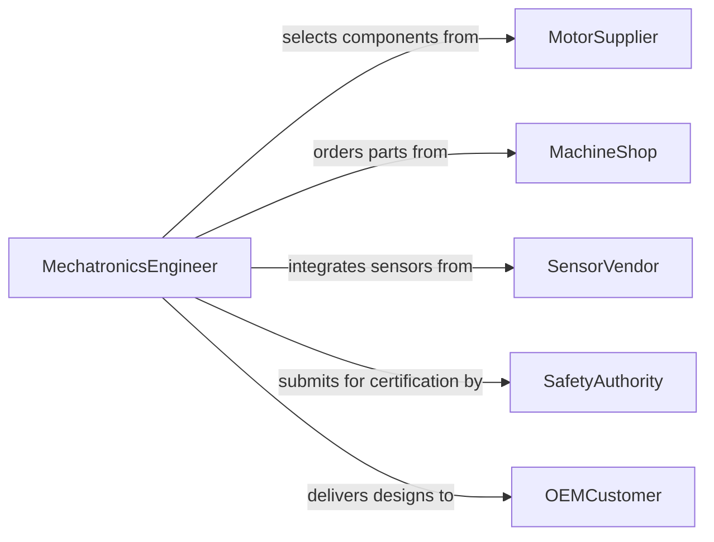

# Design Electromechanical Equipment Systems

> Business-as-Code definition for designing electromechanical equipment and systems. Models the interdisciplinary design workflow from requirements through mechanical-electrical integration, simulation, prototyping, and validation.

## Overview

Designing electromechanical equipment and systems involves integrating electrical circuits, motors, actuators, sensors, and control electronics with mechanical assemblies to create functional products such as robotic arms, automated machinery, medical devices, and industrial actuators. This definition provides actions for the concurrent mechanical-electrical design process, covering CAD modeling, motor selection, control system design, thermal analysis, and integrated prototype testing.

## Actors

| Actor | Description |
|-------|-------------|
| MotorSupplier | Provides motors, actuators, and drive components with performance specifications |
| MachineShop | Fabricates custom mechanical parts and housings for prototypes |
| SafetyAuthority | Certifies that electromechanical systems meet safety and EMC standards |
| OEMCustomer | Specifies performance requirements and integration constraints for the system |
| SensorVendor | Supplies position, force, and temperature sensors for feedback control |

## Roles

| Role | Description |
|------|-------------|
| MechatronicsEngineer | Leads the integrated design of electrical and mechanical subsystems |
| MechanicalDesigner | Creates 3D models, assemblies, and mechanical drawings |
| ControlsEngineer | Designs feedback loops, PID controllers, and motion profiles |
| PrototypeEngineer | Builds and tests integrated electromechanical assemblies |

## Entities

| Entity | Description |
|--------|-------------|
| SystemDesign | The integrated specification of electrical and mechanical subsystems |
| MechanicalAssembly | A 3D model of the physical structure, housings, and moving parts |
| ElectricalSubsystem | The circuit design for power delivery, sensing, and motor control |
| ControlAlgorithm | A software routine governing motor actuation and sensor feedback |
| ThermalAnalysis | A study of heat generation and dissipation within the system |
| IntegrationTest | A validation procedure that exercises the complete electromechanical assembly |

## Actions

| Action | Description |
|--------|-------------|
| defineSystemRequirements | Specify performance, environmental, and integration requirements |
| designMechanicalAssembly | Create 3D CAD models of structure, enclosure, and moving components |
| selectActuators | Choose motors, solenoids, or actuators based on torque, speed, and size |
| designControlSystem | Develop feedback control algorithms and motion profiles |
| performThermalAnalysis | Simulate heat generation and cooling paths in the integrated system |
| buildIntegratedPrototype | Assemble electrical and mechanical subsystems into a working prototype |
| validateSystem | Test the prototype against functional, safety, and endurance requirements |

## Events

| Event | Description |
|-------|-------------|
| systemRequirementsDefined | Performance and integration requirements have been established |
| mechanicalAssemblyDesigned | 3D models and drawings for the mechanical subsystem are complete |
| actuatorsSelected | Motors and actuators have been chosen and specified |
| controlSystemDesigned | Control algorithms and motion profiles have been developed |
| thermalAnalysisCompleted | Thermal simulation results have been produced |
| prototypeAssembled | The integrated electromechanical prototype has been built |
| systemValidated | Testing has confirmed the system meets all requirements |

## Searches

| Search | Description |
|--------|-------------|
| findSystemDesigns | List electromechanical designs by product type, project, or status |
| getActuatorSpecs | Retrieve motor and actuator specifications by torque, speed, or size |
| getThermalResults | Find thermal analysis results by system, component, or temperature range |
| getTestResults | Retrieve validation test outcomes by prototype, test type, or pass/fail |

## Entity Relationships



## State Diagram



## Workflow



## Actor Relationships



## Usage

### Calling Actions

```typescript
import { designElectromechanicalEquipmentSystems } from '@headlessly/design-electromechanical-equipment-systems'

const mechatronics = designElectromechanicalEquipmentSystems()

// Define system requirements for a robotic gripper
const requirements = await mechatronics.defineSystemRequirements({
  projectId: 'robotic-gripper-v2',
  gripForce: { value: 50, unit: 'N' },
  strokeLength: { value: 80, unit: 'mm' },
  cycleTime: { value: 0.5, unit: 's' },
  operatingVoltage: 24,
  ipRating: 'IP54'
})

// Select actuators and design the control system
const actuator = await mechatronics.selectActuators({
  projectId: 'robotic-gripper-v2',
  type: 'linear-servo',
  forceRequirement: 50,
  strokeRequirement: 80
})

await mechatronics.designControlSystem({
  projectId: 'robotic-gripper-v2',
  actuatorId: actuator.id,
  controlType: 'PID',
  feedbackSensor: 'encoder'
})
```

### Event-Driven Automation

```typescript
// Auto-run thermal analysis when mechanical design is complete
mechatronics.mechanicalAssemblyDesigned(async ({ projectId, assemblyId }) => {
  await mechatronics.performThermalAnalysis({
    projectId,
    assemblyId,
    ambientTemp: 40,
    dutyCycle: 0.6
  })
})

// Notify team when prototype validation is complete
mechatronics.systemValidated(async ({ projectId, passed, testSummary }) => {
  await notify({
    to: 'engineering-team',
    message: `Prototype for ${projectId} ${passed ? 'passed' : 'failed'} validation: ${testSummary}`
  })
})
```
