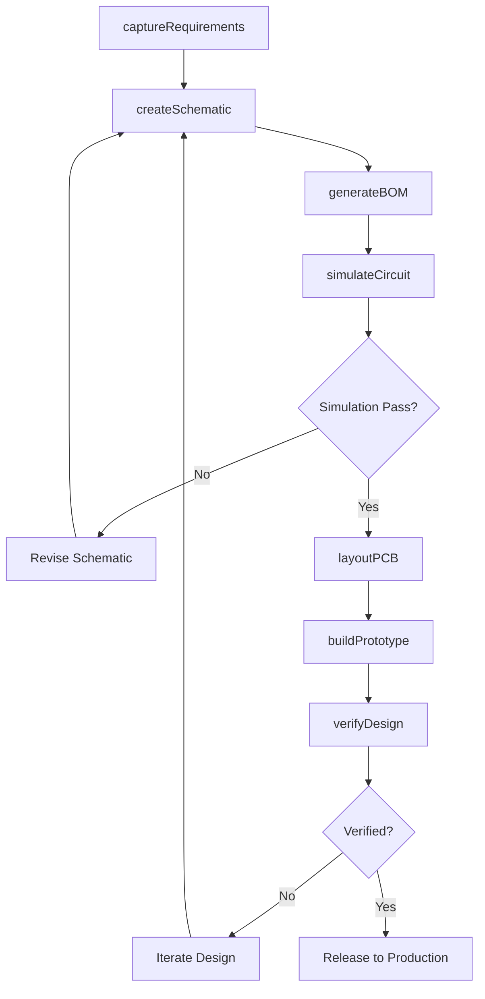
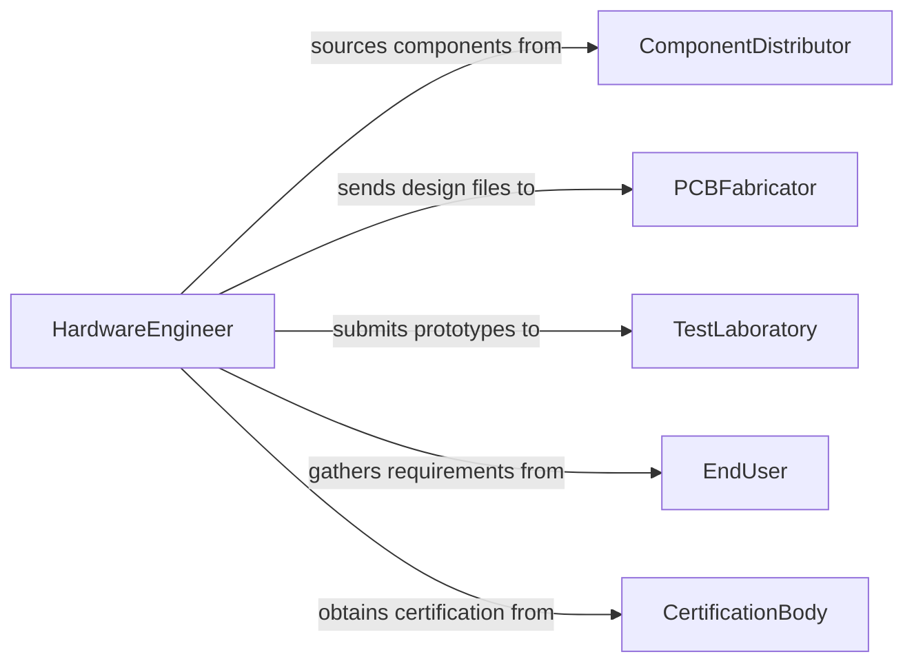

# Design Electronic Computer Equipment Instrumentation

> Business-as-Code definition for designing electronic and computer equipment or instrumentation. Models the hardware design lifecycle from requirements capture through schematic design, PCB layout, prototyping, and design verification.

## Overview

Designing electronic and computer equipment or instrumentation involves creating circuit schematics, selecting components, laying out printed circuit boards, developing firmware interfaces, and verifying designs through simulation and physical prototyping. This covers products ranging from embedded controllers and data acquisition instruments to computing hardware and scientific measurement devices. This definition provides actions for each phase of the electronic design process used in hardware engineering teams, instrumentation companies, and research facilities.

## Actors

| Actor | Description |
|-------|-------------|
| ComponentDistributor | Supplies electronic components with datasheets and availability data |
| PCBFabricator | Manufactures printed circuit boards from design files |
| TestLaboratory | Performs electromagnetic compliance, environmental, and safety testing |
| EndUser | Specifies functional requirements and operating conditions for the equipment |
| CertificationBody | Reviews and certifies that designs meet industry standards such as FCC or CE |

## Roles

| Role | Description |
|------|-------------|
| HardwareEngineer | Designs circuit schematics and selects components for the system |
| PCBDesigner | Creates physical board layouts from schematic netlists |
| FirmwareEngineer | Develops embedded software that interfaces with the hardware design |
| TestEngineer | Validates prototypes through functional, signal integrity, and compliance testing |

## Entities

| Entity | Description |
|--------|-------------|
| Schematic | A circuit diagram showing components and their electrical connections |
| BillOfMaterials | A list of all components required to build the design |
| PCBLayout | The physical arrangement of traces, pads, and layers on a circuit board |
| Prototype | A physical sample built to validate the design before production |
| SimulationResult | Output from circuit simulation tools such as SPICE or signal integrity analysis |
| DesignReviewRecord | A documented evaluation of the design by engineering peers |

## Actions

| Action | Description |
|--------|-------------|
| captureRequirements | Document functional, electrical, and environmental specifications |
| createSchematic | Design the circuit schematic with component selection and net connectivity |
| generateBOM | Compile the bill of materials with part numbers, quantities, and sourcing data |
| layoutPCB | Arrange components and route traces on the printed circuit board |
| simulateCircuit | Run electrical simulations to verify signal integrity and power distribution |
| buildPrototype | Fabricate and assemble a physical prototype for testing |
| verifyDesign | Conduct functional, compliance, and reliability testing on the prototype |

## Events

| Event | Description |
|-------|-------------|
| requirementsCaptured | Functional and electrical specifications have been documented |
| schematicCreated | A circuit schematic has been completed and checked |
| bomGenerated | The bill of materials has been compiled with sourcing data |
| pcbLayoutCompleted | The PCB layout has been finalized and design rule checked |
| simulationPassed | Circuit simulations have produced acceptable results |
| prototypeBuilt | A physical prototype has been assembled |
| designVerified | Testing has confirmed the design meets all requirements |

## Searches

| Search | Description |
|--------|-------------|
| findSchematics | List schematics by project, component family, or revision |
| getBOMs | Retrieve bills of materials by project or component availability |
| getSimulationResults | Find simulation outputs by circuit, test condition, or pass/fail status |
| getPrototypeStatus | Retrieve build and test status for prototype assemblies |

## Workflow



## Actor Relationships



## Usage

### Calling Actions

```typescript
import { designElectronicComputerEquipmentInstrumentation } from '@headlessly/design-electronic-computer-equipment-instrumentation'

const hardware = designElectronicComputerEquipmentInstrumentation()

// Capture requirements for a data acquisition instrument
const requirements = await hardware.captureRequirements({
  projectId: 'daq-instrument-v3',
  specifications: {
    channels: 16,
    sampleRate: '1MSPS',
    resolution: '24-bit',
    interface: 'USB-C',
    operatingTemp: { min: -20, max: 70, unit: 'C' }
  }
})

// Create schematic and generate BOM
const schematic = await hardware.createSchematic({
  projectId: 'daq-instrument-v3',
  requirementsId: requirements.id,
  adcPart: 'ADS1278',
  fpgaPart: 'ICE40UP5K'
})

const bom = await hardware.generateBOM({ schematicId: schematic.id })
```

### Event-Driven Automation

```typescript
// Auto-check component availability when BOM is generated
hardware.bomGenerated(async ({ bomId, projectId, components }) => {
  const outOfStock = components.filter(c => !c.available)
  if (outOfStock.length > 0) {
    await notify({
      to: 'procurement',
      message: `BOM ${bomId} for ${projectId} has ${outOfStock.length} unavailable components`
    })
  }
})

// Trigger PCB layout when simulation passes
hardware.simulationPassed(async ({ schematicId, projectId }) => {
  await hardware.layoutPCB({ schematicId, projectId, stackup: '4-layer' })
})
```
