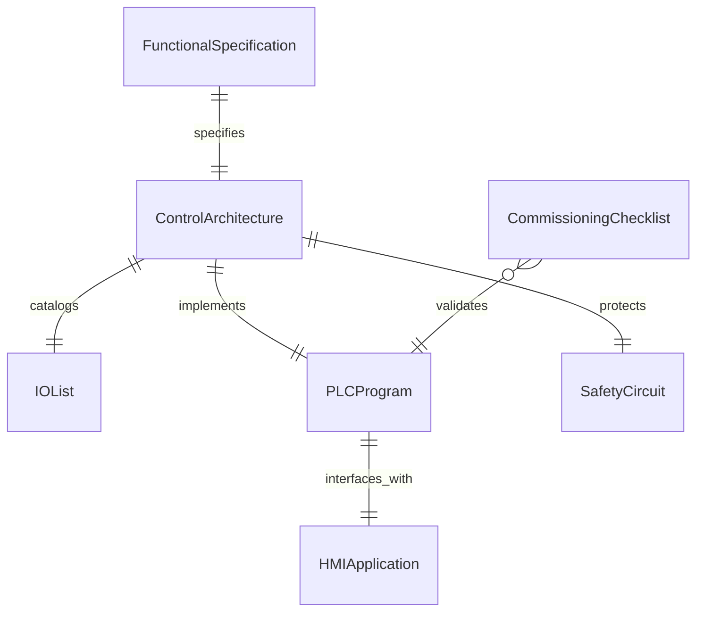
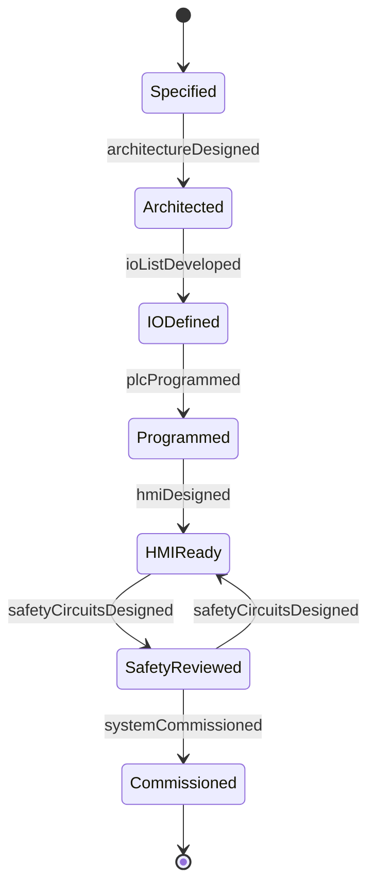
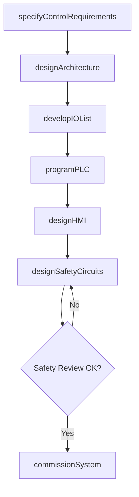
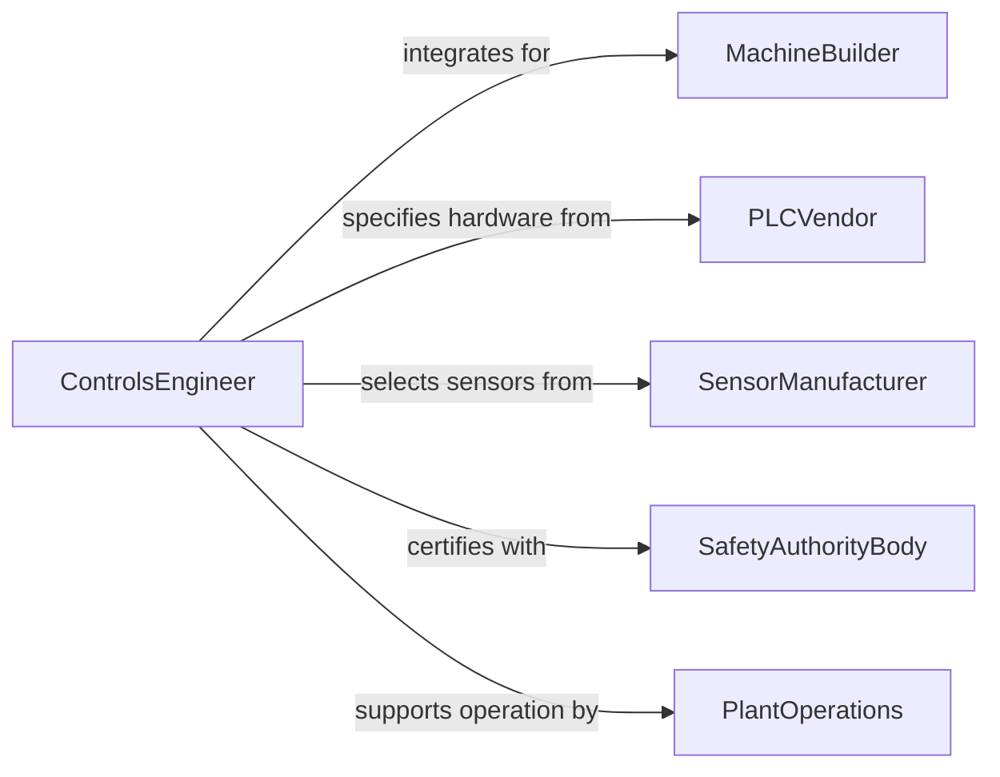

# Design Control Systems for Mechanical or Other Equipment

> Business-as-Code definition for designing control systems including PLC programs, SCADA architectures, motion control configurations, and safety interlock logic for mechanical and process equipment.

## Overview

Control systems design involves engineering the automation logic, sensor networks, actuator interfaces, and human-machine interfaces that govern mechanical equipment behavior. This definition models the workflow from control requirements specification through architecture design, PLC programming, HMI development, system integration testing, and commissioning on the target equipment.

## Actors

| Actor | Description |
|-------|-------------|
| MachineBuilder | OEM integrating the control system into equipment |
| PLCVendor | Supplier of programmable logic controllers and I/O modules |
| SensorManufacturer | Provider of proximity, pressure, temperature, and flow sensors |
| SafetyAuthorityBody | Organization certifying functional safety compliance |
| PlantOperations | End-user operating the controlled equipment |
| SystemIntegrator | Firm specializing in automation system integration |

## Roles

| Role | Description |
|------|-------------|
| ControlsEngineer | Designs automation logic and control architectures |
| PLCProgrammer | Develops ladder logic, structured text, and function blocks |
| HMIDesigner | Creates operator interface screens and dashboards |
| SafetyEngineer | Designs SIL-rated safety interlock circuits |

## Entities

| Entity | Description |
|--------|-------------|
| ControlArchitecture | Diagram of controller, network, and I/O topology |
| IOList | Catalog of all sensor and actuator connections |
| PLCProgram | Automation logic code for the programmable controller |
| HMIApplication | Operator interface screens and alarm configurations |
| SafetyCircuit | SIL-rated interlock logic and wiring diagram |
| FunctionalSpecification | Detailed description of control system behavior |
| CommissioningChecklist | Step-by-step startup and validation procedure |

## Actions

| Action | Description |
|--------|-------------|
| specifyControlRequirements | Define equipment behavior and control objectives |
| designArchitecture | Create the controller, network, and I/O topology |
| developIOList | Catalog all sensor and actuator connections |
| programPLC | Write automation logic in structured text or ladder |
| designHMI | Create operator interface screens and alarm handling |
| designSafetyCircuits | Develop SIL-rated interlock logic |
| commissionSystem | Perform startup testing and validation on equipment |

## Events

| Event | Description |
|-------|-------------|
| controlRequirementsSpecified | Equipment behavior objectives have been defined |
| architectureDesigned | Controller and network topology is complete |
| ioListDeveloped | Sensor and actuator catalog has been compiled |
| plcProgrammed | Automation logic has been written and unit-tested |
| hmiDesigned | Operator interface screens are complete |
| safetyCircuitsDesigned | Interlock logic has been developed and reviewed |
| systemCommissioned | Startup testing on equipment is complete |

## Searches

| Search | Description |
|--------|-------------|
| findControlDesigns | Search control systems by equipment type or project |
| getIOList | Retrieve the I/O catalog for a control system |
| listPLCPrograms | Enumerate automation logic versions by controller |
| getSafetyDesigns | Look up SIL-rated interlock documentation |
| findByController | Search designs using a specific PLC platform |

## Entity Relationships



## State Diagram



## Workflow



## Actor Relationships



## Usage

### Calling Actions

```typescript
import { designControlSystemsMechanicalEquipment } from '@headlessly/design-control-systems-mechanical-equipment'

const controls = designControlSystemsMechanicalEquipment()

// Specify control requirements
const req = await controls.specifyControlRequirements({
  equipment: 'hydraulic-press-line',
  modes: ['manual', 'semi-auto', 'full-auto'],
  cycleTime: { target: 12, unit: 'seconds' },
  safetyLevel: 'SIL-2',
  communications: 'EtherNet/IP'
})

// Design the architecture
const arch = await controls.designArchitecture({
  requirementsId: req.id,
  controller: 'Allen-Bradley-ControlLogix-5580',
  ioModules: [
    { type: 'digital-input', points: 64 },
    { type: 'digital-output', points: 32 },
    { type: 'analog-input', points: 16 },
    { type: 'safety-IO', points: 24 }
  ],
  network: 'EtherNet/IP-ring'
})

// Program the PLC
await controls.programPLC({
  architectureId: arch.id,
  language: 'structured-text',
  modules: ['press-sequence', 'hydraulic-control', 'part-transfer', 'fault-handling']
})
```

### Event-Driven Automation

```typescript
// Notify plant operations when commissioning is complete
controls.systemCommissioned(async ({ equipmentId }) => {
  await notify({
    to: 'plant-operations',
    message: `Control system for ${equipmentId} commissioned and ready for production`
  })
})

// Auto-trigger HMI design after PLC programming
controls.plcProgrammed(async ({ architectureId }) => {
  await controls.designHMI({
    architectureId,
    screens: ['main-overview', 'press-detail', 'alarm-summary', 'trend-history']
  })
})
```
