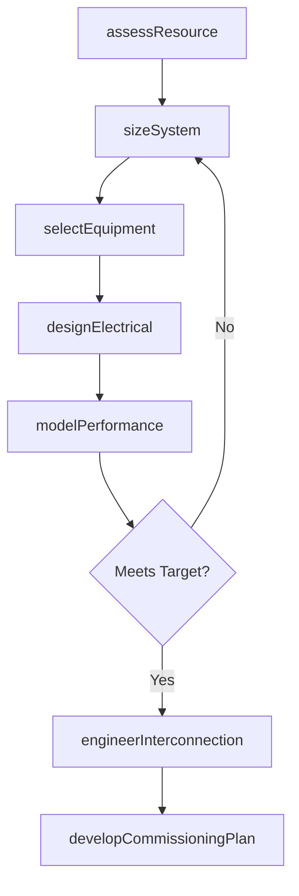
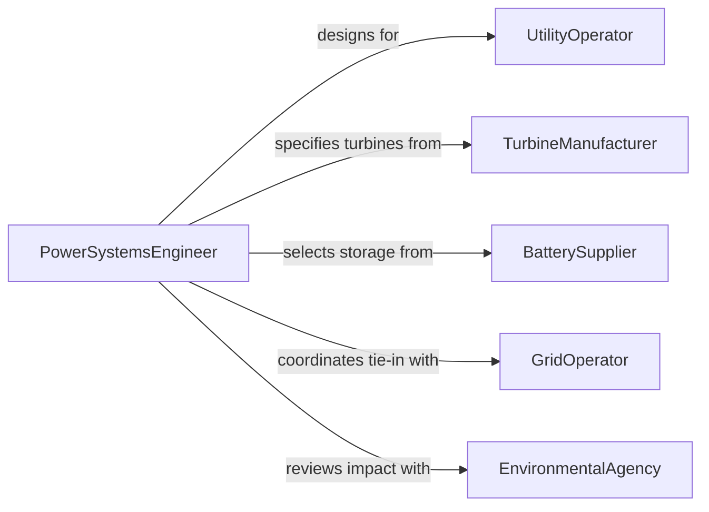

# Design Energy Production or Management Equipment

> Business-as-Code definition for designing energy production and management equipment including turbines, solar arrays, battery storage systems, grid interconnection hardware, and power distribution infrastructure.

## Overview

Energy equipment design involves engineering systems that generate, convert, store, or distribute electrical and thermal energy from conventional and renewable sources. This definition models the workflow from resource assessment and system sizing through component selection, electrical design, grid integration engineering, and commissioning documentation.

## Actors

| Actor | Description |
|-------|-------------|
| UtilityOperator | Power company or independent producer commissioning the system |
| TurbineManufacturer | Vendor fabricating generation turbines or engines |
| BatterySupplier | Provider of energy storage cells and management systems |
| GridOperator | Transmission authority managing interconnection requirements |
| EnvironmentalAgency | Regulator assessing environmental impact of energy projects |
| InverterManufacturer | Vendor supplying power conversion equipment |

## Roles

| Role | Description |
|------|-------------|
| PowerSystemsEngineer | Designs generation and distribution systems |
| ElectricalDesigner | Develops single-line diagrams and protective relay schemes |
| EnergyAnalyst | Models resource availability and system performance |
| CommissioningEngineer | Validates installed systems against design specifications |

## Entities

| Entity | Description |
|--------|-------------|
| ResourceAssessment | Analysis of solar irradiance, wind speed, or fuel availability |
| SystemSizingStudy | Calculation of generation capacity and storage requirements |
| SingleLineDiagram | Electrical schematic showing power flow and protection |
| EquipmentSpecification | Technical data sheet for turbines, inverters, or batteries |
| InterconnectionAgreement | Contract governing grid connection terms and standards |
| PerformanceModel | Simulation of annual energy production and losses |
| CommissioningProtocol | Step-by-step procedure for system startup and validation |

## Actions

| Action | Description |
|--------|-------------|
| assessResource | Analyze energy resource availability at the project site |
| sizeSystem | Calculate generation capacity and storage requirements |
| designElectrical | Create single-line diagrams and protection schemes |
| selectEquipment | Choose turbines, inverters, batteries, and transformers |
| modelPerformance | Simulate annual energy production and system losses |
| engineerInterconnection | Design grid tie-in to meet utility requirements |
| developCommissioningPlan | Create the startup and validation protocol |

## Events

| Event | Description |
|-------|-------------|
| resourceAssessed | Energy resource data have been analyzed |
| systemSized | Generation and storage capacities have been calculated |
| electricalDesigned | Single-line diagrams and protection are complete |
| equipmentSelected | Major components have been specified |
| performanceModeled | Annual energy simulation is complete |
| interconnectionEngineered | Grid tie-in design meets utility standards |
| commissioningPlanDeveloped | Startup and validation protocol is ready |

## Searches

| Search | Description |
|--------|-------------|
| findEnergyDesigns | Search projects by technology type or capacity |
| getResourceData | Retrieve site-specific energy resource assessments |
| listEquipment | Enumerate specified components by project |
| getPerformanceModels | Look up energy production simulations |
| findByCapacity | Search designs meeting specific generation targets |

## Workflow



## Actor Relationships



## Usage

### Calling Actions

```typescript
import { designEnergyProductionManagementEquipment } from '@headlessly/design-energy-production-management-equipment'

const energy = designEnergyProductionManagementEquipment()

// Assess the resource
const resource = await energy.assessResource({
  site: { lat: 35.0, lng: -118.0 },
  technology: 'solar-PV',
  dataSource: 'NSRDB-TMY3',
  years: 25
})

// Size the system
const sizing = await energy.sizeSystem({
  resourceId: resource.id,
  targetCapacity: { value: 100, unit: 'MW-AC' },
  storageHours: 4,
  dcAcRatio: 1.3,
  degradationRate: 0.005
})

// Design electrical systems
await energy.designElectrical({
  sizingId: sizing.id,
  voltage: { collection: '34.5kV', pointOfInterconnection: '230kV' },
  protection: ['overcurrent', 'ground-fault', 'anti-islanding'],
  inverterType: 'central-2500kVA'
})
```

### Event-Driven Automation

```typescript
// Notify utility when interconnection design is complete
energy.interconnectionEngineered(async ({ projectId }) => {
  await notify({
    to: 'grid-operator',
    message: `Interconnection engineering complete for project ${projectId} - ready for review`
  })
})

// Auto-model performance after equipment selection
energy.equipmentSelected(async ({ projectId }) => {
  await energy.modelPerformance({ projectId })
})
```
