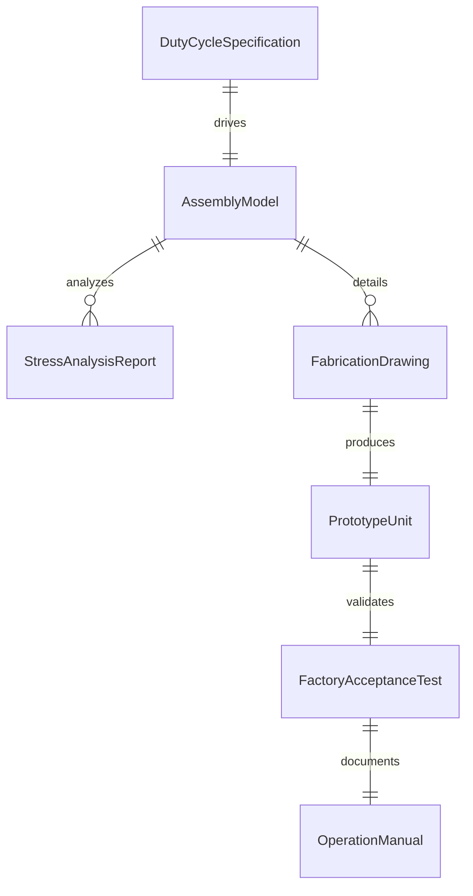
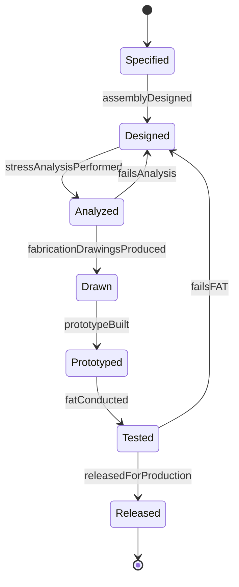
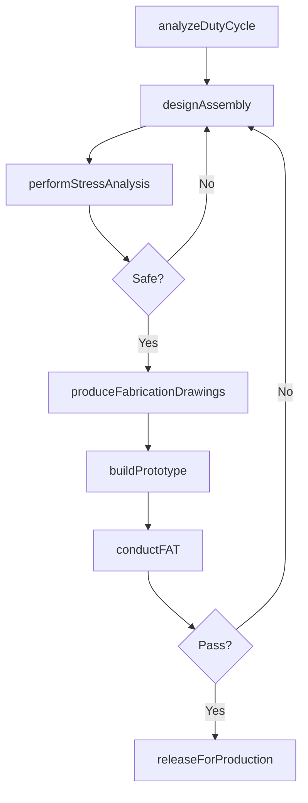
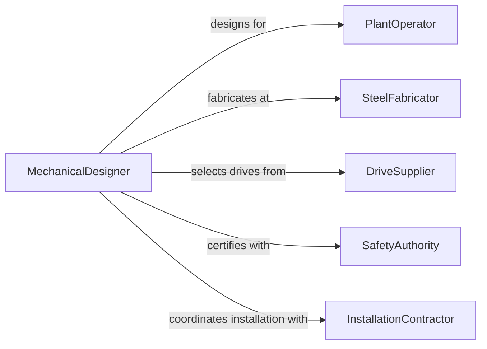

# Design Industrial Equipment

> Business-as-Code definition for designing industrial equipment including conveyors, presses, mixers, packaging machines, and material handling systems used in manufacturing and production environments.

## Overview

Industrial equipment design transforms operational requirements into mechanical assemblies that perform specific manufacturing functions reliably and safely. This definition models the process from duty cycle analysis through mechanical design, stress analysis, prototype fabrication, factory acceptance testing, and production release of equipment used in heavy industry, food processing, and general manufacturing.

## Actors

| Actor | Description |
|-------|-------------|
| PlantOperator | Manufacturing facility purchasing the equipment |
| SteelFabricator | Workshop fabricating structural and mechanical components |
| DriveSupplier | Vendor providing motors, gearboxes, and variable frequency drives |
| SafetyAuthority | Organization certifying equipment safety compliance |
| InstallationContractor | Team responsible for on-site equipment assembly |
| MaintenanceDepartment | Internal team servicing the equipment post-installation |

## Roles

| Role | Description |
|------|-------------|
| MechanicalDesigner | Creates detailed mechanical assemblies and drawings |
| StressAnalyst | Performs finite element analysis and fatigue calculations |
| PrototypeEngineer | Builds and tests physical samples of the equipment |
| ApplicationEngineer | Sizes and selects equipment for specific duty cycles |

## Entities

| Entity | Description |
|--------|-------------|
| DutyCycleSpecification | Operating parameters including loads, speeds, and frequencies |
| AssemblyModel | Three-dimensional CAD model of the equipment |
| StressAnalysisReport | FEA results and safety factor calculations |
| FabricationDrawing | Production-ready drawing with dimensions and tolerances |
| PrototypeUnit | Physical test unit of the equipment |
| FactoryAcceptanceTest | Formal test protocol verifying equipment performance |
| OperationManual | Documentation for installation, use, and maintenance |

## Actions

| Action | Description |
|--------|-------------|
| analyzeDutyCycle | Define operating loads, speeds, and environmental conditions |
| designAssembly | Create the three-dimensional mechanical design |
| performStressAnalysis | Calculate loads, stresses, and safety factors |
| produceFabricationDrawings | Generate production-ready engineering drawings |
| buildPrototype | Fabricate a physical test unit |
| conductFAT | Perform factory acceptance testing |
| releaseForProduction | Approve the design for serial manufacturing |

## Events

| Event | Description |
|-------|-------------|
| dutyCycleAnalyzed | Operating parameters have been defined |
| assemblyDesigned | Mechanical design model is complete |
| stressAnalysisPerformed | Load and safety factor calculations are done |
| fabricationDrawingsProduced | Engineering drawings are production-ready |
| prototypeBuilt | Physical test unit has been fabricated |
| fatConducted | Factory acceptance testing is complete |
| releasedForProduction | Design is approved for serial manufacturing |

## Searches

| Search | Description |
|--------|-------------|
| findEquipmentDesigns | Search designs by type, capacity, or application |
| getStressReports | Retrieve FEA results for a design |
| listPrototypes | Enumerate test units by status or design |
| getFATResults | Look up factory acceptance test data |
| findByDutyCycle | Search equipment meeting specific operating parameters |

## Entity Relationships



## State Diagram



## Workflow



## Actor Relationships



## Usage

### Calling Actions

```typescript
import { designIndustrialEquipment } from '@headlessly/design-industrial-equipment'

const equipment = designIndustrialEquipment()

// Analyze duty cycle
const duty = await equipment.analyzeDutyCycle({
  equipmentType: 'belt-conveyor',
  application: 'aggregate-transport',
  parameters: {
    throughput: { value: 800, unit: 'tonnes/hr' },
    beltWidth: 1200,
    length: 150,
    inclination: 12,
    unit: 'mm-and-m-and-degrees'
  },
  environment: 'outdoor-dusty'
})

// Design the assembly
const assembly = await equipment.designAssembly({
  dutyCycleId: duty.id,
  components: ['drive-station', 'tail-pulley', 'idler-frames', 'belt-tensioner', 'chute-work'],
  driveType: 'dual-motor-VFD',
  structuralMaterial: 'S355-structural-steel'
})

// Perform stress analysis
await equipment.performStressAnalysis({
  assemblyId: assembly.id,
  loadCases: ['full-load', 'startup-surge', 'emergency-stop'],
  method: 'FEA',
  minSafetyFactor: 2.5
})
```

### Event-Driven Automation

```typescript
// Notify fabrication shop when drawings are ready
equipment.fabricationDrawingsProduced(async ({ designId }) => {
  await notify({
    to: 'fabrication-shop',
    message: `Fabrication drawings released for equipment design ${designId}`
  })
})

// Auto-release after successful FAT
equipment.fatConducted(async ({ designId, passed }) => {
  if (passed) {
    await equipment.releaseForProduction({ designId })
  }
})
```
