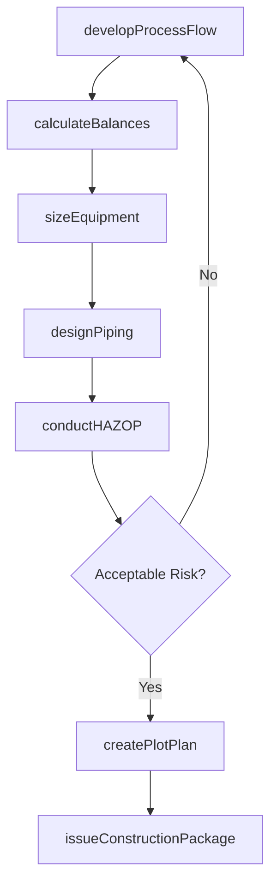
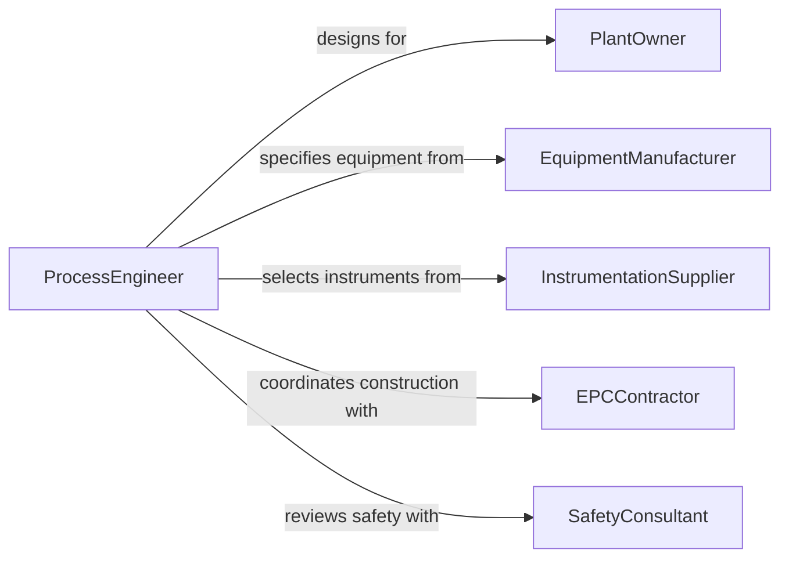

# Design Industrial Processing Systems

> Business-as-Code definition for designing industrial processing systems including chemical plants, food processing lines, pharmaceutical manufacturing, and water treatment facilities from process flow development through detailed engineering.

## Overview

Industrial processing system design involves developing process flow diagrams, selecting unit operations, sizing equipment, and producing piping and instrumentation diagrams that enable safe and efficient production at scale. This definition models the workflow from process feasibility analysis through simulation, equipment specification, layout design, and construction documentation release.

## Actors

| Actor | Description |
|-------|-------------|
| PlantOwner | Organization commissioning the processing system |
| EquipmentManufacturer | Vendor fabricating process vessels, pumps, and exchangers |
| InstrumentationSupplier | Provider of sensors, controllers, and automation hardware |
| EPCContractor | Engineering, procurement, and construction firm |
| EnvironmentalRegulator | Agency governing emissions and discharge standards |
| SafetyConsultant | Specialist conducting hazard and operability studies |

## Roles

| Role | Description |
|------|-------------|
| ProcessEngineer | Designs process flow and unit operations |
| PipingDesigner | Develops piping layout and isometric drawings |
| InstrumentationEngineer | Specifies control loops and measurement points |
| ProjectEngineer | Coordinates multidisciplinary design deliverables |

## Entities

| Entity | Description |
|--------|-------------|
| ProcessFlowDiagram | High-level schematic of unit operations and material flows |
| PipingInstrumentationDiagram | Detailed drawing of piping, valves, and instruments |
| MassEnergyBalance | Calculation of material and energy flows through the system |
| EquipmentDataSheet | Technical specification for a process vessel or machine |
| HAZOPStudy | Hazard and operability analysis of the process design |
| PlotPlan | Physical layout of equipment within the facility |
| ConstructionPackage | Complete engineering documents for system fabrication |

## Actions

| Action | Description |
|--------|-------------|
| developProcessFlow | Create the process flow diagram and unit operation sequence |
| calculateBalances | Compute mass and energy balances for the system |
| sizeEquipment | Determine dimensions and capacity for process equipment |
| designPiping | Develop piping layout and instrumentation diagrams |
| conductHAZOP | Perform hazard and operability analysis |
| createPlotPlan | Arrange equipment in the physical facility layout |
| issueConstructionPackage | Release final engineering documents for fabrication |

## Events

| Event | Description |
|-------|-------------|
| processFlowDeveloped | Process flow diagram has been completed |
| balancesCalculated | Mass and energy balances are verified |
| equipmentSized | Process equipment dimensions have been determined |
| pipingDesigned | Piping and instrumentation diagrams are complete |
| hazopConducted | Hazard and operability study is finished |
| plotPlanCreated | Facility equipment layout has been arranged |
| constructionPackageIssued | Engineering documents are released for fabrication |

## Searches

| Search | Description |
|--------|-------------|
| findProcessDesigns | Search system designs by product type or capacity |
| getEquipmentSpecs | Retrieve data sheets for specified equipment |
| listHAZOPFindings | Enumerate hazard study recommendations |
| getBalanceData | Look up mass and energy calculations by system |
| findByCapacity | Search designs meeting specific throughput requirements |

## Workflow



## Actor Relationships



## Usage

### Calling Actions

```typescript
import { designIndustrialProcessingSystems } from '@headlessly/design-industrial-processing-systems'

const process = designIndustrialProcessingSystems()

// Develop the process flow
const pfd = await process.developProcessFlow({
  product: 'pharmaceutical-API',
  capacity: { value: 5000, unit: 'kg/day' },
  operations: ['reaction', 'crystallization', 'filtration', 'drying', 'milling'],
  classification: 'cGMP'
})

// Calculate mass and energy balances
const balances = await process.calculateBalances({
  processFlowId: pfd.id,
  feedComposition: { solvent: 60, reactant: 35, catalyst: 5, unit: 'wt%' },
  targetYield: 0.92
})

// Size the equipment
await process.sizeEquipment({
  balancesId: balances.id,
  equipment: [
    { type: 'reactor', volume: 10000, unit: 'L', material: '316L-stainless' },
    { type: 'filter-dryer', area: 8, unit: 'm2' },
    { type: 'hammer-mill', throughput: 500, unit: 'kg/hr' }
  ]
})
```

### Event-Driven Automation

```typescript
// Notify EPC contractor when construction package is ready
process.constructionPackageIssued(async ({ projectId }) => {
  await notify({
    to: 'epc-contractor',
    message: `Construction package issued for project ${projectId} - ready for procurement and fabrication`
  })
})

// Auto-schedule HAZOP after piping design is complete
process.pipingDesigned(async ({ projectId }) => {
  await process.conductHAZOP({ projectId })
})
```
