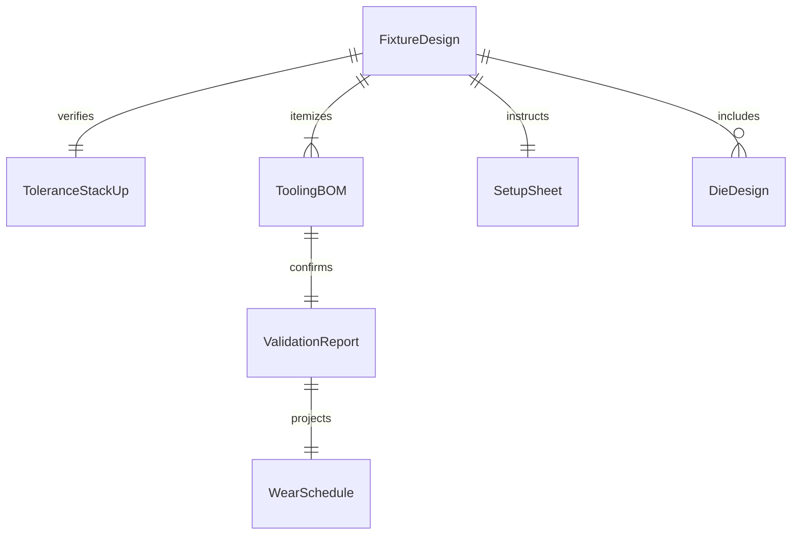
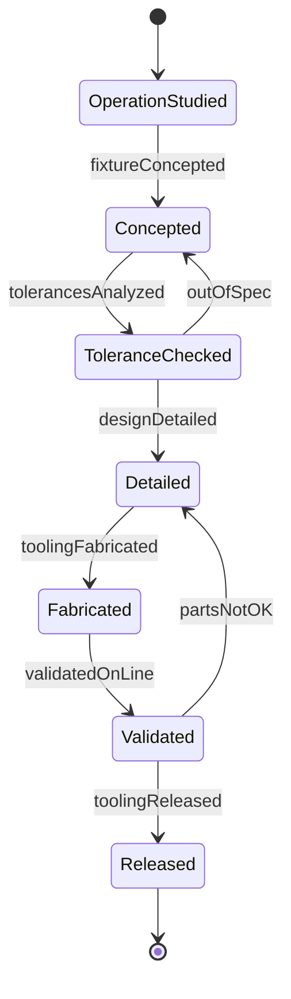
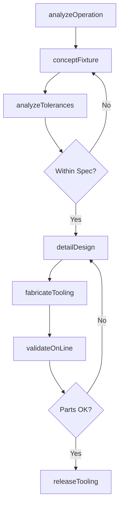
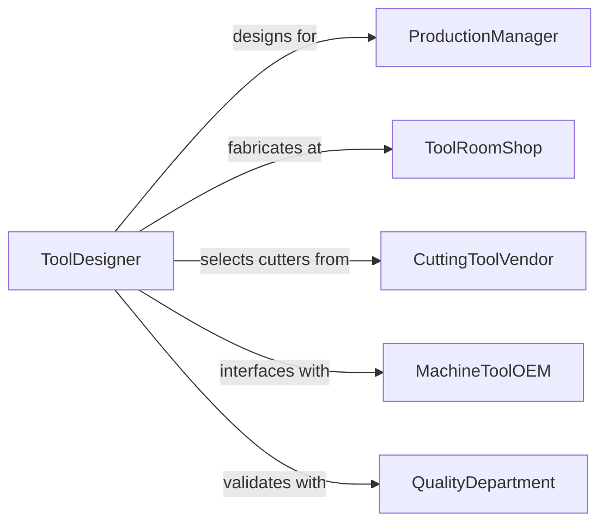

# Design Tools, Fixtures, or Devices for Production Equipment

> Business-as-Code definition for designing production tooling, work-holding fixtures, jigs, dies, and auxiliary devices that enable efficient and repeatable manufacturing operations.

## Overview

Production tooling design involves creating specialized tools, fixtures, and devices that hold workpieces, guide cutting tools, and enable consistent manufacturing outcomes. This definition models the process from operation analysis through fixture concept development, tolerance stack-up analysis, tooling fabrication, and validation on the production line.

## Actors

| Actor | Description |
|-------|-------------|
| ProductionManager | Plant manager requesting tooling for a manufacturing process |
| ToolRoomShop | Internal or external facility fabricating tooling components |
| CuttingToolVendor | Supplier of drills, end mills, inserts, and abrasives |
| MachineToolOEM | Manufacturer of the CNC or press equipment using the tooling |
| QualityDepartment | Team verifying part conformance produced with the tooling |

## Roles

| Role | Description |
|------|-------------|
| ToolDesigner | Creates fixture and tooling designs for production |
| ManufacturingEngineer | Defines production processes requiring tooling support |
| ToleranceAnalyst | Performs stack-up analysis ensuring dimensional accuracy |
| ToolMaker | Fabricates and fits tooling components |

## Entities

| Entity | Description |
|--------|-------------|
| FixtureDesign | Detailed drawing of the work-holding device |
| ToleranceStackUp | Analysis of cumulative dimensional variations |
| ToolingBOM | Bill of materials for fixture components and hardware |
| SetupSheet | Instructions for installing and aligning the fixture |
| ValidationReport | Data confirming tooling produces parts within specification |
| DieDesign | Drawing of forming or stamping die geometry |
| WearSchedule | Projected service life and replacement intervals for tooling |

## Actions

| Action | Description |
|--------|-------------|
| analyzeOperation | Study the manufacturing operation requiring tooling |
| conceptFixture | Develop initial fixture or tool concept |
| analyzeTolerances | Perform stack-up analysis for dimensional accuracy |
| detailDesign | Create production-ready tooling drawings |
| fabricateTooling | Manufacture the fixture or die components |
| validateOnLine | Test the tooling in the production environment |
| releaseTooling | Approve and document the tooling for ongoing use |

## Events

| Event | Description |
|-------|-------------|
| operationAnalyzed | Manufacturing operation requirements have been studied |
| fixtureConcepted | Initial tooling concept has been developed |
| tolerancesAnalyzed | Dimensional stack-up analysis is complete |
| designDetailed | Production-ready tooling drawings are finished |
| toolingFabricated | Fixture or die components have been manufactured |
| validatedOnLine | Tooling has been tested in the production environment |
| toolingReleased | Tooling is approved for ongoing production use |

## Searches

| Search | Description |
|--------|-------------|
| findToolingDesigns | Search fixtures by operation type or part number |
| getToleranceData | Retrieve stack-up analysis for a fixture design |
| listBOMs | Enumerate tooling bills of materials |
| getValidationResults | Look up on-line test data for tooling |
| findByMachine | Search tooling designed for a specific machine tool |

## Entity Relationships



## State Diagram



## Workflow



## Actor Relationships



## Usage

### Calling Actions

```typescript
import { designToolsFixturesDevicesProduction } from '@headlessly/design-tools-fixtures-devices-production'

const tooling = designToolsFixturesDevicesProduction()

// Analyze the manufacturing operation
const op = await tooling.analyzeOperation({
  partNumber: 'BRK-4420',
  operation: '5-axis-milling',
  machine: 'DMG-MORI-DMU-80',
  material: 'titanium-6Al-4V',
  batchSize: 500
})

// Develop fixture concept
const concept = await tooling.conceptFixture({
  operationId: op.id,
  clamping: 'hydraulic-4-point',
  locating: '3-2-1-principle',
  chipEvacuation: 'through-fixture-coolant',
  changeover: { target: 5, unit: 'minutes' }
})

// Analyze tolerances
await tooling.analyzeTolerances({
  fixtureId: concept.id,
  criticalDimensions: [
    { feature: 'bore-diameter', nominal: 25.0, tolerance: 0.012, unit: 'mm' },
    { feature: 'hole-position', nominal: 50.0, tolerance: 0.025, unit: 'mm' }
  ]
})
```

### Event-Driven Automation

```typescript
// Notify tool room when detailed design is complete
tooling.designDetailed(async ({ fixtureId }) => {
  await notify({
    to: 'tool-room',
    message: `Fixture design ${fixtureId} is detailed and ready for fabrication`
  })
})

// Auto-release tooling after successful on-line validation
tooling.validatedOnLine(async ({ fixtureId, cpk }) => {
  if (cpk >= 1.33) {
    await tooling.releaseTooling({ fixtureId })
  }
})
```
