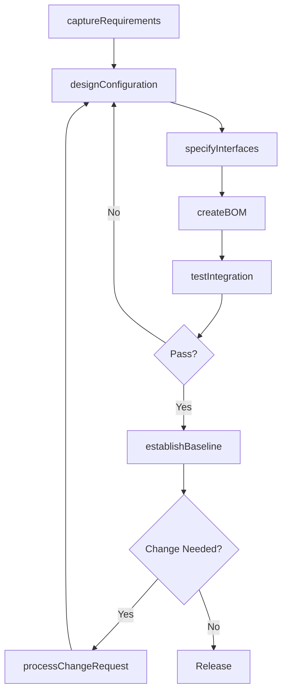
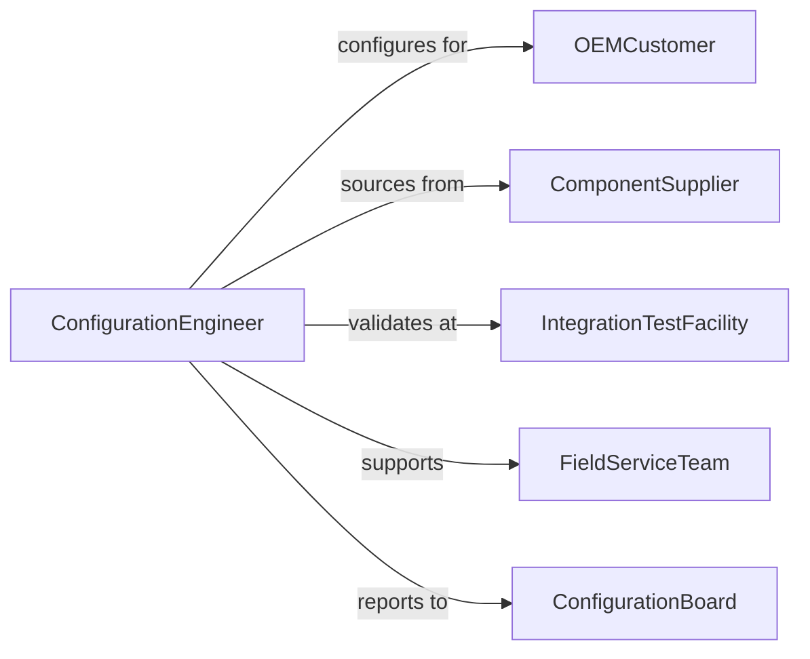

# Develop Equipment or Component Configurations

> Business-as-Code definition for developing equipment and component configurations that define the arrangement, interconnection, and interface specifications for machinery assemblies and subsystems.

## Overview

Equipment configuration development involves defining how components, modules, and subsystems are arranged and interconnected to form a complete functional assembly. This definition models the process from requirements capture through configuration design, interface specification, integration testing, and baseline release for manufacturing and field deployment.

## Actors

| Actor | Description |
|-------|-------------|
| OEMCustomer | Original equipment manufacturer ordering configured assemblies |
| ComponentSupplier | Vendor providing individual parts and subassemblies |
| IntegrationTestFacility | Laboratory validating assembled configurations |
| FieldServiceTeam | Technicians deploying and maintaining configurations on-site |
| ConfigurationBoard | Governance body approving configuration changes |

## Roles

| Role | Description |
|------|-------------|
| ConfigurationEngineer | Designs component arrangements and interfaces |
| SystemsArchitect | Defines subsystem boundaries and integration points |
| IntegrationTester | Validates assembled configurations against requirements |
| ConfigurationManager | Controls baselines, changes, and version history |

## Entities

| Entity | Description |
|--------|-------------|
| ConfigurationBaseline | Approved snapshot of component arrangement and versions |
| InterfaceSpecification | Definition of connections between components and subsystems |
| BillOfMaterials | Hierarchical list of all components in the configuration |
| AssemblyDrawing | Technical illustration of component arrangement |
| IntegrationTestPlan | Protocol for validating the assembled configuration |
| ChangeRequest | Formal proposal to modify the configuration baseline |
| CompatibilityMatrix | Table of verified component interoperability |

## Actions

| Action | Description |
|--------|-------------|
| captureRequirements | Gather functional and interface requirements |
| designConfiguration | Arrange components and define interconnections |
| specifyInterfaces | Document mechanical, electrical, and data interfaces |
| createBOM | Build the hierarchical bill of materials |
| testIntegration | Validate the assembled configuration against requirements |
| establishBaseline | Lock the approved configuration version |
| processChangeRequest | Evaluate and approve modifications to the baseline |

## Events

| Event | Description |
|-------|-------------|
| requirementsCaptured | Functional and interface requirements have been gathered |
| configurationDesigned | Component arrangement has been defined |
| interfacesSpecified | Interconnection details have been documented |
| bomCreated | Bill of materials has been assembled |
| integrationTested | Configuration validation is complete |
| baselineEstablished | Approved configuration version has been locked |
| changeRequestProcessed | Modification to the baseline has been evaluated |

## Searches

| Search | Description |
|--------|-------------|
| findConfigurations | Search configurations by product or customer |
| getBOM | Retrieve bill of materials for a configuration |
| listChangeRequests | Enumerate pending or approved change requests |
| getCompatibility | Check component compatibility within a configuration |
| findBaselines | Search approved configuration versions by date or product |

## Workflow



## Actor Relationships



## Usage

### Calling Actions

```typescript
import { developEquipmentComponentConfigurations } from '@headlessly/develop-equipment-component-configurations'

const config = developEquipmentComponentConfigurations()

// Capture requirements
const req = await config.captureRequirements({
  product: 'CNC-machining-center',
  variant: 'high-speed-5-axis',
  requirements: {
    spindleSpeed: { max: 24000, unit: 'rpm' },
    axes: 5,
    toolChanger: { capacity: 60, type: 'carousel' },
    controlSystem: 'Fanuc-31i-B5'
  }
})

// Design the configuration
const design = await config.designConfiguration({
  requirementsId: req.id,
  modules: [
    { name: 'spindle-assembly', variant: 'HSK-A63-24K' },
    { name: 'rotary-table', variant: 'DDR-200' },
    { name: 'tool-changer', variant: 'ATC-60' },
    { name: 'coolant-system', variant: 'through-spindle-70bar' }
  ]
})

// Test integration
await config.testIntegration({
  configurationId: design.id,
  tests: ['mechanical-fit', 'electrical-continuity', 'control-handshake', 'safety-interlock']
})
```

### Event-Driven Automation

```typescript
// Notify manufacturing when baseline is established
config.baselineEstablished(async ({ configurationId, product }) => {
  await notify({
    to: 'manufacturing',
    message: `Configuration baseline established for ${product} - ${configurationId} ready for production`
  })
})

// Route change requests to configuration board
config.changeRequestProcessed(async ({ changeId, impact }) => {
  if (impact === 'major') {
    await notify({
      to: 'configuration-board',
      message: `Major configuration change ${changeId} requires board review`
    })
  }
})
```
