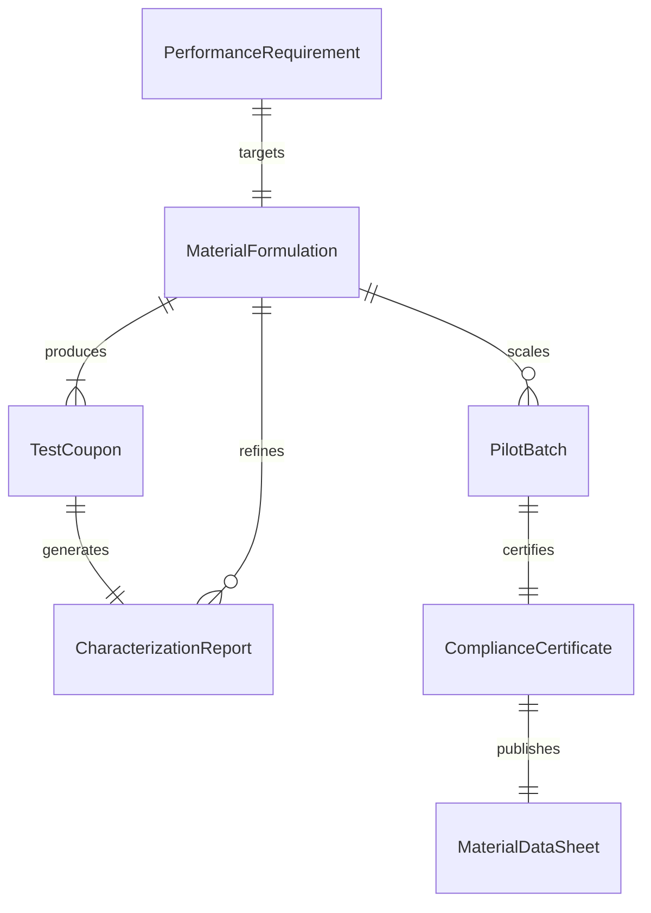
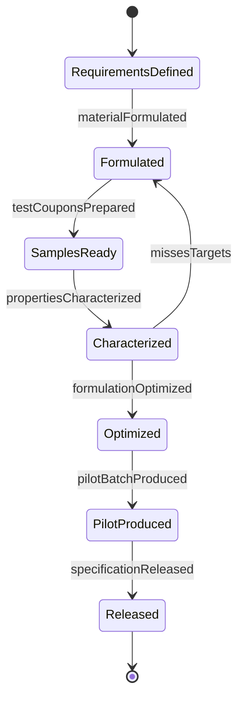
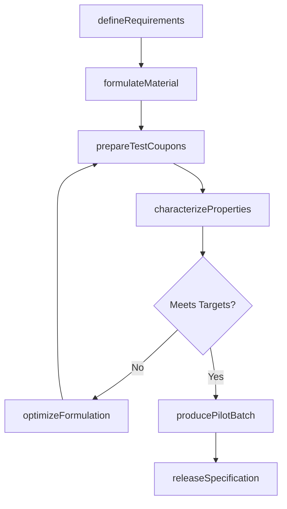
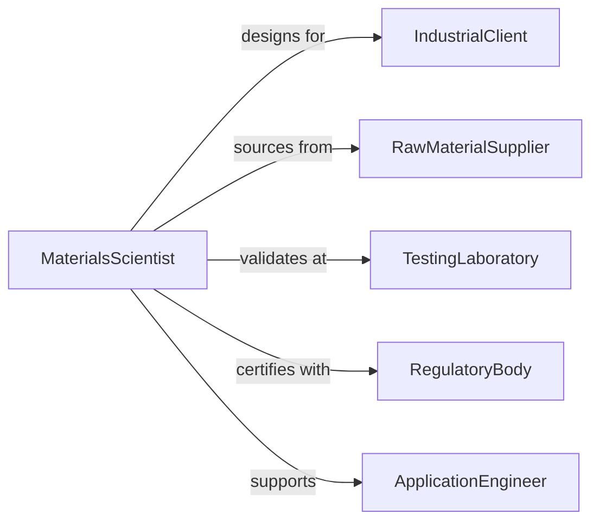

# Design Materials for Industrial or Commercial Applications

> Business-as-Code definition for designing engineered materials such as polymers, composites, alloys, and coatings tailored to specific industrial or commercial performance requirements.

## Overview

Materials design for industrial and commercial applications involves selecting base constituents, engineering microstructures, and validating performance characteristics to meet application-specific demands such as thermal resistance, tensile strength, or chemical compatibility. This definition models the process from requirements analysis through material formulation, laboratory testing, pilot production, and specification release.

## Actors

| Actor | Description |
|-------|-------------|
| IndustrialClient | Manufacturer requiring custom-engineered materials |
| RawMaterialSupplier | Vendor providing base chemicals, metals, or fibers |
| TestingLaboratory | Accredited facility performing material characterization |
| RegulatoryBody | Agency governing material safety and compliance standards |
| ApplicationEngineer | End-user engineer integrating the material into products |
| PatentCounsel | Legal advisor managing intellectual property for novel materials |

## Roles

| Role | Description |
|------|-------------|
| MaterialsScientist | Designs and formulates new material compositions |
| PolymerChemist | Develops polymer and composite formulations |
| TestEngineer | Conducts mechanical, thermal, and chemical testing |
| ProcessEngineer | Scales formulations from lab to production quantities |

## Entities

| Entity | Description |
|--------|-------------|
| MaterialFormulation | Composition recipe with constituent ratios and processing parameters |
| PerformanceRequirement | Target properties such as strength, conductivity, or flexibility |
| TestCoupon | Standardized sample prepared for laboratory evaluation |
| CharacterizationReport | Results of mechanical, thermal, or chemical testing |
| MaterialDataSheet | Technical specification document for the engineered material |
| PilotBatch | Small-scale production run validating scalability |
| ComplianceCertificate | Documentation confirming regulatory approval |

## Actions

| Action | Description |
|--------|-------------|
| defineRequirements | Specify target performance properties for the application |
| formulateMaterial | Design the composition and processing method |
| prepareTestCoupons | Fabricate standardized samples for evaluation |
| characterizeProperties | Test mechanical, thermal, and chemical performance |
| optimizeFormulation | Adjust composition based on test results |
| producePilotBatch | Manufacture a small-scale validation run |
| releaseSpecification | Publish the material data sheet for production use |

## Events

| Event | Description |
|-------|-------------|
| requirementsDefined | Target performance properties have been specified |
| materialFormulated | Composition and processing method have been designed |
| testCouponsPrepared | Laboratory samples have been fabricated |
| propertiesCharacterized | Material testing is complete |
| formulationOptimized | Composition has been refined for target properties |
| pilotBatchProduced | Validation production run is complete |
| specificationReleased | Material data sheet has been published |

## Searches

| Search | Description |
|--------|-------------|
| findFormulations | Search material compositions by application or property |
| getTestResults | Retrieve characterization data for a formulation |
| listPilotBatches | Enumerate validation runs by status or material |
| getComplianceStatus | Check regulatory approval progress |
| findByProperty | Search materials meeting specific performance thresholds |

## Entity Relationships



## State Diagram



## Workflow



## Actor Relationships



## Usage

### Calling Actions

```typescript
import { designMaterialsIndustrialCommercialApplications } from '@headlessly/design-materials-industrial-commercial-applications'

const materials = designMaterialsIndustrialCommercialApplications()

// Define performance requirements
const req = await materials.defineRequirements({
  application: 'automotive-underbody-shield',
  properties: {
    tensileStrength: { min: 85, unit: 'MPa' },
    heatDeflection: { min: 180, unit: 'C' },
    impactResistance: { min: 12, unit: 'kJ/m2' },
    density: { max: 1.4, unit: 'g/cm3' }
  },
  standards: ['ASTM-D638', 'ISO-75']
})

// Formulate the material
const formula = await materials.formulateMaterial({
  requirementsId: req.id,
  basePolymer: 'PA6-GF30',
  additives: [
    { type: 'impact-modifier', loading: 8, unit: 'wt%' },
    { type: 'heat-stabilizer', loading: 0.5, unit: 'wt%' }
  ],
  processing: 'injection-molding'
})

// Characterize properties
await materials.characterizeProperties({
  formulationId: formula.id,
  tests: ['tensile', 'HDT', 'Charpy-impact', 'density']
})
```

### Event-Driven Automation

```typescript
// Alert engineering when specification is released
materials.specificationReleased(async ({ materialId, application }) => {
  await notify({
    to: 'product-engineering',
    message: `Material specification for ${application} is ready - data sheet ${materialId} published`
  })
})

// Auto-produce pilot batch when formulation meets targets
materials.propertiesCharacterized(async ({ formulationId, meetsTargets }) => {
  if (meetsTargets) {
    await materials.producePilotBatch({ formulationId, quantity: 500, unit: 'kg' })
  }
})
```
