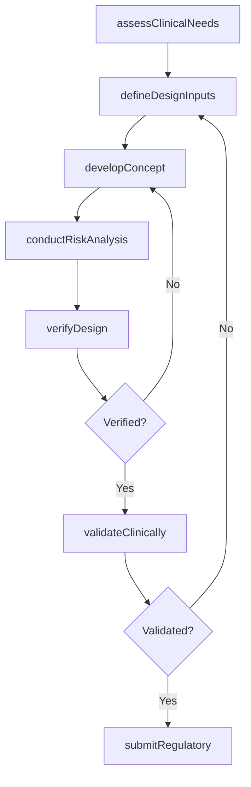
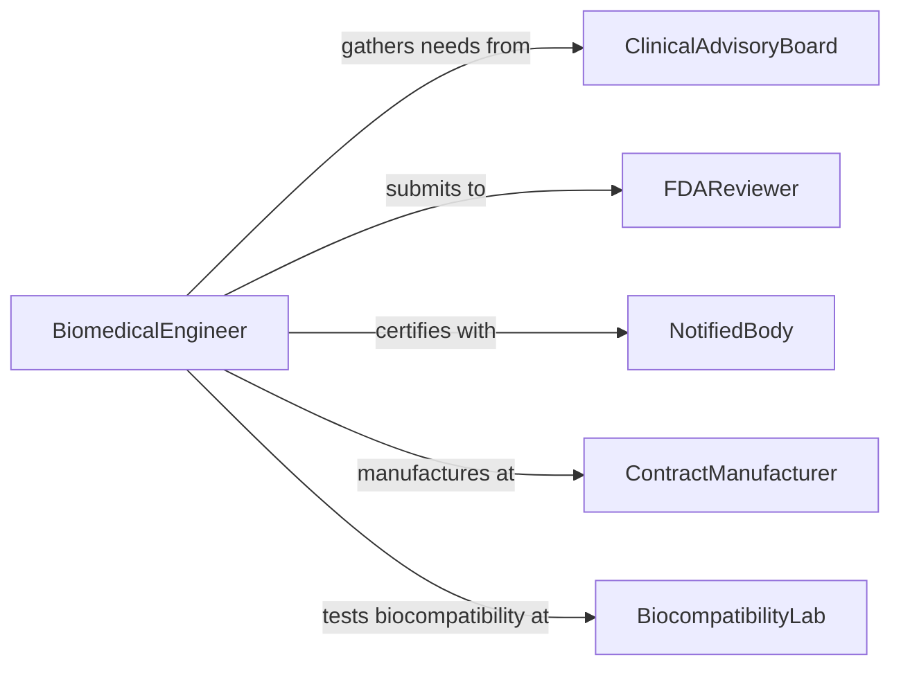

# Design Medical Devices or Appliances

> Business-as-Code definition for designing medical devices and appliances including diagnostic instruments, surgical tools, implantable devices, and therapeutic equipment that meet FDA and international regulatory standards.

## Overview

Medical device design requires balancing clinical efficacy, patient safety, manufacturing feasibility, and regulatory compliance across a rigorous development lifecycle. This definition models the process from clinical needs assessment through concept development, design verification and validation, biocompatibility testing, and regulatory submission under frameworks such as FDA 21 CFR 820 and ISO 13485.

## Actors

| Actor | Description |
|-------|-------------|
| ClinicalAdvisoryBoard | Physicians providing clinical input on device requirements |
| FDAReviewer | Regulatory authority evaluating device safety and efficacy |
| NotifiedBody | European conformity assessment organization for CE marking |
| ContractManufacturer | Production facility building the medical device |
| BiocompatibilityLab | Accredited laboratory conducting ISO 10993 testing |
| DistributorNetwork | Channel partner distributing devices to healthcare facilities |

## Roles

| Role | Description |
|------|-------------|
| BiomedicalEngineer | Leads device design from concept through validation |
| RegulatorySpecialist | Manages submissions and compliance documentation |
| QualityEngineer | Develops design controls and risk management processes |
| ClinicalEngineer | Validates device performance in clinical settings |

## Entities

| Entity | Description |
|--------|-------------|
| UserNeedsDocument | Clinical and user requirements for the device |
| DesignInputSpecification | Engineering requirements derived from user needs |
| DesignOutputPackage | Technical drawings, software code, and manufacturing specs |
| RiskAnalysis | FMEA and hazard analysis per ISO 14971 |
| VerificationReport | Test results confirming design outputs meet inputs |
| ValidationProtocol | Clinical study plan confirming the device meets user needs |
| RegulatorySubmission | 510(k), PMA, or CE technical file for market clearance |
| DesignHistoryFile | Complete record of design decisions and changes |

## Actions

| Action | Description |
|--------|-------------|
| assessClinicalNeeds | Gather clinical requirements from physicians and users |
| defineDesignInputs | Translate user needs into measurable engineering specs |
| developConcept | Create device concept designs and feasibility prototypes |
| conductRiskAnalysis | Perform FMEA and hazard analysis per ISO 14971 |
| verifyDesign | Test that design outputs satisfy design input specifications |
| validateClinically | Confirm the device meets user needs in clinical settings |
| submitRegulatory | File for regulatory clearance or approval |

## Events

| Event | Description |
|-------|-------------|
| clinicalNeedsAssessed | Clinical requirements have been gathered |
| designInputsDefined | Engineering specifications have been established |
| conceptDeveloped | Device concept and feasibility prototypes are ready |
| riskAnalysisConducted | FMEA and hazard analysis are complete |
| designVerified | Verification testing confirms specification compliance |
| clinicallyValidated | Clinical validation confirms device meets user needs |
| regulatorySubmitted | Submission has been filed with regulatory authorities |

## Searches

| Search | Description |
|--------|-------------|
| findDeviceDesigns | Search device projects by classification or indication |
| getRiskAnalysis | Retrieve FMEA data for a device design |
| listVerificationTests | Enumerate test results by design output |
| getSubmissionStatus | Check regulatory filing progress |
| findPredicateDevices | Search cleared devices for substantial equivalence |

## Workflow



## Actor Relationships



## Usage

### Calling Actions

```typescript
import { designMedicalDevicesAppliances } from '@headlessly/design-medical-devices-appliances'

const medDevice = designMedicalDevicesAppliances()

// Assess clinical needs
const needs = await medDevice.assessClinicalNeeds({
  indication: 'minimally-invasive-biopsy',
  deviceClass: 'Class-II',
  intendedUse: 'Percutaneous tissue sampling under ultrasound guidance',
  clinicians: ['interventional-radiologist', 'surgical-oncologist']
})

// Define design inputs
const inputs = await medDevice.defineDesignInputs({
  needsId: needs.id,
  specifications: {
    needleGauge: 18,
    sampleLength: { min: 15, unit: 'mm' },
    firingMechanism: 'spring-loaded',
    biocompatibility: 'ISO-10993-compliant',
    sterilization: 'ethylene-oxide'
  }
})

// Conduct risk analysis
await medDevice.conductRiskAnalysis({
  designId: inputs.designId,
  method: 'FMEA',
  standard: 'ISO-14971',
  hazardCategories: ['mechanical', 'biocompatibility', 'sterility', 'usability']
})
```

### Event-Driven Automation

```typescript
// Notify regulatory team when design is verified
medDevice.designVerified(async ({ designId, passRate }) => {
  await notify({
    to: 'regulatory-affairs',
    message: `Design ${designId} verification complete - ${passRate}% pass rate - ready for clinical validation`
  })
})

// Auto-prepare submission after clinical validation
medDevice.clinicallyValidated(async ({ designId, validated }) => {
  if (validated) {
    await medDevice.submitRegulatory({
      designId,
      pathway: '510k',
      predicateDevice: 'K201234'
    })
  }
})
```
