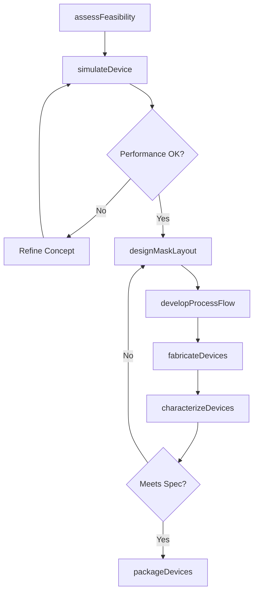
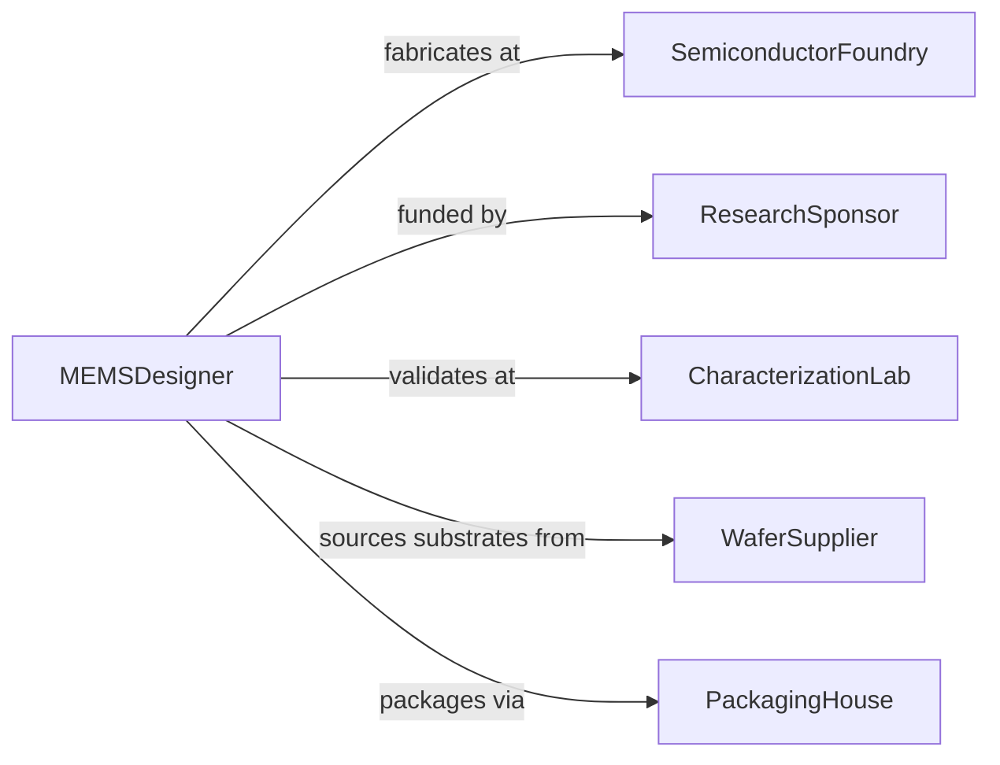

# Design Micro- or Nano-scale Materials, Devices, or Systems

> Business-as-Code definition for designing materials, devices, and systems at micro- and nano-scale dimensions, including MEMS sensors, nanocomposites, lab-on-a-chip platforms, and quantum dot arrays.

## Overview

Micro- and nano-scale design involves engineering structures at dimensions from nanometers to hundreds of micrometers, requiring cleanroom fabrication processes, atomic-level material characterization, and specialized simulation tools. This definition models the workflow from concept feasibility through device modeling, mask layout, fabrication process development, and characterization validation.

## Actors

| Actor | Description |
|-------|-------------|
| SemiconductorFoundry | Fabrication facility producing micro- and nano-scale devices |
| ResearchSponsor | Funding agency or corporate R&D investor |
| CharacterizationLab | Facility with electron microscopy and surface analysis tools |
| WaferSupplier | Vendor providing silicon, glass, or polymer substrates |
| PackagingHouse | Service packaging fabricated devices for deployment |
| IPOffice | Patent authority reviewing novel device designs |

## Roles

| Role | Description |
|------|-------------|
| MEMSDesigner | Designs microelectromechanical systems and sensors |
| NanomaterialsEngineer | Develops nano-scale material compositions and structures |
| ProcessIntegrationEngineer | Defines cleanroom fabrication process sequences |
| DevicePhysicist | Simulates device behavior at micro- and nano-scale |

## Entities

| Entity | Description |
|--------|-------------|
| DeviceConcept | Functional specification of the micro- or nano-scale device |
| SimulationModel | Finite element or molecular dynamics model of the device |
| MaskLayout | Photolithography mask design for device fabrication |
| ProcessFlow | Ordered sequence of cleanroom fabrication steps |
| FabricatedWafer | Substrate containing manufactured device structures |
| CharacterizationResult | Measurement data from electron microscopy or profilometry |
| DevicePackage | Encapsulated and wire-bonded device ready for integration |

## Actions

| Action | Description |
|--------|-------------|
| assessFeasibility | Evaluate whether the device concept is manufacturable |
| simulateDevice | Model device physics and predict performance |
| designMaskLayout | Create photolithography mask patterns |
| developProcessFlow | Define the cleanroom fabrication step sequence |
| fabricateDevices | Manufacture devices on wafer substrates |
| characterizeDevices | Measure device dimensions, properties, and performance |
| packageDevices | Encapsulate and prepare devices for deployment |

## Events

| Event | Description |
|-------|-------------|
| feasibilityAssessed | Manufacturability evaluation is complete |
| deviceSimulated | Physics modeling and performance prediction are done |
| maskLayoutDesigned | Photolithography patterns have been created |
| processFlowDeveloped | Fabrication step sequence has been defined |
| devicesFabricated | Wafer-level manufacturing is complete |
| devicesCharacterized | Measurement and validation data have been collected |
| devicesPackaged | Devices have been encapsulated for deployment |

## Searches

| Search | Description |
|--------|-------------|
| findDeviceDesigns | Search device concepts by type or application |
| getSimulationResults | Retrieve modeling data for a device design |
| listProcessFlows | Enumerate fabrication sequences by technology node |
| getCharacterizationData | Look up measurement results for fabricated devices |
| findByDimension | Search designs by feature size or scale |

## Workflow



## Actor Relationships



## Usage

### Calling Actions

```typescript
import { designMicroNanoScaleMaterialsDevices } from '@headlessly/design-micro-nano-scale-materials-devices'

const nanoDesign = designMicroNanoScaleMaterialsDevices()

// Assess feasibility of a MEMS pressure sensor
const feasibility = await nanoDesign.assessFeasibility({
  deviceType: 'piezoresistive-pressure-sensor',
  featureSize: { min: 2, unit: 'um' },
  substrate: 'SOI-wafer',
  targetSensitivity: { value: 0.5, unit: 'mV/kPa' }
})

// Simulate device behavior
const sim = await nanoDesign.simulateDevice({
  conceptId: feasibility.id,
  method: 'finite-element-analysis',
  parameters: {
    diaphragmThickness: 10,
    diaphragmDiameter: 500,
    unit: 'um',
    pressureRange: { min: 0, max: 500, unit: 'kPa' }
  }
})

// Design mask layout
await nanoDesign.designMaskLayout({
  simulationId: sim.id,
  layers: ['silicon-etch', 'oxide-deposition', 'metal-contact', 'passivation'],
  dieSize: { width: 2, height: 2, unit: 'mm' }
})
```

### Event-Driven Automation

```typescript
// Trigger fabrication when mask layout is complete
nanoDesign.maskLayoutDesigned(async ({ designId }) => {
  await nanoDesign.developProcessFlow({ designId })
})

// Notify research team when characterization is complete
nanoDesign.devicesCharacterized(async ({ designId, yield: deviceYield }) => {
  await notify({
    to: 'research-team',
    message: `Device ${designId} characterization complete - wafer yield: ${deviceYield}%`
  })
})
```
