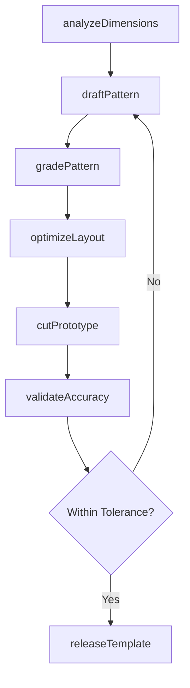
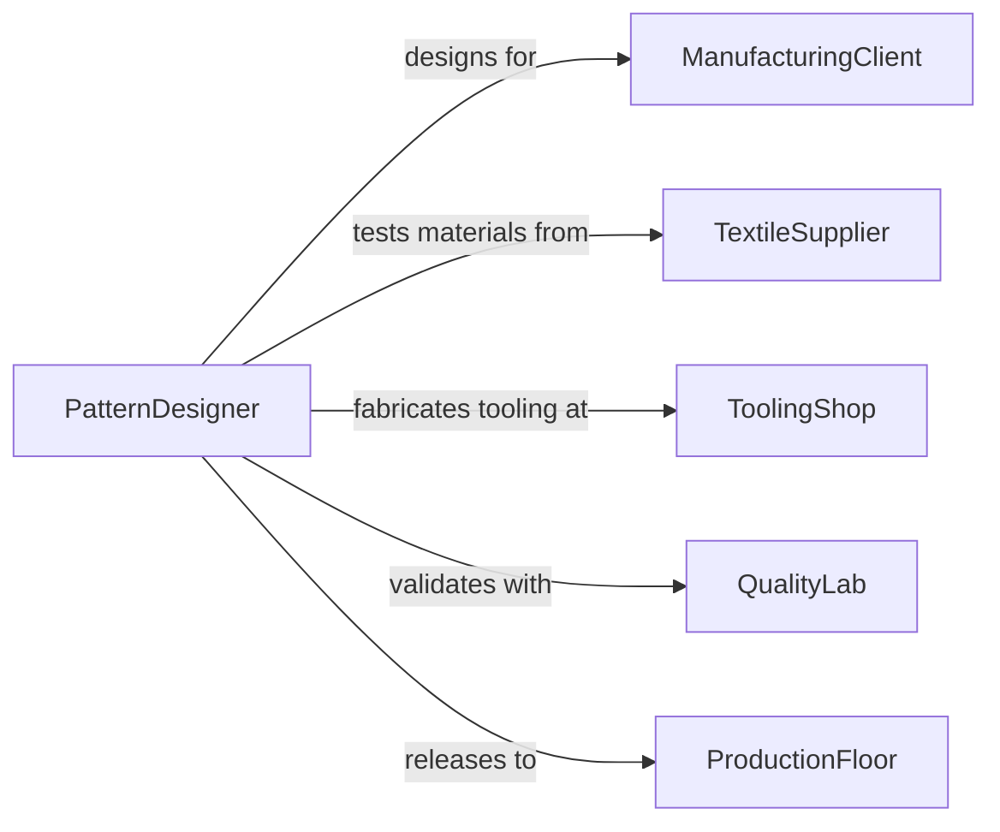

# Design Templates or Patterns

> Business-as-Code definition for designing templates and patterns used in manufacturing, garment production, printing, and digital layout systems to ensure consistent replication of forms, shapes, and designs.

## Overview

Template and pattern design involves creating precise reference guides, cutting patterns, molds, and digital templates that enable repeatable production of physical or digital goods. This definition models the workflow from dimensional analysis through pattern drafting, grading, prototyping, and release for production use.

## Actors

| Actor | Description |
|-------|-------------|
| ManufacturingClient | Organization commissioning templates for production |
| TextileSupplier | Provider of fabrics and materials for pattern testing |
| ToolingShop | Facility that fabricates physical templates and dies |
| QualityLab | Testing facility verifying template accuracy |
| ProductionFloor | Manufacturing line consuming templates for output |

## Roles

| Role | Description |
|------|-------------|
| PatternDesigner | Creates and grades templates and patterns |
| PatternGrader | Scales patterns across sizes or dimensions |
| PrototypeSpecialist | Tests templates through sample production |
| TemplateEngineer | Develops precision tooling templates for manufacturing |

## Entities

| Entity | Description |
|--------|-------------|
| MasterPattern | The original full-scale pattern or template |
| GradedPattern | Scaled versions of the master across size ranges |
| CuttingLayout | Optimized arrangement of pattern pieces on material |
| DigitalTemplate | CAD-based pattern file for automated cutting |
| PrototypeSample | Test piece produced from the template |
| ToleranceSpecification | Allowed dimensional variation for the pattern |
| PatternLibrary | Repository of approved templates for reuse |

## Actions

| Action | Description |
|--------|-------------|
| analyzeDimensions | Measure and define the dimensional requirements |
| draftPattern | Create the initial master pattern or template |
| gradePattern | Scale the pattern across required size ranges |
| optimizeLayout | Arrange pattern pieces to minimize material waste |
| cutPrototype | Produce a test sample from the pattern |
| validateAccuracy | Verify dimensional conformance to specifications |
| releaseTemplate | Approve and distribute the template for production |

## Events

| Event | Description |
|-------|-------------|
| dimensionsAnalyzed | Required measurements have been defined |
| patternDrafted | Master pattern has been created |
| patternGraded | Size-range scaling is complete |
| layoutOptimized | Cutting arrangement has been finalized |
| prototypeCut | Test sample has been produced |
| accuracyValidated | Dimensional verification has passed |
| templateReleased | Template has been approved for production use |

## Searches

| Search | Description |
|--------|-------------|
| findPatterns | Search templates by product type or category |
| getGradedSizes | Retrieve size-range variants for a pattern |
| listPrototypes | Enumerate test samples by pattern or status |
| getLayouts | Look up cutting layouts for a pattern |
| findByTolerance | Search templates by dimensional accuracy class |

## Workflow



## Actor Relationships



## Usage

### Calling Actions

```typescript
import { designTemplatesPatterns } from '@headlessly/design-templates-patterns'

const patterns = designTemplatesPatterns()

// Analyze dimensional requirements
const dims = await patterns.analyzeDimensions({
  product: 'structured-blazer',
  baseSize: 'M',
  measurements: { chest: 102, waist: 88, shoulder: 46, length: 72, unit: 'cm' }
})

// Draft the master pattern
const master = await patterns.draftPattern({
  dimensionsId: dims.id,
  pieceCount: 14,
  seamAllowance: 1.5,
  grainLine: true,
  notchMarks: true
})

// Grade across size range
await patterns.gradePattern({
  patternId: master.id,
  sizeRange: ['XS', 'S', 'M', 'L', 'XL', '2XL'],
  gradingRules: 'ASTM-D5585'
})
```

### Event-Driven Automation

```typescript
// Notify production when template is released
patterns.templateReleased(async ({ patternId, product }) => {
  await notify({
    to: 'production-planning',
    message: `Pattern ${patternId} for ${product} is approved and ready for cutting`
  })
})

// Auto-optimize layout after grading is complete
patterns.patternGraded(async ({ patternId }) => {
  await patterns.optimizeLayout({
    patternId,
    materialWidth: 150,
    unit: 'cm',
    nesting: 'best-fit'
  })
})
```
