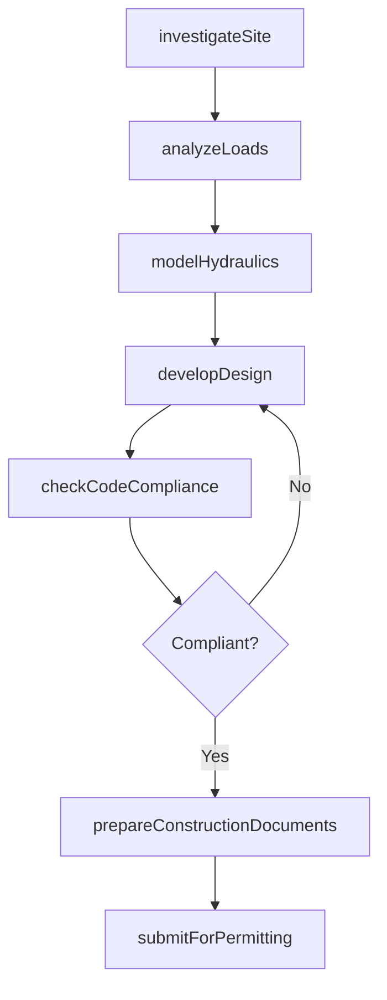
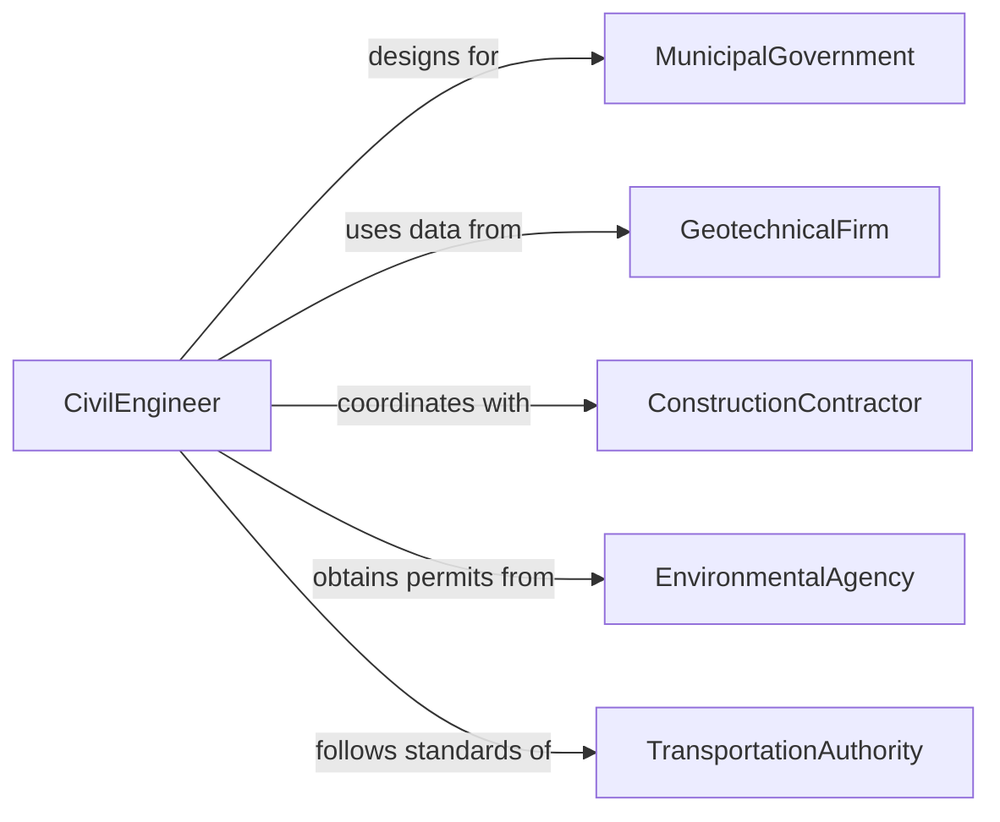

# Design Civil Structures or Systems

> Business-as-Code definition for designing civil engineering structures and infrastructure systems including bridges, roadways, dams, and water treatment facilities.

## Overview

Civil structure and system design involves geotechnical analysis, structural calculations, hydraulic modeling, and construction document preparation for public infrastructure and private development projects. This definition models the engineering design process from site investigation through structural analysis, design development, and construction-ready documentation.

## Actors

| Actor | Description |
|-------|-------------|
| MunicipalGovernment | Public entity commissioning infrastructure projects |
| GeotechnicalFirm | Specialist firm providing subsurface investigation data |
| ConstructionContractor | Builder executing designs in the field |
| EnvironmentalAgency | Regulatory body overseeing environmental impact |
| TransportationAuthority | Agency governing road and bridge standards |
| UtilityDistrict | Provider of water, sewer, or stormwater services |

## Roles

| Role | Description |
|------|-------------|
| CivilEngineer | Designs structural and infrastructure systems |
| StructuralAnalyst | Performs load calculations and finite element analysis |
| HydrologicEngineer | Models water flow and drainage systems |
| ProjectEngineer | Coordinates design phases and deliverables |

## Entities

| Entity | Description |
|--------|-------------|
| StructuralDesign | Engineering drawings and calculations for a structure |
| GeotechnicalReport | Subsurface investigation and soil analysis data |
| HydraulicModel | Simulation of water flow through the system |
| LoadCalculation | Analysis of forces acting on a structural element |
| ConstructionDocument | Final drawings and specifications for building |
| DesignStandard | Code or specification governing the design approach |
| RightOfWay | Legal boundary for infrastructure construction |

## Actions

| Action | Description |
|--------|-------------|
| investigateSite | Collect geotechnical and survey data |
| analyzeLoads | Calculate forces and stresses on structural elements |
| modelHydraulics | Simulate water flow and drainage behavior |
| developDesign | Create structural drawings and engineering calculations |
| checkCodeCompliance | Verify design meets applicable standards |
| prepareConstructionDocuments | Produce final drawings and specifications |
| submitForPermitting | File design with authorities for construction approval |

## Events

| Event | Description |
|-------|-------------|
| siteInvestigated | Geotechnical and survey data have been collected |
| loadsAnalyzed | Structural force calculations are complete |
| hydraulicsModeled | Water flow simulation has been performed |
| designDeveloped | Structural drawings and calculations are ready |
| codeComplianceChecked | Design has been verified against standards |
| constructionDocumentsPrepared | Final drawings and specs are complete |
| permitSubmitted | Design has been filed for construction approval |

## Searches

| Search | Description |
|--------|-------------|
| findDesigns | Search structural designs by project or structure type |
| getGeotechnicalData | Retrieve subsurface investigation results |
| listLoadCalculations | Enumerate force analyses for a structure |
| getHydraulicModels | Look up water flow simulations by project |
| getPermitStatus | Check construction permit application progress |

## Workflow



## Actor Relationships



## Usage

### Calling Actions

```typescript
import { designCivilStructuresSystems } from '@headlessly/design-civil-structures-systems'

const civil = designCivilStructuresSystems()

// Investigate the site
const site = await civil.investigateSite({
  location: { lat: 38.9072, lng: -77.0369 },
  projectType: 'highway-bridge',
  borings: 12,
  soilClassification: 'required'
})

// Analyze structural loads
const loads = await civil.analyzeLoads({
  siteId: site.id,
  structureType: 'steel-girder-bridge',
  designLoad: { hl93: true, laneWidth: 3.6, spans: [30, 45, 30] }
})

// Develop the design
await civil.developDesign({
  siteId: site.id,
  loadAnalysisId: loads.id,
  designCode: 'AASHTO-LRFD-9th',
  materials: { superstructure: 'A709-Grade-50', substructure: 'Class-B-Concrete' }
})
```

### Event-Driven Automation

```typescript
// Notify construction team when documents are ready
civil.constructionDocumentsPrepared(async ({ projectId }) => {
  await notify({
    to: 'construction-management',
    message: `Construction documents ready for project ${projectId}`
  })
})

// Auto-submit for permitting after code compliance
civil.codeComplianceChecked(async ({ projectId, passed }) => {
  if (passed) {
    await civil.submitForPermitting({ projectId })
  }
})
```
