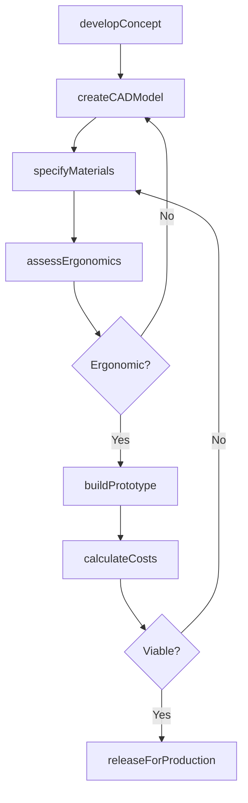
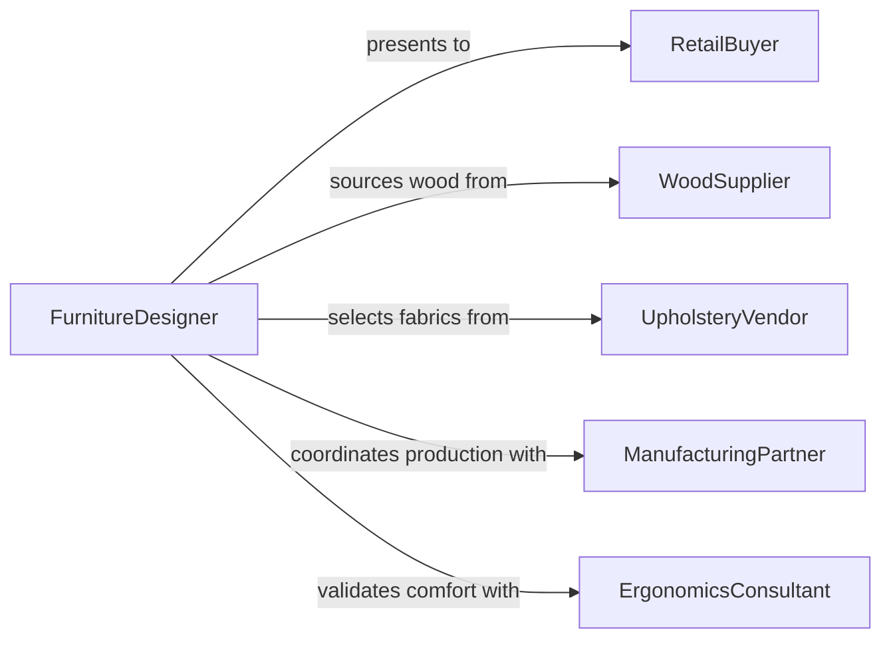

# Design Furniture

> Business-as-Code definition for designing furniture pieces and collections, from concept sketching through material specification, prototyping, and production-ready documentation.

## Overview

Furniture design involves translating functional requirements and aesthetic vision into producible pieces that meet ergonomic standards, material constraints, and manufacturing capabilities. This definition models the complete design process from initial concept development through 3D modeling, material and finish selection, prototype fabrication, and production specification release.

## Actors

| Actor | Description |
|-------|-------------|
| RetailBuyer | Wholesale or retail customer purchasing furniture lines |
| WoodSupplier | Vendor providing lumber and wood-based materials |
| UpholsteryVendor | Supplier of fabrics, foams, and textile components |
| ManufacturingPartner | Factory producing furniture at scale |
| ErgonomicsConsultant | Specialist advising on human factors and comfort |
| InteriorDesignClient | Designer or end user specifying custom furniture |

## Roles

| Role | Description |
|------|-------------|
| FurnitureDesigner | Creates furniture concepts and detailed designs |
| IndustrialDesigner | Develops production-ready specifications |
| Prototyper | Builds physical samples for testing and review |
| MaterialCoordinator | Sources and specifies materials and finishes |

## Entities

| Entity | Description |
|--------|-------------|
| DesignConcept | Initial sketch or rendering of a furniture piece |
| CADModel | Three-dimensional digital model of the furniture |
| MaterialSpecification | Detailed list of materials, finishes, and hardware |
| Prototype | Physical sample built to test the design |
| ProductionDrawing | Manufacturing-ready technical drawing |
| ErgonomicAssessment | Evaluation of comfort, posture, and human factors |
| FinishSample | Physical sample of color, texture, or coating |
| CostSheet | Detailed breakdown of material and production costs |

## Actions

| Action | Description |
|--------|-------------|
| developConcept | Sketch initial furniture ideas and forms |
| createCADModel | Build a detailed 3D digital model of the design |
| specifyMaterials | Select wood species, fabrics, hardware, and finishes |
| assessErgonomics | Evaluate the design for comfort and human factors |
| buildPrototype | Fabricate a physical sample of the design |
| calculateCosts | Estimate material and production expenses |
| releaseForProduction | Finalize drawings and specs for manufacturing |

## Events

| Event | Description |
|-------|-------------|
| conceptDeveloped | Initial furniture concept has been sketched |
| cadModelCreated | A 3D digital model has been built |
| materialsSpecified | Materials and finishes have been selected |
| ergonomicsAssessed | Comfort and human factors have been evaluated |
| prototypeBuilt | A physical sample has been fabricated |
| costsCalculated | Production cost estimates are complete |
| releasedForProduction | Design is finalized for manufacturing |

## Searches

| Search | Description |
|--------|-------------|
| findDesigns | Search furniture designs by collection or type |
| getMaterials | Retrieve material specifications for a design |
| listPrototypes | Enumerate prototypes by status or design |
| getCostSheets | Look up production cost breakdowns |
| findByStyle | Search designs by aesthetic style or era |

## Workflow



## Actor Relationships



## Usage

### Calling Actions

```typescript
import { designFurniture } from '@headlessly/design-furniture'

const furniture = designFurniture()

// Develop a concept
const concept = await furniture.developConcept({
  name: 'Alder Lounge Chair',
  collection: 'Pacific Modern',
  type: 'lounge-chair',
  style: 'mid-century-modern',
  inspirations: ['Danish-teak', 'organic-forms']
})

// Create 3D model
const model = await furniture.createCADModel({
  conceptId: concept.id,
  dimensions: { width: 750, depth: 820, height: 780, seatHeight: 420 },
  unit: 'mm'
})

// Specify materials
await furniture.specifyMaterials({
  modelId: model.id,
  frame: { species: 'white-oak', finish: 'natural-oil' },
  upholstery: { fabric: 'wool-blend', color: 'charcoal', density: '35kg/m3' },
  hardware: { joints: 'mortise-and-tenon', glides: 'felt' }
})
```

### Event-Driven Automation

```typescript
// Auto-calculate costs after prototype is built
furniture.prototypeBuilt(async ({ designId }) => {
  await furniture.calculateCosts({ designId })
})

// Notify retail team when production-ready
furniture.releasedForProduction(async ({ designId, collection }) => {
  await notify({
    to: 'sales-team',
    message: `${collection} collection: ${designId} is production-ready and available for ordering`
  })
})
```
