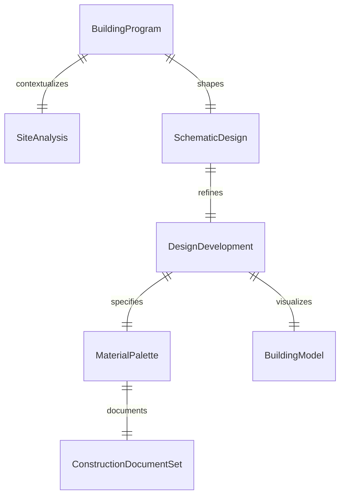
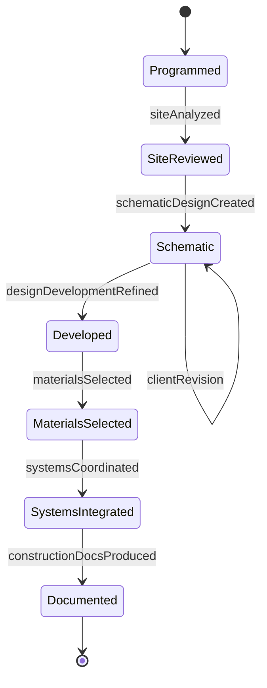
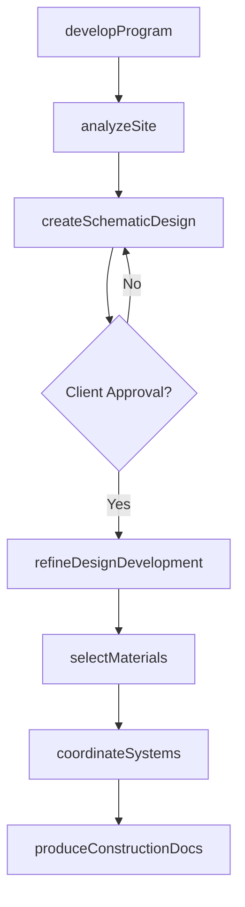
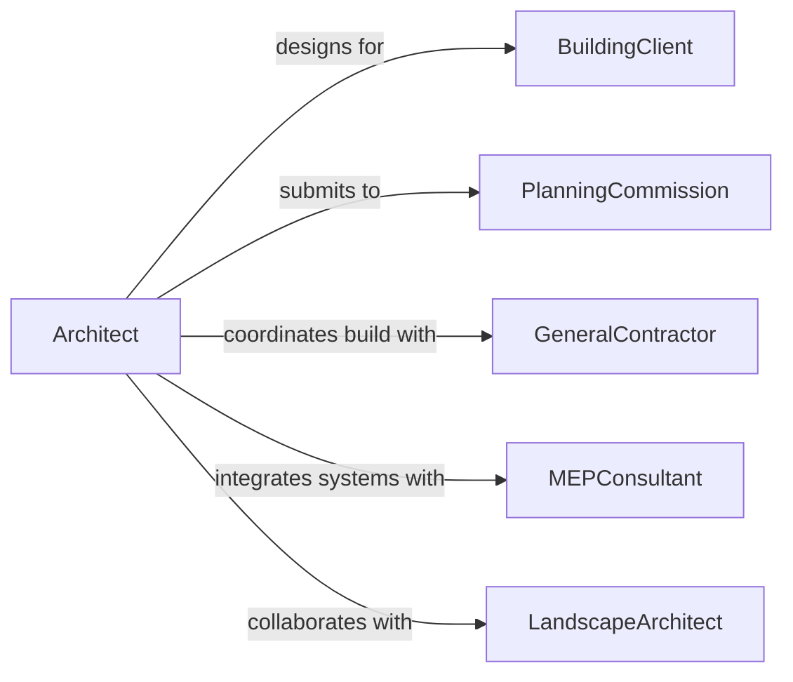

# Design Structures or Facilities

> Business-as-Code definition for designing buildings, structures, and facilities from concept through detailed architectural and engineering documentation.

## Overview

Structure and facility design encompasses architectural programming, schematic design, design development, and construction documentation for buildings and specialized facilities. This definition models the design workflow from client requirements and site analysis through space planning, material selection, systems integration, and regulatory review, producing complete documentation packages for construction.

## Actors

| Actor | Description |
|-------|-------------|
| BuildingClient | Organization or individual commissioning the facility |
| PlanningCommission | Local government body reviewing zoning and land use |
| GeneralContractor | Construction firm that will build the facility |
| MEPConsultant | Mechanical, electrical, and plumbing engineering firm |
| InteriorDesigner | Specialist defining interior finishes and furnishings |
| LandscapeArchitect | Designer of exterior grounds and site features |

## Roles

| Role | Description |
|------|-------------|
| Architect | Leads the overall facility design process |
| StructuralEngineer | Designs the building structural system |
| ProjectArchitect | Manages design phases and coordinates disciplines |
| CodeConsultant | Reviews design for building code compliance |

## Entities

| Entity | Description |
|--------|-------------|
| SchematicDesign | Initial design concept drawings and layouts |
| DesignDevelopment | Detailed drawings refining the schematic design |
| ConstructionDocumentSet | Complete drawings and specifications for building |
| BuildingProgram | Document defining space requirements and functions |
| SiteAnalysis | Assessment of site conditions, orientation, and access |
| MaterialPalette | Selected finishes, cladding, and structural materials |
| BuildingModel | Three-dimensional digital representation of the design |

## Actions

| Action | Description |
|--------|-------------|
| developProgram | Define space requirements and functional relationships |
| analyzeSite | Assess site conditions, solar orientation, and access |
| createSchematicDesign | Develop initial design concepts and layouts |
| refineDesignDevelopment | Detail the design with materials and systems |
| selectMaterials | Choose structural and finish materials |
| coordinateSystems | Integrate MEP, structural, and architectural systems |
| produceConstructionDocs | Generate final drawings and specifications |

## Events

| Event | Description |
|-------|-------------|
| programDeveloped | Space requirements have been defined |
| siteAnalyzed | Site conditions have been assessed |
| schematicDesignCreated | Initial design concepts are ready |
| designDevelopmentRefined | Detailed design is complete |
| materialsSelected | Building materials have been chosen |
| systemsCoordinated | All building systems have been integrated |
| constructionDocsProduced | Final construction documents are complete |

## Searches

| Search | Description |
|--------|-------------|
| findDesignProjects | Search projects by type, phase, or status |
| getSiteAnalysis | Retrieve site condition data for a project |
| listMaterials | Enumerate selected materials by project |
| getDesignPhase | Check the current design phase status |
| findBuildingModels | Locate 3D model files by project |

## Entity Relationships



## State Diagram



## Workflow



## Actor Relationships



## Usage

### Calling Actions

```typescript
import { designStructuresFacilities } from '@headlessly/design-structures-facilities'

const facility = designStructuresFacilities()

// Develop the building program
const program = await facility.developProgram({
  projectName: 'Regional Medical Center',
  totalArea: 250000,
  unit: 'sqft',
  departments: [
    { name: 'Emergency', area: 35000, adjacency: ['Imaging', 'Surgery'] },
    { name: 'Surgery', area: 40000, adjacency: ['Emergency', 'ICU'] },
    { name: 'ICU', area: 20000, adjacency: ['Surgery'] },
    { name: 'Imaging', area: 15000 }
  ]
})

// Create schematic design
const schematic = await facility.createSchematicDesign({
  programId: program.id,
  stories: 4,
  structuralSystem: 'steel-frame',
  floorToFloorHeight: 4.2
})

// Select materials
await facility.selectMaterials({
  projectId: schematic.projectId,
  exterior: { cladding: 'curtain-wall', roofing: 'TPO-membrane' },
  interior: { flooring: 'LVT-and-epoxy', ceilings: 'acoustic-tile' }
})
```

### Event-Driven Automation

```typescript
// Notify contractor when construction docs are complete
facility.constructionDocsProduced(async ({ projectId }) => {
  await notify({
    to: 'general-contractor',
    message: `Construction documents complete for project ${projectId} - ready for bidding`
  })
})

// Trigger systems coordination after design development
facility.designDevelopmentRefined(async ({ projectId }) => {
  await facility.coordinateSystems({ projectId })
})
```
