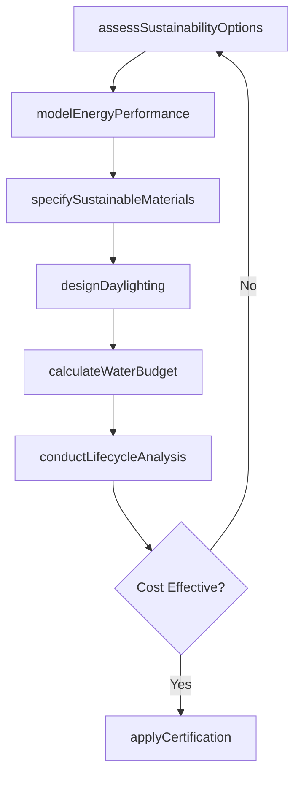

# Incorporate Green Features into the Design of Structures or Facilities

> Business-as-Code definition for integrating sustainable design elements such as energy efficiency, renewable materials, water conservation, and indoor environmental quality into building and facility designs.

## Overview

Green feature incorporation involves evaluating sustainable design options, modeling energy performance, selecting eco-friendly materials, and pursuing green building certifications. This definition covers the process of identifying applicable sustainability strategies, integrating them into architectural and engineering designs, performing lifecycle cost analysis, and documenting compliance with green building standards such as LEED and WELL.

## Actors

| Actor | Description |
|-------|-------------|
| GreenBuildingCouncil | Organization administering sustainability certifications |
| EnergyConsultant | Specialist modeling building energy performance |
| SustainableMaterialSupplier | Vendor providing recycled or low-impact building products |
| UtilityCompany | Energy provider offering rebates for efficient design |
| BuildingOwner | Client seeking sustainable design for their facility |
| EnvironmentalReviewer | Third party assessing environmental impact of design |

## Roles

| Role | Description |
|------|-------------|
| SustainabilityArchitect | Integrates green features into building designs |
| EnergyModeler | Simulates building energy consumption and savings |
| MaterialSpecialist | Selects sustainable and low-impact building materials |
| CertificationCoordinator | Manages green building certification applications |

## Entities

| Entity | Description |
|--------|-------------|
| GreenDesignFeature | A specific sustainable element integrated into the design |
| EnergyModel | Simulation of building energy consumption and performance |
| MaterialSchedule | List of sustainable materials specified for the project |
| CertificationApplication | Submission for green building certification |
| LifecycleCostAnalysis | Comparison of upfront costs versus long-term savings |
| DaylightingStudy | Analysis of natural light distribution in the design |
| WaterBudget | Projected water consumption and conservation measures |

## Actions

| Action | Description |
|--------|-------------|
| assessSustainabilityOptions | Evaluate applicable green features for the project |
| modelEnergyPerformance | Simulate building energy use and savings potential |
| specifySustainableMaterials | Select eco-friendly products for the design |
| designDaylighting | Optimize natural light distribution in the building |
| calculateWaterBudget | Project water use and conservation measures |
| conductLifecycleAnalysis | Compare costs and savings over the building lifespan |
| applyCertification | Submit for green building certification review |

## Events

| Event | Description |
|-------|-------------|
| sustainabilityOptionsAssessed | Green feature options have been evaluated |
| energyPerformanceModeled | Building energy simulation is complete |
| sustainableMaterialsSpecified | Eco-friendly products have been selected |
| daylightingDesigned | Natural light optimization is complete |
| waterBudgetCalculated | Water use projections have been established |
| lifecycleAnalysisCompleted | Cost-benefit comparison is finished |
| certificationApplied | Green building certification has been submitted |

## Searches

| Search | Description |
|--------|-------------|
| findGreenFeatures | Search sustainable design elements by category |
| getEnergyModels | Retrieve energy performance simulations |
| listSustainableMaterials | Enumerate eco-friendly products in the specification |
| getCertificationStatus | Check green building certification progress |
| getLifecycleAnalysis | Look up cost-benefit data for green features |

## Entity Relationships


## State Diagram


## Workflow



## Actor Relationships


## Usage

### Calling Actions

```typescript
import { incorporateGreenFeaturesIntoDesign } from '@headlessly/incorporate-green-features-into-design'

const greenDesign = incorporateGreenFeaturesIntoDesign()

// Assess sustainability options
const options = await greenDesign.assessSustainabilityOptions({
  projectType: 'commercial-office',
  location: 'Austin, TX',
  targetCertification: 'LEED-Gold',
  categories: ['energy', 'water', 'materials', 'indoor-quality']
})

// Model energy performance
const energyModel = await greenDesign.modelEnergyPerformance({
  projectId: options.projectId,
  features: [
    { type: 'solar-panels', capacity: 200, unit: 'kW' },
    { type: 'high-performance-glazing', uValue: 0.25 },
    { type: 'variable-refrigerant-flow', cop: 4.2 }
  ],
  baselineCode: 'ASHRAE-90.1-2019'
})

// Conduct lifecycle analysis
await greenDesign.conductLifecycleAnalysis({
  projectId: options.projectId,
  horizon: 30,
  discountRate: 0.03
})
```

### Event-Driven Automation

```typescript
// Notify team when energy model shows significant savings
greenDesign.energyPerformanceModeled(async ({ projectId, savingsPercent }) => {
  if (savingsPercent > 30) {
    await notify({
      to: 'design-team',
      message: `Energy model shows ${savingsPercent}% savings over baseline for project ${projectId}`
    })
  }
})

// Auto-apply for certification when lifecycle analysis is favorable
greenDesign.lifecycleAnalysisCompleted(async ({ projectId, roi }) => {
  if (roi > 0) {
    await greenDesign.applyCertification({ projectId })
  }
})
```
