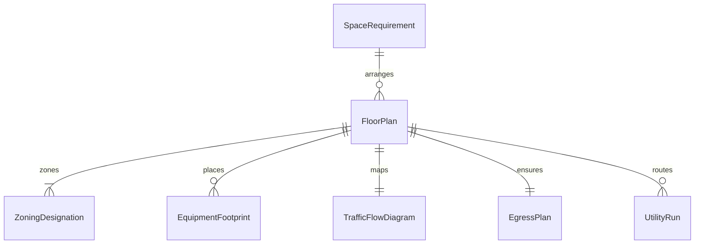
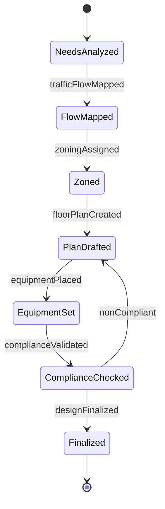
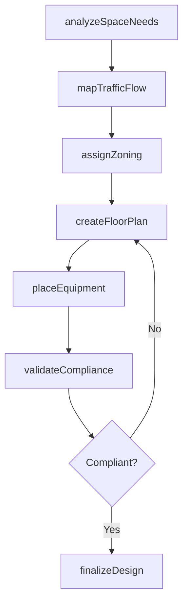
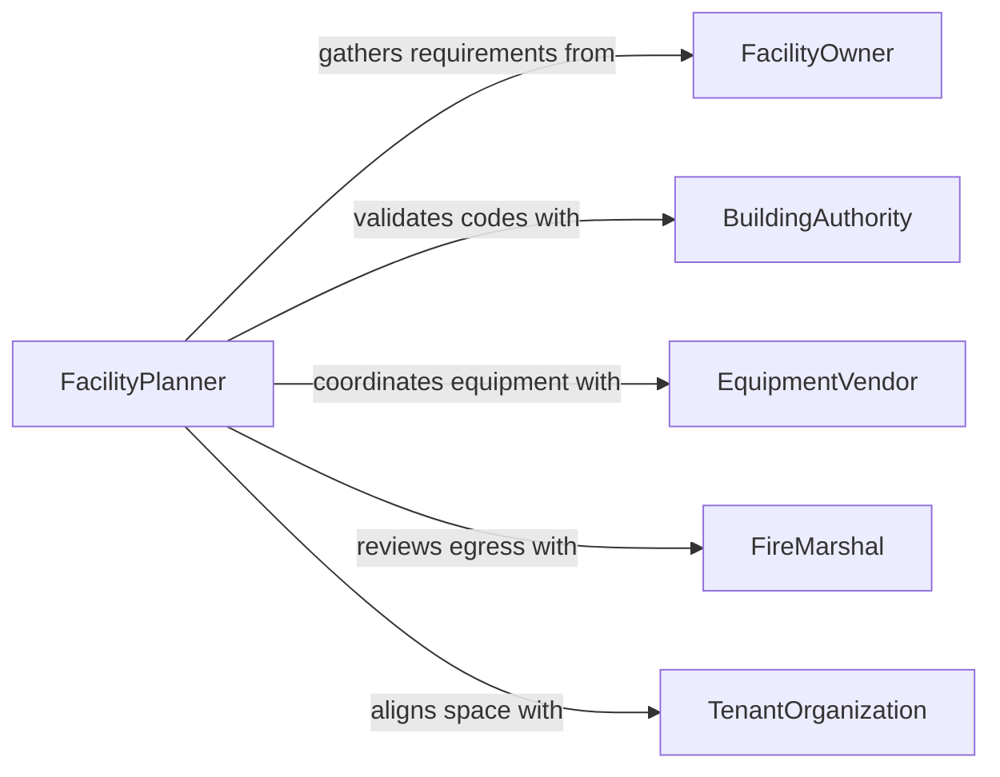

# Plan Facility Layouts or Designs

> Business-as-Code definition for planning the spatial arrangement, workflow optimization, and functional zoning of commercial, industrial, and institutional facilities.

## Overview

Facility layout planning involves analyzing space requirements, traffic flow patterns, equipment placement, and building code compliance to create optimal arrangements for operational efficiency and safety. This definition models the planning process from space needs analysis through layout development, stakeholder review, and final design documentation.

## Actors

| Actor | Description |
|-------|-------------|
| FacilityOwner | Organization commissioning the layout design |
| BuildingAuthority | Government body enforcing zoning and building codes |
| EquipmentVendor | Supplier of machinery requiring specific floor space |
| FireMarshal | Official reviewing egress and fire safety compliance |
| TenantOrganization | Department or business occupying the facility |
| ArchitecturalFirm | External design firm providing layout services |

## Roles

| Role | Description |
|------|-------------|
| FacilityPlanner | Designs spatial arrangements and flow patterns |
| SpaceAnalyst | Calculates area requirements and utilization rates |
| SafetyOfficer | Ensures layout compliance with safety regulations |
| OperationsManager | Defines workflow requirements for the space |

## Entities

| Entity | Description |
|--------|-------------|
| FloorPlan | Two-dimensional layout drawing of the facility |
| SpaceRequirement | Documented area and adjacency needs for each function |
| TrafficFlowDiagram | Map of pedestrian and material movement patterns |
| ZoningDesignation | Classification of areas by function or use type |
| EquipmentFootprint | Space allocation for specific machinery or fixtures |
| EgressPlan | Emergency exit routes and assembly areas |
| UtilityRun | Routing of electrical, plumbing, and HVAC systems |

## Actions

| Action | Description |
|--------|-------------|
| analyzeSpaceNeeds | Calculate area requirements for each functional zone |
| mapTrafficFlow | Document movement patterns for people and materials |
| createFloorPlan | Draft the spatial arrangement of the facility |
| assignZoning | Designate areas for specific functions or departments |
| placeEquipment | Position machinery and fixtures within the layout |
| validateCompliance | Check the layout against building codes and safety standards |
| finalizeDesign | Complete and distribute the approved layout |

## Events

| Event | Description |
|-------|-------------|
| spaceNeedsAnalyzed | Area requirements have been calculated |
| trafficFlowMapped | Movement patterns have been documented |
| floorPlanCreated | A layout drawing has been drafted |
| zoningAssigned | Functional area designations have been set |
| equipmentPlaced | Machinery positions have been determined |
| complianceValidated | Building code review has passed |
| designFinalized | The approved layout has been completed |

## Searches

| Search | Description |
|--------|-------------|
| findFloorPlans | Search layouts by facility, version, or status |
| getSpaceUtilization | Retrieve area allocation and occupancy data |
| listEquipmentPlacements | Enumerate machinery positions by zone |
| getComplianceStatus | Check code compliance for a layout |
| findTrafficFlowDiagrams | Locate movement pattern documentation |

## Entity Relationships



## State Diagram



## Workflow



## Actor Relationships



## Usage

### Calling Actions

```typescript
import { planFacilityLayoutsDesigns } from '@headlessly/plan-facility-layouts-designs'

const layout = planFacilityLayoutsDesigns()

// Analyze space needs
const needs = await layout.analyzeSpaceNeeds({
  facilityType: 'distribution-center',
  totalArea: 150000,
  unit: 'sqft',
  zones: [
    { name: 'receiving', minArea: 15000 },
    { name: 'storage', minArea: 80000 },
    { name: 'packing', minArea: 25000 },
    { name: 'shipping', minArea: 20000 },
    { name: 'office', minArea: 10000 }
  ]
})

// Create floor plan
const plan = await layout.createFloorPlan({
  needsId: needs.id,
  format: 'CAD',
  scale: '1:100'
})

// Validate compliance
await layout.validateCompliance({
  planId: plan.id,
  codes: ['IBC-2021', 'ADA', 'NFPA-101']
})
```

### Event-Driven Automation

```typescript
// Notify stakeholders when layout is finalized
layout.designFinalized(async ({ facilityId, planId }) => {
  await notify({
    to: 'construction-team',
    message: `Facility layout ${planId} finalized and ready for construction documents`
  })
})

// Flag compliance issues immediately
layout.complianceValidated(async ({ planId, issues }) => {
  if (issues.length > 0) {
    await notify({
      to: 'facility-planning',
      message: `Layout ${planId} has ${issues.length} compliance issues to resolve`
    })
  }
})
```
