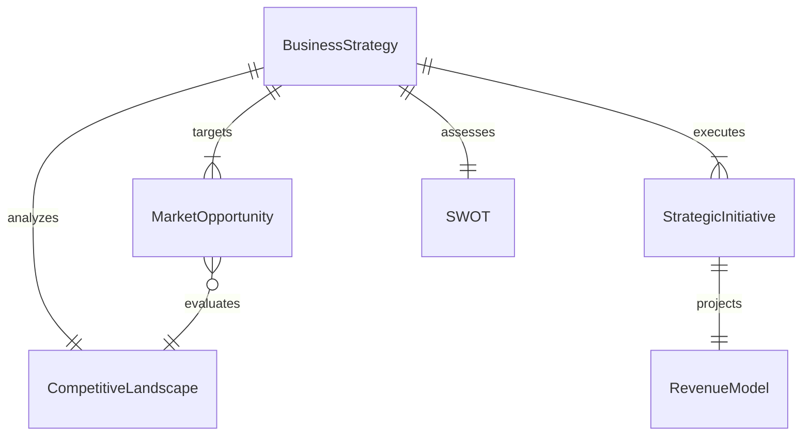
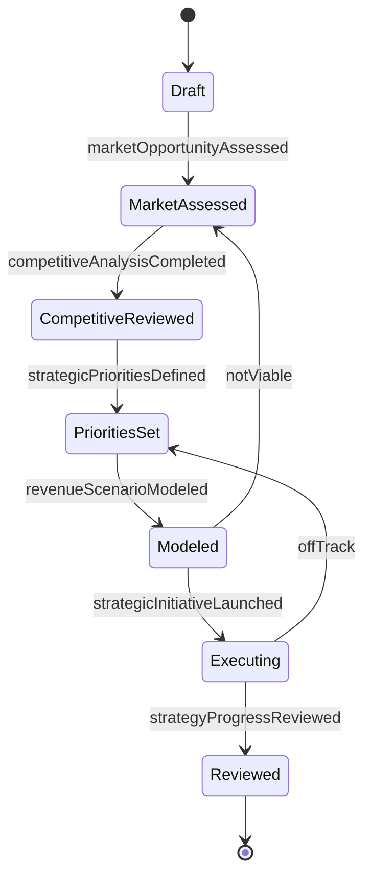
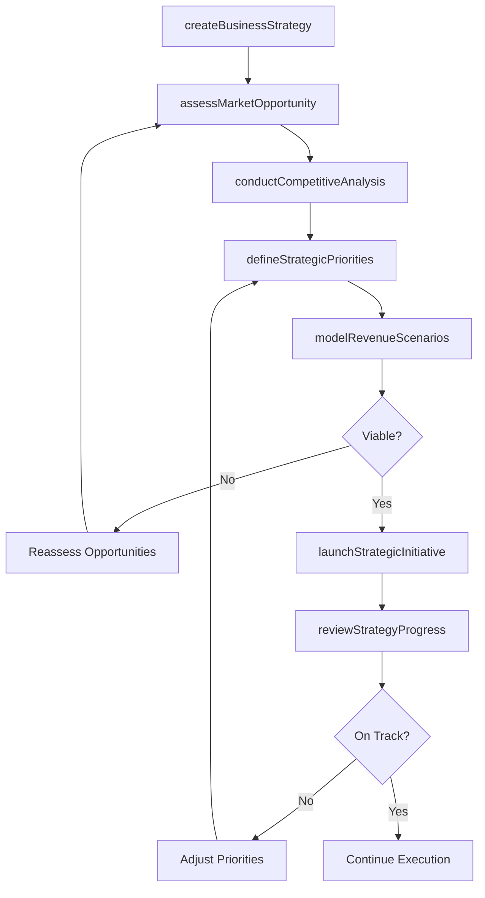
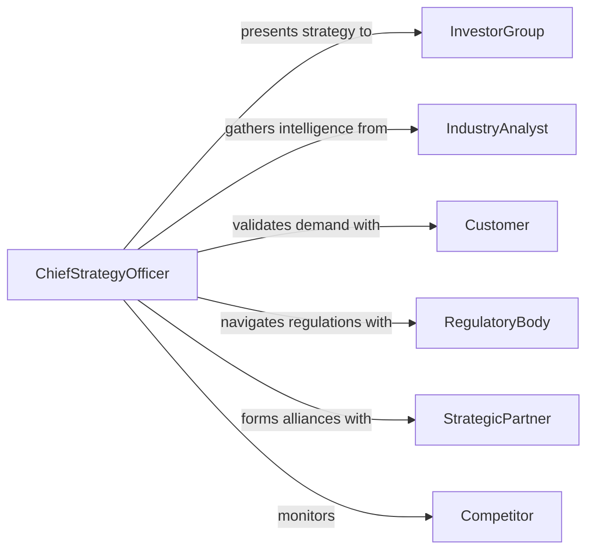

# Develop Business Market Strategies

> Business-as-Code definition for developing business and market strategies that align organizational capabilities with market opportunities to drive sustainable competitive advantage.

## Overview

Developing business or market strategies involves assessing the competitive landscape, identifying growth opportunities, defining strategic priorities, and creating actionable plans for market entry, expansion, or repositioning. This definition exposes actions for strategy formulation, market opportunity assessment, and strategic initiative management. It provides events for automating strategic review cycles and searches for retrieving market intelligence and strategy performance data.

## Actors

| Actor | Description |
|-------|-------------|
| InvestorGroup | Shareholders and investors who evaluate and fund strategic initiatives |
| IndustryAnalyst | External analyst providing market intelligence and industry forecasts |
| Customer | Current or prospective buyer whose needs shape market strategy |
| RegulatoryBody | Government or industry authority whose policies affect market entry |
| StrategicPartner | Organization with complementary capabilities for joint market approaches |
| Competitor | Rival organization whose actions influence strategic positioning |

## Roles

| Role | Description |
|------|-------------|
| ChiefStrategyOfficer | Leads enterprise strategy development and portfolio decisions |
| BusinessDevelopmentManager | Identifies market opportunities and partnership prospects |
| StrategyAnalyst | Conducts market research, modeling, and scenario analysis |
| ProductStrategist | Aligns product roadmap with business strategy and market demand |
| FinancialPlanner | Models financial projections and investment requirements for initiatives |

## Entities

| Entity | Description |
|--------|-------------|
| BusinessStrategy | A plan defining organizational direction, priorities, and competitive approach |
| MarketOpportunity | An identified gap or demand in the market that can be addressed |
| CompetitiveLandscape | An assessment of industry rivals, their positioning, and market share |
| StrategicInitiative | A specific project or program that executes part of the strategy |
| SWOT | A structured analysis of strengths, weaknesses, opportunities, and threats |
| RevenueModel | A framework defining how the organization generates income from market activities |

## Actions

| Action | Description |
|--------|-------------|
| createBusinessStrategy | Initialize a new business or market strategy document |
| assessMarketOpportunity | Evaluate a potential market segment or growth opportunity |
| conductCompetitiveAnalysis | Analyze competitor positioning, capabilities, and market share |
| defineStrategicPriorities | Establish the key focus areas and resource allocation for the strategy |
| modelRevenueScenarios | Project financial outcomes under different strategic approaches |
| launchStrategicInitiative | Activate a specific initiative to execute part of the strategy |
| reviewStrategyProgress | Evaluate execution progress and results against strategic goals |

## Events

| Event | Description |
|-------|-------------|
| businessStrategyCreated | A new business strategy has been initialized |
| marketOpportunityAssessed | A market opportunity has been evaluated and scored |
| competitiveAnalysisCompleted | Competitor landscape analysis has been finalized |
| strategicPrioritiesDefined | Key strategic focus areas have been established |
| revenueScenarioModeled | Financial projections for a strategic approach have been completed |
| strategicInitiativeLaunched | A strategic initiative has been activated for execution |
| strategyProgressReviewed | Strategy execution has been evaluated against milestones |

## Searches

| Search | Description |
|--------|-------------|
| findBusinessStrategies | List strategies by status, business unit, or planning period |
| getMarketOpportunities | Retrieve market opportunities by segment, size, or priority score |
| getCompetitiveLandscape | Search competitor data by industry, market share, or capability |
| getInitiativeProgress | Retrieve execution status and KPIs for strategic initiatives |
| getRevenueProjections | Retrieve modeled revenue scenarios by strategy or time horizon |

## Entity Relationships



## State Diagram



## Workflow



## Actor Relationships



## Usage

### Calling Actions

```typescript
import { developBusinessMarketStrategies } from '@headlessly/develop-business-market-strategies'

const strategy = developBusinessMarketStrategies()

// Create a new business strategy
const plan = await strategy.createBusinessStrategy({
  name: 'APAC Market Expansion 2026',
  horizon: '3-year',
  businessUnit: 'International',
  objectives: ['Enter 3 new markets', 'Achieve $10M ARR in region']
})

// Assess market opportunities
const opportunity = await strategy.assessMarketOpportunity({
  strategyId: plan.id,
  market: 'Southeast Asia SaaS',
  factors: ['market-size', 'growth-rate', 'regulatory-environment', 'competition']
})

// Model revenue scenarios
await strategy.modelRevenueScenarios({
  strategyId: plan.id,
  scenarios: [
    { name: 'Conservative', assumptions: { marketShare: 0.02, growthRate: 0.15 } },
    { name: 'Aggressive', assumptions: { marketShare: 0.05, growthRate: 0.30 } }
  ]
})
```

### Event-Driven Automation

```typescript
// Trigger initiative launch when priorities are finalized
strategy.strategicPrioritiesDefined(async ({ strategyId, priorities }) => {
  for (const priority of priorities) {
    if (priority.readiness === 'approved') {
      await strategy.launchStrategicInitiative({
        strategyId,
        initiativeName: priority.name
      })
    }
  }
})

// Schedule periodic strategy reviews
strategy.strategicInitiativeLaunched(async ({ strategyId, initiativeId }) => {
  await scheduleRecurring('quarterly', () =>
    strategy.reviewStrategyProgress({ strategyId, initiativeId })
  )
})
```
