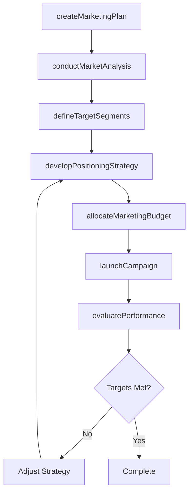
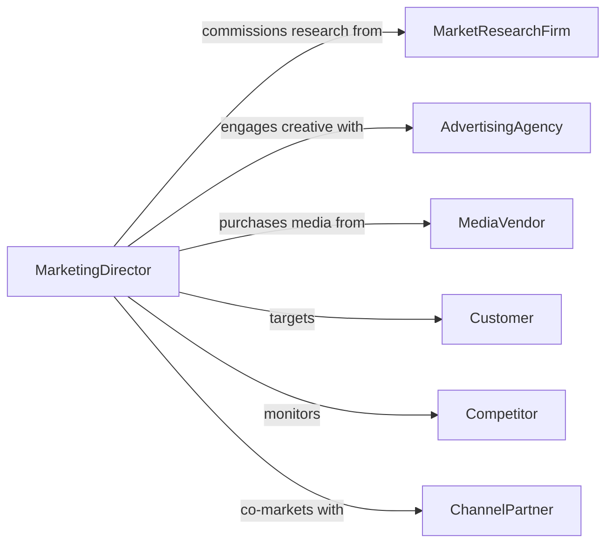

# Develop Marketing Plans Strategies

> Business-as-Code definition for developing comprehensive marketing plans and strategies that drive brand awareness, customer acquisition, and revenue growth.

## Overview

Developing marketing plans and strategies involves analyzing market conditions, defining target audiences, setting objectives, and designing coordinated campaigns across multiple channels. This definition exposes actions for each phase of the marketing planning lifecycle, from market research through execution and performance evaluation. It provides events for workflow automation around campaign milestones and searches for retrieving strategy, audience, and performance data.

## Actors

| Actor | Description |
|-------|-------------|
| Customer | End consumer or business buyer targeted by marketing efforts |
| AdvertisingAgency | External partner that creates and places advertising content |
| MarketResearchFirm | Third-party provider of market data, surveys, and competitive intelligence |
| MediaVendor | Platform or publisher that sells advertising inventory |
| Competitor | Rival organization whose positioning informs strategic decisions |
| ChannelPartner | Distribution or co-marketing partner that extends campaign reach |

## Roles

| Role | Description |
|------|-------------|
| MarketingDirector | Oversees marketing strategy development and resource allocation |
| BrandManager | Manages brand positioning, messaging consistency, and creative direction |
| MarketAnalyst | Conducts research and provides data-driven insights for planning |
| CampaignManager | Executes and monitors marketing campaigns across channels |
| ContentMarketer | Develops content assets that support campaign objectives |

## Entities

| Entity | Description |
|--------|-------------|
| MarketingPlan | A comprehensive document defining marketing objectives, strategies, and budgets |
| MarketSegment | A defined group of potential customers sharing common characteristics |
| Campaign | A coordinated set of marketing activities with specific goals and timelines |
| CompetitiveAnalysis | An assessment of competitor strategies, strengths, and market positioning |
| BrandGuideline | Standards governing brand voice, visual identity, and messaging |
| MarketingBudget | Financial allocation for marketing activities across channels and periods |

## Actions

| Action | Description |
|--------|-------------|
| createMarketingPlan | Initialize a new marketing plan with objectives and timeline |
| conductMarketAnalysis | Analyze market conditions, trends, and competitive landscape |
| defineTargetSegments | Identify and profile customer segments for targeting |
| developPositioningStrategy | Craft brand positioning and value propositions for each segment |
| allocateMarketingBudget | Distribute budget across channels, campaigns, and periods |
| launchCampaign | Activate a marketing campaign across selected channels |
| evaluatePerformance | Assess campaign results against defined objectives and KPIs |

## Events

| Event | Description |
|-------|-------------|
| marketingPlanCreated | A new marketing plan has been initialized |
| marketAnalysisCompleted | Market research and competitive analysis have been finalized |
| targetSegmentsDefined | Customer segments for targeting have been identified |
| positioningStrategyDeveloped | Brand positioning and value propositions have been established |
| budgetAllocated | Marketing budget has been distributed across channels |
| campaignLaunched | A marketing campaign has been activated |
| performanceEvaluated | Campaign performance has been assessed against KPIs |

## Searches

| Search | Description |
|--------|-------------|
| findMarketingPlans | List marketing plans by status, period, or business unit |
| getMarketSegments | Retrieve target segments by demographics, behavior, or value |
| getCampaignPerformance | Retrieve performance metrics for campaigns by channel or period |
| getCompetitiveInsights | Search competitive analysis data by competitor or market category |
| getBudgetUtilization | Retrieve budget spend and remaining allocation by channel |

## Workflow



## Actor Relationships



## Usage

### Calling Actions

```typescript
import { developMarketingPlansStrategies } from '@headlessly/develop-marketing-plans-strategies'

const marketing = developMarketingPlansStrategies()

// Create a new marketing plan
const plan = await marketing.createMarketingPlan({
  name: 'Q3 Product Launch Campaign',
  objectives: ['Increase brand awareness by 25%', 'Generate 5000 qualified leads'],
  period: { start: '2026-07-01', end: '2026-09-30' },
  totalBudget: 500000
})

// Conduct market analysis
const analysis = await marketing.conductMarketAnalysis({
  planId: plan.id,
  scope: ['market-size', 'competitor-positioning', 'customer-trends']
})

// Define target segments and allocate budget
await marketing.defineTargetSegments({
  planId: plan.id,
  segments: [
    { name: 'Enterprise Decision Makers', criteria: { role: 'C-Suite', companySize: '500+' } },
    { name: 'Growth-Stage Startups', criteria: { funding: 'Series A-C', employees: '50-200' } }
  ]
})

await marketing.allocateMarketingBudget({
  planId: plan.id,
  allocations: [
    { channel: 'Digital Advertising', amount: 200000 },
    { channel: 'Content Marketing', amount: 150000 },
    { channel: 'Events', amount: 150000 }
  ]
})
```

### Event-Driven Automation

```typescript
// Auto-launch campaigns when budget is allocated
marketing.budgetAllocated(async ({ planId }) => {
  const plan = await marketing.findMarketingPlans({ id: planId })
  if (plan.status === 'ready') {
    await marketing.launchCampaign({ planId })
  }
})

// Alert on underperformance
marketing.performanceEvaluated(async ({ planId, metrics }) => {
  if (metrics.leadConversion < 0.03) {
    await notify({
      to: 'marketing-director',
      message: `Campaign ${planId} lead conversion below 3% - strategy adjustment recommended`
    })
  }
})
```
