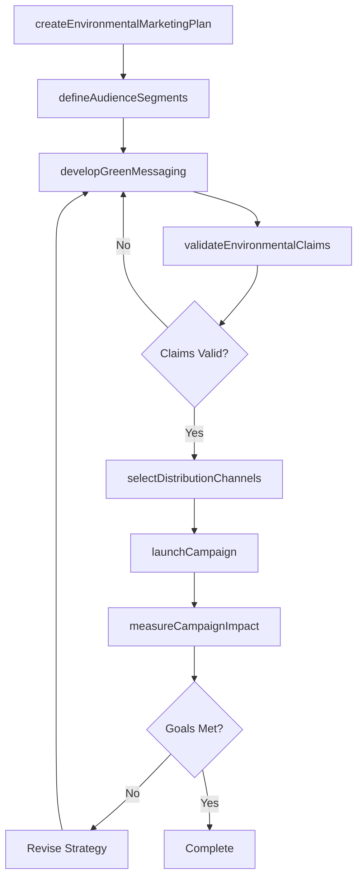
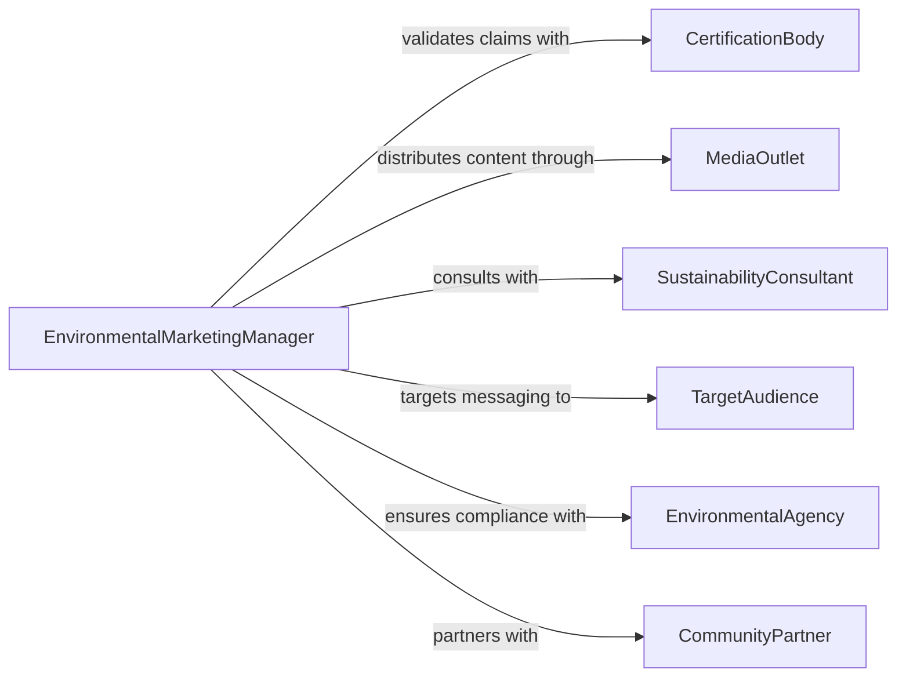

# Develop Marketing Plans Strategies Environmental

> Business-as-Code definition for developing marketing plans and strategies tailored to environmental initiatives, sustainability campaigns, and green product positioning.

## Overview

Developing marketing plans and strategies for environmental initiatives involves crafting targeted campaigns that communicate sustainability goals, green product benefits, and corporate environmental responsibility to diverse audiences. This definition exposes actions for creating eco-focused marketing strategies, managing campaign lifecycles, and measuring the impact of environmental messaging. It provides events for automation around campaign milestones and searches for retrieving strategy performance data.

## Actors

| Actor | Description |
|-------|-------------|
| EnvironmentalAgency | Regulatory body that validates environmental claims and certifications |
| MediaOutlet | Publication or broadcaster that distributes environmental marketing content |
| SustainabilityConsultant | External advisor providing guidance on green marketing best practices |
| TargetAudience | Consumer or business segment receptive to environmental messaging |
| CertificationBody | Organization that grants eco-labels and sustainability certifications |
| CommunityPartner | Local organization collaborating on environmental awareness campaigns |

## Roles

| Role | Description |
|------|-------------|
| EnvironmentalMarketingManager | Leads strategy development for environmental marketing initiatives |
| ContentStrategist | Develops messaging and creative direction for sustainability campaigns |
| MarketResearchAnalyst | Analyzes audience segments and competitive landscape for green positioning |
| ComplianceOfficer | Ensures marketing claims meet environmental advertising regulations |

## Entities

| Entity | Description |
|--------|-------------|
| MarketingPlan | A structured plan outlining environmental marketing objectives, tactics, and timelines |
| Campaign | A coordinated set of marketing activities promoting an environmental initiative |
| AudienceSegment | A defined group of consumers or businesses targeted by environmental messaging |
| GreenClaim | A specific environmental benefit or sustainability statement used in marketing |
| ChannelStrategy | The selection and prioritization of media channels for campaign distribution |
| PerformanceMetric | A measurable indicator tracking campaign reach, engagement, or conversion |

## Actions

| Action | Description |
|--------|-------------|
| createEnvironmentalMarketingPlan | Initialize a new marketing plan for an environmental initiative |
| defineAudienceSegments | Identify and characterize target audiences for sustainability messaging |
| developGreenMessaging | Craft marketing messages highlighting environmental benefits and claims |
| selectDistributionChannels | Choose media channels suited to environmental audience demographics |
| validateEnvironmentalClaims | Verify that marketing claims comply with regulatory and certification standards |
| launchCampaign | Activate an environmental marketing campaign across selected channels |
| measureCampaignImpact | Assess the effectiveness of environmental marketing efforts |

## Events

| Event | Description |
|-------|-------------|
| marketingPlanCreated | A new environmental marketing plan has been initialized |
| audienceSegmentsDefined | Target audiences for environmental messaging have been identified |
| greenMessagingDeveloped | Marketing messages for sustainability claims have been finalized |
| claimsValidated | Environmental marketing claims have been verified for compliance |
| campaignLaunched | An environmental marketing campaign has gone live |
| campaignImpactMeasured | Performance metrics for the campaign have been assessed |
| strategyRevised | The environmental marketing strategy has been updated based on results |

## Searches

| Search | Description |
|--------|-------------|
| findMarketingPlans | List environmental marketing plans by initiative, status, or period |
| getAudienceInsights | Retrieve audience segment data and engagement patterns |
| getCampaignPerformance | Retrieve metrics for active or completed environmental campaigns |
| findGreenClaims | Search environmental claims by certification status or category |

## Workflow



## Actor Relationships



## Usage

### Calling Actions

```typescript
import { developMarketingPlansStrategiesEnvironmental } from '@headlessly/develop-marketing-plans-strategies-environmental'

const envMarketing = developMarketingPlansStrategiesEnvironmental()

// Create a new environmental marketing plan
const plan = await envMarketing.createEnvironmentalMarketingPlan({
  name: 'Carbon Neutral Product Line Launch',
  initiative: 'Zero-Carbon Manufacturing',
  period: { start: '2026-03-01', end: '2026-09-30' },
  budget: 250000
})

// Define target audience segments
await envMarketing.defineAudienceSegments({
  planId: plan.id,
  segments: [
    { name: 'Eco-Conscious Millennials', demographics: { ageRange: '25-40', interests: ['sustainability'] } },
    { name: 'Green Business Buyers', demographics: { sector: 'B2B', certificationPreference: 'ISO14001' } }
  ]
})

// Validate environmental claims before launch
await envMarketing.validateEnvironmentalClaims({
  planId: plan.id,
  claims: [
    { statement: '100% carbon neutral manufacturing', certificationId: 'cert-789' }
  ]
})
```

### Event-Driven Automation

```typescript
// Notify compliance team when claims need validation
envMarketing.greenMessagingDeveloped(async ({ planId, claims }) => {
  await envMarketing.validateEnvironmentalClaims({
    planId,
    claims
  })
})

// Track campaign effectiveness and trigger revision
envMarketing.campaignImpactMeasured(async ({ planId, metrics }) => {
  if (metrics.engagementRate < 0.02) {
    await notify({
      to: 'marketing-team',
      message: `Environmental campaign ${planId} underperforming - consider strategy revision`
    })
  }
})
```
