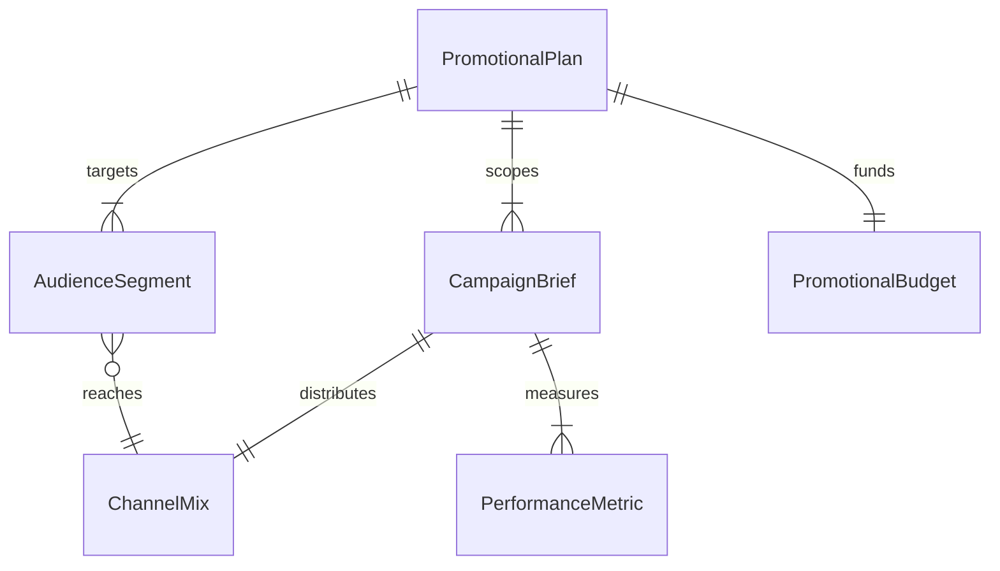
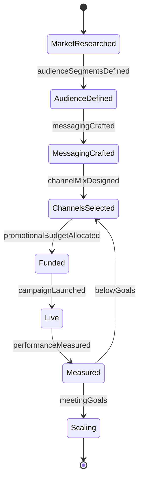
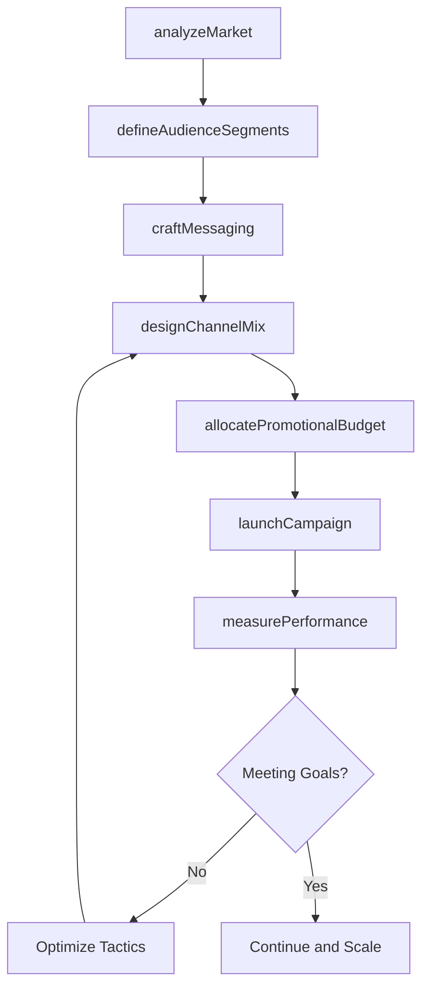
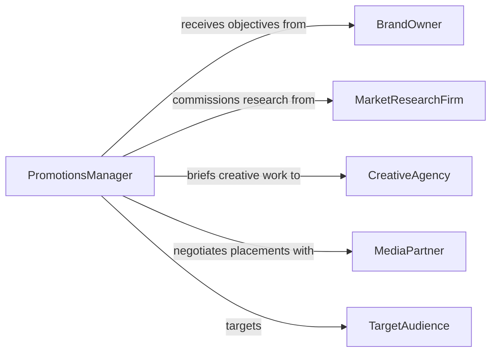

# Develop Promotional Strategies Plans

> Business-as-Code definition for developing promotional strategies and plans. Models the end-to-end promotional planning lifecycle from market analysis through strategy formulation, campaign design, budget allocation, and performance measurement.

## Overview

Developing promotional strategies and plans involves analyzing market conditions, defining target audiences, selecting promotional channels, designing campaign tactics, allocating budgets, and establishing performance metrics. This applies to product launches, brand awareness campaigns, seasonal promotions, and ongoing marketing programs. This definition exposes actions for researching audiences, crafting messaging, planning channel mixes, and measuring campaign effectiveness. Events drive automated reporting, and searches provide access to campaign performance data and market intelligence.

## Actors

| Actor | Description |
|-------|-------------|
| BrandOwner | Commissions promotional strategies to achieve business objectives |
| TargetAudience | The consumer or business segment the promotion aims to reach |
| MediaPartner | Provides advertising inventory and promotional placement |
| CreativeAgency | Produces promotional content, visuals, and messaging |
| MarketResearchFirm | Supplies audience insights and competitive intelligence |

## Roles

| Role | Description |
|------|-------------|
| PromotionsManager | Leads the development and execution of promotional plans |
| MarketingStrategist | Defines the overall promotional approach and positioning |
| MediaPlanner | Selects channels and allocates promotional spend |
| CampaignAnalyst | Measures performance and optimizes promotional tactics |
| ContentStrategist | Develops messaging frameworks and creative briefs |

## Entities

| Entity | Description |
|--------|-------------|
| PromotionalPlan | A comprehensive document outlining promotional goals, tactics, and budgets |
| CampaignBrief | A defined scope for a specific promotional campaign |
| AudienceSegment | A targeted group of consumers or businesses |
| ChannelMix | The combination of media channels selected for promotion |
| PromotionalBudget | The allocated spend across channels and campaigns |
| PerformanceMetric | A measurable indicator of promotional effectiveness |

## Actions

| Action | Description |
|--------|-------------|
| analyzeMarket | Research competitive landscape and market conditions |
| defineAudienceSegments | Identify and profile the target audiences for promotion |
| craftMessaging | Develop the core promotional messages and value propositions |
| designChannelMix | Select and prioritize promotional channels |
| allocatePromotionalBudget | Distribute spend across campaigns and channels |
| launchCampaign | Activate a promotional campaign across selected channels |
| measurePerformance | Track and analyze campaign results against objectives |

## Events

| Event | Description |
|-------|-------------|
| marketAnalyzed | Competitive and market research has been completed |
| audienceSegmentsDefined | Target audience profiles have been established |
| messagingCrafted | Core promotional messages have been developed |
| channelMixDesigned | The promotional channel combination has been selected |
| promotionalBudgetAllocated | Spend has been distributed across campaigns |
| campaignLaunched | A promotional campaign has been activated |
| performanceMeasured | Campaign results have been analyzed and reported |

## Searches

| Search | Description |
|--------|-------------|
| findPromotionalPlans | List promotional plans by brand, status, or period |
| getCampaignPerformance | Retrieve performance metrics for specific campaigns |
| getAudienceInsights | Look up audience segment profiles and behaviors |
| getChannelEffectiveness | Find performance data by promotional channel |
| getCompetitiveActivity | Retrieve competitive promotional intelligence |

## Entity Relationships



## State Diagram



## Workflow



## Actor Relationships



## Usage

### Calling Actions

```typescript
import { developPromotionalStrategiesPlans } from '@headlessly/develop-promotional-strategies-plans'

const promos = developPromotionalStrategiesPlans()

// Analyze the market landscape
const market = await promos.analyzeMarket({
  industry: 'consumer-electronics',
  region: 'North America',
  competitors: ['Brand A', 'Brand B', 'Brand C'],
  timeframe: 'Q2-2026'
})

// Define audience segments
await promos.defineAudienceSegments({
  planId: market.planId,
  segments: [
    { name: 'Tech Early Adopters', age: '25-40', interests: ['gadgets', 'innovation'] },
    { name: 'Value Seekers', age: '30-55', interests: ['deals', 'reliability'] }
  ]
})

// Design the channel mix and allocate budget
await promos.designChannelMix({
  planId: market.planId,
  channels: [
    { name: 'Social Media', weight: 0.35 },
    { name: 'Search Ads', weight: 0.25 },
    { name: 'Email Marketing', weight: 0.20 },
    { name: 'Influencer Partnerships', weight: 0.20 }
  ]
})

await promos.allocatePromotionalBudget({
  planId: market.planId,
  totalBudget: 500000,
  currency: 'USD'
})
```

### Event-Driven Automation

```typescript
// Generate performance report when campaign metrics come in
promos.performanceMeasured(async ({ campaignId, metrics }) => {
  if (metrics.roas < 2.0) {
    await notify({
      to: 'promotions-manager',
      message: `Campaign ${campaignId} ROAS is ${metrics.roas.toFixed(1)}x - below 2.0x target, optimization recommended`
    })
  }
})

// Auto-scale budget for high-performing campaigns
promos.campaignLaunched(async ({ campaignId, planId }) => {
  // Schedule first performance check
  await schedule({
    action: 'measurePerformance',
    campaignId,
    delay: { value: 7, unit: 'days' }
  })
})
```
