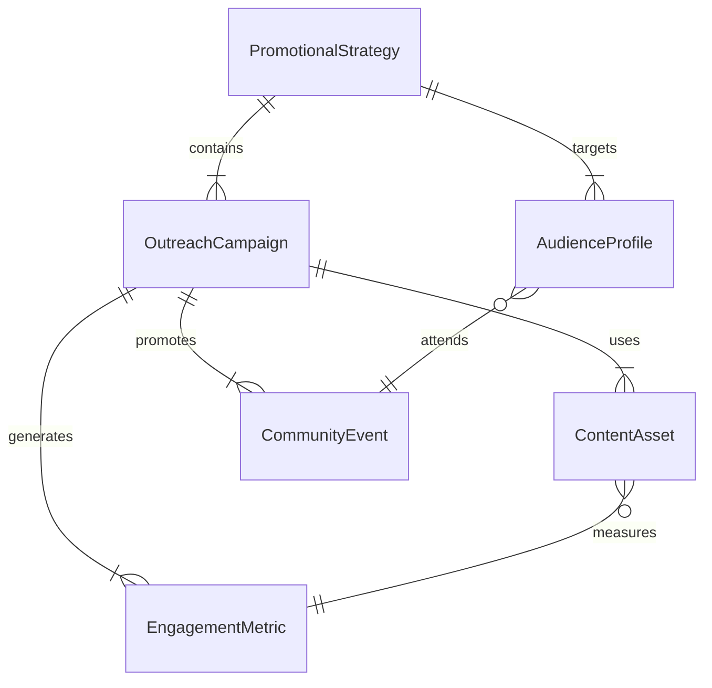
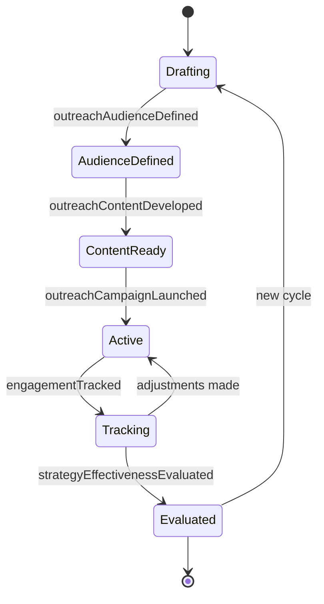
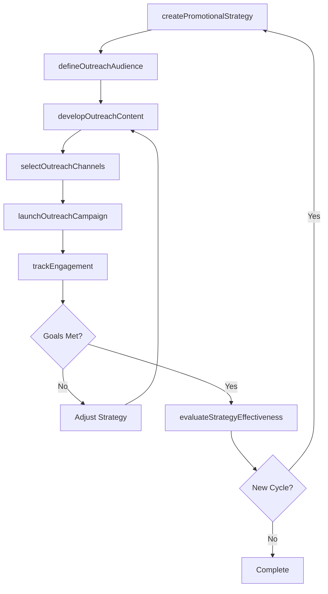
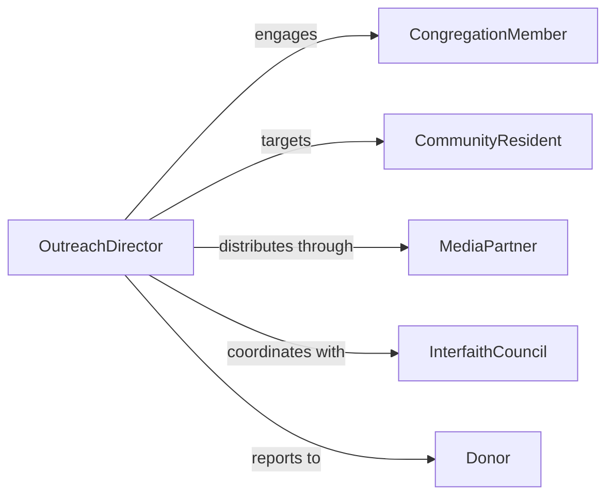

# Develop Promotional Strategies Religious Organizations

> Business-as-Code definition for developing promotional strategies that increase awareness, engagement, and participation within religious organizations and faith-based communities.

## Overview

Developing promotional strategies for religious organizations involves crafting outreach plans that grow congregation membership, publicize events and programs, and communicate the organization's mission to the broader community. This definition exposes actions for creating promotional campaigns, managing outreach channels, and tracking engagement across faith-based audiences. It provides events for automation around outreach milestones and searches for retrieving campaign and audience data.

## Actors

| Actor | Description |
|-------|-------------|
| CongregationMember | Existing member who participates in and shares organizational activities |
| CommunityResident | Local individual who may be reached through outreach efforts |
| MediaPartner | Local media outlet or platform used to distribute promotional content |
| InterfaithCouncil | Collaborative body of religious organizations coordinating joint outreach |
| Donor | Financial supporter who funds promotional activities and programs |

## Roles

| Role | Description |
|------|-------------|
| OutreachDirector | Leads promotional strategy development and community engagement |
| CommunicationsCoordinator | Manages messaging, content creation, and channel distribution |
| EventPlanner | Organizes community events that serve as promotional touchpoints |
| VolunteerCoordinator | Mobilizes congregation members for outreach activities |

## Entities

| Entity | Description |
|--------|-------------|
| PromotionalStrategy | A plan defining outreach goals, messaging, channels, and timelines |
| OutreachCampaign | A coordinated set of promotional activities targeting specific audiences |
| CommunityEvent | A gathering or program designed to attract and engage the public |
| AudienceProfile | A characterization of the target demographic for outreach efforts |
| ContentAsset | A piece of promotional material such as a flyer, video, or social post |
| EngagementMetric | A measurable indicator of outreach effectiveness and audience response |

## Actions

| Action | Description |
|--------|-------------|
| createPromotionalStrategy | Initialize a new promotional strategy for the organization |
| defineOutreachAudience | Identify and characterize target communities for promotional efforts |
| developOutreachContent | Create messaging and materials aligned with organizational mission |
| selectOutreachChannels | Choose communication channels best suited to reach target audiences |
| launchOutreachCampaign | Activate a promotional campaign across selected channels |
| trackEngagement | Monitor audience interactions with promotional content and events |
| evaluateStrategyEffectiveness | Assess whether promotional goals have been met |

## Events

| Event | Description |
|-------|-------------|
| promotionalStrategyCreated | A new promotional strategy has been initialized |
| outreachAudienceDefined | Target communities for outreach have been identified |
| outreachContentDeveloped | Promotional materials and messaging have been finalized |
| outreachCampaignLaunched | A promotional campaign has been activated |
| engagementTracked | Audience interaction data has been recorded |
| strategyEffectivenessEvaluated | Results of promotional efforts have been assessed |
| membershipIncreased | New members have joined as a result of outreach efforts |

## Searches

| Search | Description |
|--------|-------------|
| findPromotionalStrategies | List promotional strategies by status, period, or audience |
| getCampaignEngagement | Retrieve engagement metrics for active or completed campaigns |
| getContentAssets | Search promotional materials by type, channel, or campaign |
| findCommunityEvents | List upcoming or past outreach events by date or location |

## Entity Relationships



## State Diagram



## Workflow



## Actor Relationships



## Usage

### Calling Actions

```typescript
import { developPromotionalStrategiesReligiousOrganizations } from '@headlessly/develop-promotional-strategies-religious-organizations'

const outreach = developPromotionalStrategiesReligiousOrganizations()

// Create a promotional strategy for a community event
const strategy = await outreach.createPromotionalStrategy({
  name: 'Fall Community Open House',
  organization: 'First Community Church',
  period: { start: '2026-08-01', end: '2026-10-31' },
  goals: ['Increase attendance by 30%', 'Reach 500 new community members']
})

// Define target outreach audience
await outreach.defineOutreachAudience({
  strategyId: strategy.id,
  audiences: [
    { name: 'Young Families', demographics: { ageRange: '25-40', hasChildren: true } },
    { name: 'New Residents', demographics: { residenceDuration: 'under-1-year' } }
  ]
})

// Launch the campaign
await outreach.launchOutreachCampaign({
  strategyId: strategy.id,
  channels: ['social-media', 'local-newspaper', 'community-bulletin-board']
})
```

### Event-Driven Automation

```typescript
// Notify team when engagement milestones are reached
outreach.engagementTracked(async ({ strategyId, metrics }) => {
  if (metrics.newContacts >= 100) {
    await notify({
      to: 'outreach-director',
      message: `Campaign ${strategyId} reached 100 new contacts`
    })
  }
})

// Auto-evaluate strategy when campaign concludes
outreach.outreachCampaignLaunched(async ({ strategyId, endDate }) => {
  await scheduleAt(endDate, () =>
    outreach.evaluateStrategyEffectiveness({ strategyId })
  )
})
```
