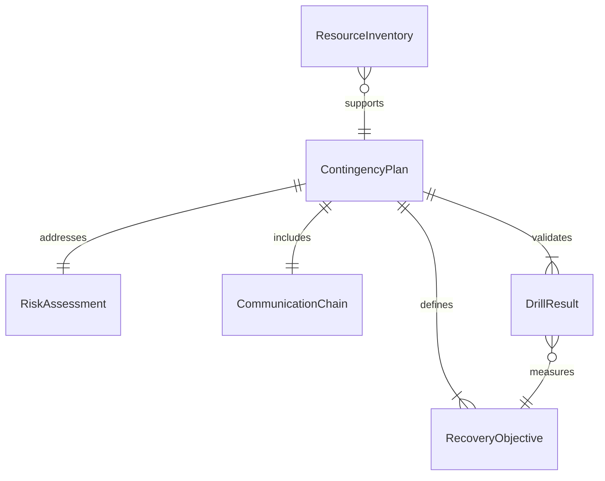
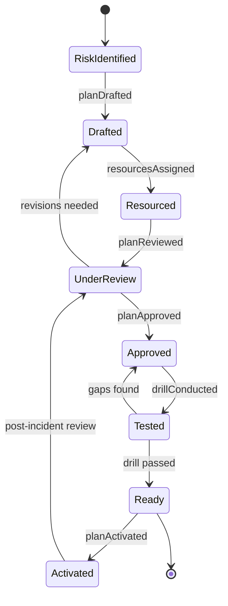
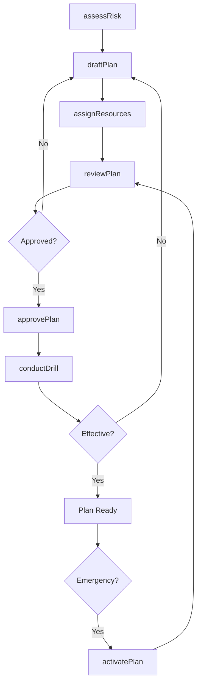
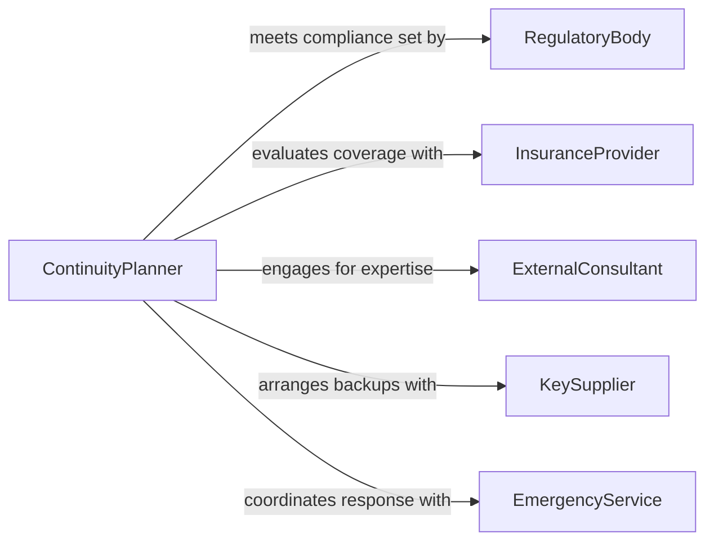

# Develop Contingency Plans Deal Organizational

> Business-as-Code definition for developing contingency plans to deal with organizational emergencies. Models the lifecycle from risk identification through plan creation, testing, and activation.

## Overview

Developing contingency plans for organizational emergencies involves identifying potential disruptions such as cyberattacks, supply chain failures, key personnel loss, and financial crises, then creating structured response protocols to minimize operational impact. This process encompasses threat assessment, resource allocation planning, communication chains, and recovery timelines to ensure business continuity under adverse conditions.

## Actors

| Actor | Description |
|-------|-------------|
| RegulatoryBody | Sets compliance requirements for organizational preparedness |
| InsuranceProvider | Assesses risk exposure and coverage terms for contingency events |
| ExternalConsultant | Provides specialized expertise in risk management and continuity planning |
| KeySupplier | Represents critical supply chain dependencies requiring backup arrangements |
| EmergencyService | Local fire, police, and medical services coordinating with the organization |

## Roles

| Role | Description |
|------|-------------|
| ContinuityPlanner | Designs and documents contingency plans across business functions |
| RiskManager | Identifies organizational threats and quantifies their potential impact |
| CrisisCoordinator | Leads plan activation and coordinates response during emergencies |
| DepartmentLiaison | Represents a business unit in contingency planning and drills |

## Entities

| Entity | Description |
|--------|-------------|
| ContingencyPlan | A documented set of procedures for responding to a specific organizational emergency |
| RiskAssessment | An evaluation of potential threats including likelihood and business impact |
| RecoveryObjective | A target metric defining acceptable recovery time or data loss thresholds |
| CommunicationChain | An ordered contact list specifying notification sequence during activation |
| DrillResult | Outcomes and findings from a contingency plan simulation exercise |
| ResourceInventory | A catalog of personnel, equipment, and facilities available for emergency response |

## Actions

| Action | Description |
|--------|-------------|
| assessRisk | Evaluate potential organizational threats and their impact severity |
| draftPlan | Create a contingency plan document with response procedures and timelines |
| assignResources | Allocate personnel, equipment, and budget to contingency plan execution |
| reviewPlan | Conduct stakeholder review of a contingency plan for completeness |
| approvePlan | Formally authorize a contingency plan for organizational adoption |
| conductDrill | Execute a simulation exercise to validate plan effectiveness |
| activatePlan | Trigger a contingency plan in response to an actual emergency |

## Events

| Event | Description |
|-------|-------------|
| riskAssessed | A potential organizational threat has been evaluated and scored |
| planDrafted | A new contingency plan document has been created |
| resourcesAssigned | Personnel and equipment have been allocated to a contingency plan |
| planReviewed | Stakeholder review of a contingency plan has been completed |
| planApproved | A contingency plan has been formally authorized |
| drillConducted | A simulation exercise has been completed with findings recorded |
| planActivated | A contingency plan has been triggered for an actual emergency |

## Searches

| Search | Description |
|--------|-------------|
| findPlans | List contingency plans by type, department, status, or risk category |
| getRiskAssessments | Retrieve risk assessments by threat type, severity, or date range |
| getDrillResults | Retrieve drill outcomes filtered by plan, date, or pass/fail status |
| getRecoveryObjectives | List recovery targets by business function or criticality tier |

## Entity Relationships



## State Diagram



## Workflow



## Actor Relationships



## Usage

### Calling Actions

```typescript
import { developContingencyPlansDealOrganizational } from '@headlessly/develop-contingency-plans-deal-organizational'

const contingency = developContingencyPlansDealOrganizational()

// Assess a cybersecurity risk
const risk = await contingency.assessRisk({
  threatType: 'ransomware-attack',
  affectedSystems: ['erp', 'email', 'file-storage'],
  likelihood: 'medium',
  businessImpact: 'critical'
})

// Draft a contingency plan
const plan = await contingency.draftPlan({
  riskAssessmentId: risk.id,
  name: 'Ransomware Response Plan',
  recoveryTimeObjective: '4 hours',
  recoveryPointObjective: '1 hour',
  communicationChain: ['CISO', 'CTO', 'CEO', 'Legal Counsel']
})

// Conduct a drill to test the plan
await contingency.conductDrill({
  planId: plan.id,
  scenario: 'Simulated ransomware encryption of primary file server',
  participants: ['IT Security', 'Operations', 'Communications']
})
```

### Event-Driven Automation

```typescript
// Notify leadership when a plan is activated
contingency.planActivated(async ({ planId, emergencyType, activatedBy }) => {
  await notify({
    to: 'executive-team',
    priority: 'urgent',
    message: `Contingency plan ${planId} activated for ${emergencyType} by ${activatedBy}`
  })
})

// Schedule re-review after drill findings
contingency.drillConducted(async ({ planId, findings }) => {
  if (findings.gaps.length > 0) {
    await contingency.reviewPlan({
      planId,
      reason: `Drill revealed ${findings.gaps.length} gap(s) requiring remediation`
    })
  }
})
```
