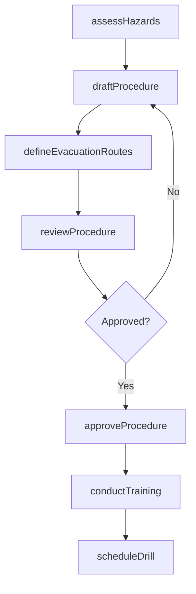
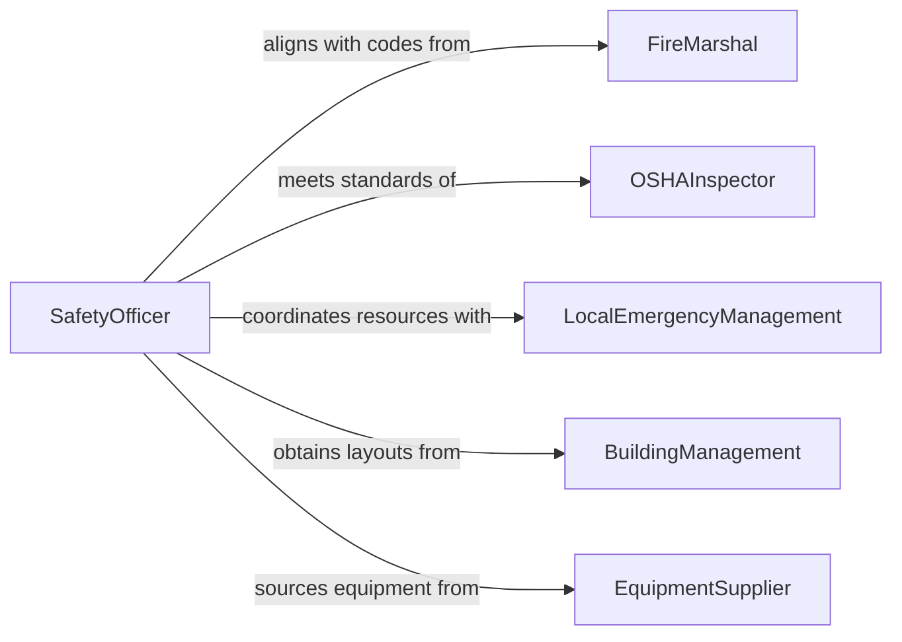

# Develop Emergency Procedures

> Business-as-Code definition for developing emergency procedures. Models the complete lifecycle from hazard identification through procedure authoring, approval, training, and maintenance.

## Overview

Developing emergency procedures involves creating step-by-step protocols that guide personnel through hazardous situations such as fires, chemical spills, workplace violence, severe weather, and medical emergencies. This process requires analyzing facility-specific risks, defining evacuation routes and assembly points, establishing communication protocols, and documenting role-specific responsibilities to ensure a coordinated and timely response that protects lives and property.

## Actors

| Actor | Description |
|-------|-------------|
| FireMarshal | Provides fire safety codes and reviews evacuation plans |
| OSHAInspector | Enforces workplace safety standards and evaluates procedure compliance |
| LocalEmergencyManagement | Coordinates community-level emergency resources and mutual aid agreements |
| BuildingManagement | Provides facility layouts, access control details, and utility shutoff locations |
| EquipmentSupplier | Provides emergency equipment such as extinguishers, AEDs, and spill kits |

## Roles

| Role | Description |
|------|-------------|
| SafetyOfficer | Authors and maintains emergency procedures for the organization |
| FloorWarden | Leads evacuation and headcount activities for an assigned area |
| EmergencyResponseTeamLead | Directs on-site emergency response actions before external services arrive |
| TrainingCoordinator | Develops and delivers emergency procedure training to personnel |

## Entities

| Entity | Description |
|--------|-------------|
| EmergencyProcedure | A documented step-by-step protocol for a specific emergency scenario |
| HazardAssessment | An evaluation identifying potential emergencies and their likelihood at a facility |
| EvacuationRoute | A designated pathway with assembly points for building evacuation |
| EmergencyContact | A directory entry for internal responders and external emergency services |
| TrainingRecord | Documentation of personnel completion of emergency procedure training |

## Actions

| Action | Description |
|--------|-------------|
| assessHazards | Identify and evaluate facility-specific emergency risks |
| draftProcedure | Author a step-by-step emergency response protocol for a specific scenario |
| defineEvacuationRoutes | Map designated exit paths and assembly points for a facility |
| reviewProcedure | Submit a drafted procedure for stakeholder and regulatory review |
| approveProcedure | Formally authorize an emergency procedure for organizational use |
| conductTraining | Deliver training sessions to personnel on approved procedures |
| scheduleDrill | Plan a live practice exercise to validate procedure effectiveness |

## Events

| Event | Description |
|-------|-------------|
| hazardsAssessed | Facility-specific emergency risks have been identified and evaluated |
| procedureDrafted | A new emergency procedure document has been authored |
| evacuationRoutesDefined | Exit paths and assembly points have been mapped for a facility |
| procedureReviewed | Stakeholder review of an emergency procedure has been completed |
| procedureApproved | An emergency procedure has been formally authorized |
| trainingConducted | Personnel have completed training on an emergency procedure |
| drillScheduled | A live practice exercise has been placed on the calendar |

## Searches

| Search | Description |
|--------|-------------|
| findProcedures | List emergency procedures by scenario type, facility, or approval status |
| getHazardAssessments | Retrieve hazard evaluations by facility, risk level, or date |
| getTrainingRecords | Find training completion records by employee, procedure, or date range |

## Workflow



## Actor Relationships



## Usage

### Calling Actions

```typescript
import { developEmergencyProcedures } from '@headlessly/develop-emergency-procedures'

const emergencyProc = developEmergencyProcedures()

// Assess facility hazards
const hazards = await emergencyProc.assessHazards({
  facilityId: 'headquarters-building-a',
  hazardTypes: ['fire', 'chemical-spill', 'severe-weather', 'medical-emergency'],
  lastAssessmentDate: '2025-06-15'
})

// Draft a fire emergency procedure
const procedure = await emergencyProc.draftProcedure({
  hazardAssessmentId: hazards.id,
  scenario: 'fire',
  steps: [
    'Activate nearest fire alarm pull station',
    'Call 911 and provide building address',
    'Evacuate via designated routes to assembly point',
    'Floor wardens conduct headcount and report to incident commander'
  ]
})

// Conduct training on the approved procedure
await emergencyProc.conductTraining({
  procedureId: procedure.id,
  format: 'in-person',
  participants: ['all-building-a-personnel'],
  scheduledDate: '2026-03-01'
})
```

### Event-Driven Automation

```typescript
// Schedule drill after training completion
emergencyProc.trainingConducted(async ({ procedureId, completionRate }) => {
  if (completionRate >= 0.95) {
    await emergencyProc.scheduleDrill({
      procedureId,
      drillType: 'full-evacuation',
      scheduledDate: addWeeks(new Date(), 2)
    })
  }
})

// Alert safety officer when hazard assessment reveals new risks
emergencyProc.hazardsAssessed(async ({ facilityId, newHazards }) => {
  if (newHazards.length > 0) {
    await notify({
      to: 'safety-team',
      message: `${newHazards.length} new hazard(s) identified at ${facilityId}`
    })
  }
})
```
