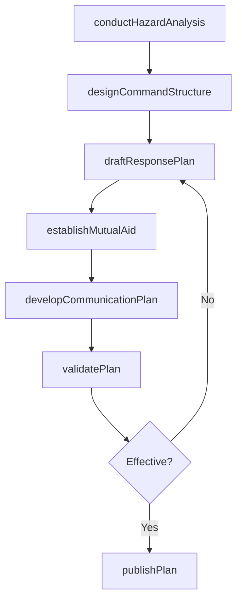
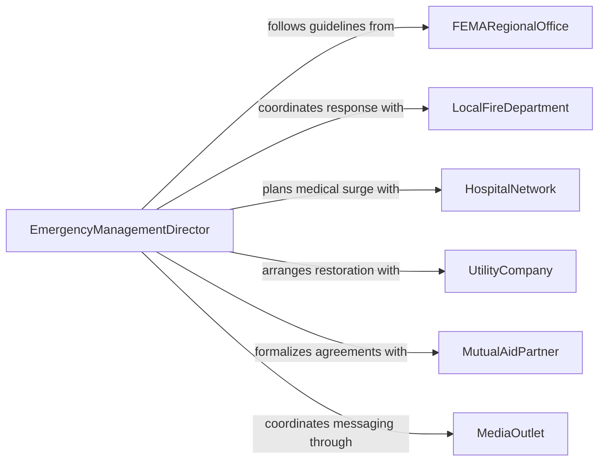

# Develop Emergency Response Plans Procedures

> Business-as-Code definition for developing emergency response plans or procedures. Models the end-to-end process of creating comprehensive multi-hazard response plans that coordinate personnel, resources, and external agencies.

## Overview

Developing emergency response plans and procedures involves creating comprehensive, multi-hazard frameworks that define how an organization will detect, respond to, and recover from emergencies including natural disasters, industrial accidents, terrorism, and public health crises. This process integrates incident command structures, resource staging, mutual aid agreements, and communication protocols into actionable documents that can be rapidly deployed when an emergency occurs.

## Actors

| Actor | Description |
|-------|-------------|
| FEMARegionalOffice | Provides federal emergency management guidelines and grant programs |
| LocalFireDepartment | Coordinates fire suppression and hazmat response capabilities |
| HospitalNetwork | Provides mass casualty triage and medical surge capacity |
| UtilityCompany | Manages critical infrastructure and coordinates service restoration |
| MutualAidPartner | Neighboring jurisdiction or organization providing shared emergency resources |
| MediaOutlet | Disseminates public warnings and emergency information to the community |

## Roles

| Role | Description |
|------|-------------|
| EmergencyManagementDirector | Leads the development and oversight of all emergency response plans |
| IncidentCommander | Directs on-scene operations during emergency activation |
| PlanningOfficer | Researches hazards and drafts response plan sections |
| PublicInformationOfficer | Manages emergency communications to media and the public |

## Entities

| Entity | Description |
|--------|-------------|
| EmergencyResponsePlan | A comprehensive document defining multi-hazard response procedures |
| IncidentCommandStructure | An organizational chart defining roles and reporting lines during emergencies |
| ResourceStaging | A pre-identified location and inventory for deploying emergency supplies |
| MutualAidAgreement | A formal compact between organizations for shared emergency resources |
| CommunicationPlan | A protocol defining notification channels, message templates, and escalation paths |
| AfterActionReport | A post-incident review documenting response effectiveness and improvement areas |

## Actions

| Action | Description |
|--------|-------------|
| conductHazardAnalysis | Analyze potential emergency scenarios and their community impact |
| designCommandStructure | Define incident command roles, reporting lines, and span of control |
| draftResponsePlan | Author response procedures for specific hazard scenarios |
| establishMutualAid | Formalize resource-sharing agreements with partner organizations |
| developCommunicationPlan | Create notification protocols and public messaging templates |
| validatePlan | Conduct tabletop or functional exercises to test plan effectiveness |
| publishPlan | Finalize and distribute the approved emergency response plan |

## Events

| Event | Description |
|-------|-------------|
| hazardAnalysisCompleted | Potential emergency scenarios have been evaluated and documented |
| commandStructureDesigned | Incident command roles and reporting lines have been defined |
| responsePlanDrafted | A hazard-specific response plan section has been authored |
| mutualAidEstablished | A resource-sharing agreement has been formalized with a partner |
| communicationPlanDeveloped | Notification protocols and message templates have been created |
| planValidated | An exercise has confirmed plan effectiveness or identified gaps |
| planPublished | The emergency response plan has been finalized and distributed |

## Searches

| Search | Description |
|--------|-------------|
| findResponsePlans | List emergency response plans by hazard type, jurisdiction, or status |
| getMutualAidAgreements | Retrieve mutual aid compacts by partner, resource type, or expiration date |
| getAfterActionReports | Find post-incident reviews by event type, date, or findings category |
| getExerciseHistory | List plan validation exercises by type, outcome, or date range |

## Workflow



## Actor Relationships



## Usage

### Calling Actions

```typescript
import { developEmergencyResponsePlansProcedures } from '@headlessly/develop-emergency-response-plans-procedures'

const responsePlanning = developEmergencyResponsePlansProcedures()

// Conduct a multi-hazard analysis
const analysis = await responsePlanning.conductHazardAnalysis({
  jurisdiction: 'Metro County',
  hazards: ['earthquake', 'flooding', 'wildfire', 'chemical-release'],
  populationAtRisk: 450000
})

// Draft a flood response plan
const plan = await responsePlanning.draftResponsePlan({
  hazardAnalysisId: analysis.id,
  hazardType: 'flooding',
  sections: ['detection-and-warning', 'evacuation', 'shelter-operations', 'infrastructure-protection']
})

// Validate with a tabletop exercise
await responsePlanning.validatePlan({
  planId: plan.id,
  exerciseType: 'tabletop',
  scenario: 'Category 3 river flooding with 48-hour advance warning',
  participants: ['Emergency Management', 'Fire', 'Public Works', 'Red Cross']
})
```

### Event-Driven Automation

```typescript
// Notify all stakeholders when a plan is published
responsePlanning.planPublished(async ({ planId, hazardType, jurisdiction }) => {
  await notify({
    to: 'all-response-partners',
    message: `Updated ${hazardType} response plan for ${jurisdiction} is now available`
  })
})

// Trigger plan revision when exercise reveals gaps
responsePlanning.planValidated(async ({ planId, outcome, gaps }) => {
  if (outcome === 'gaps-identified') {
    await responsePlanning.draftResponsePlan({
      planId,
      revisionReason: `Exercise identified ${gaps.length} gap(s): ${gaps.join(', ')}`
    })
  }
})
```
