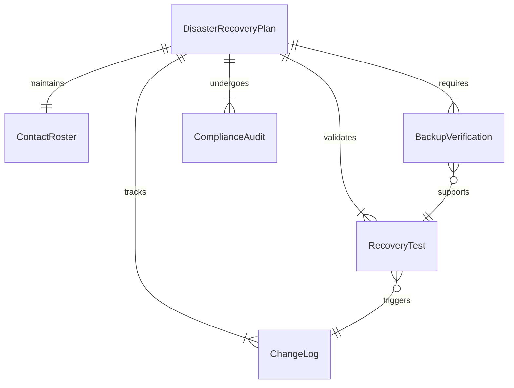
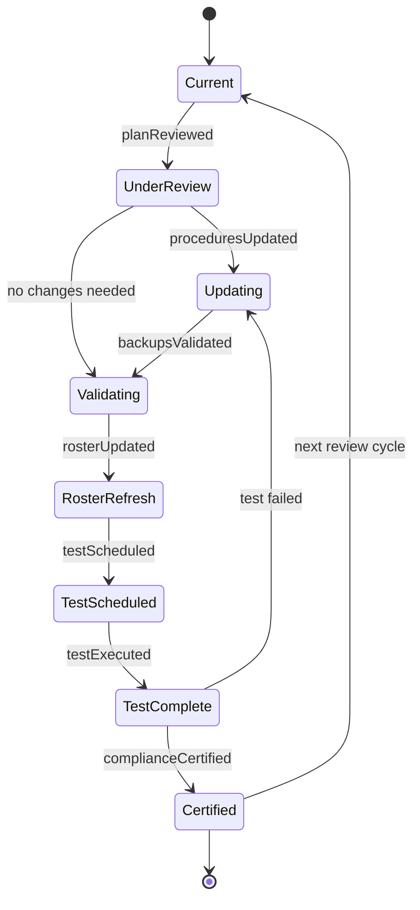
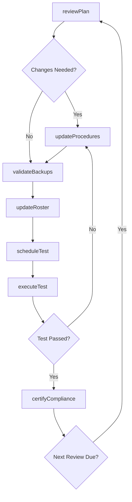
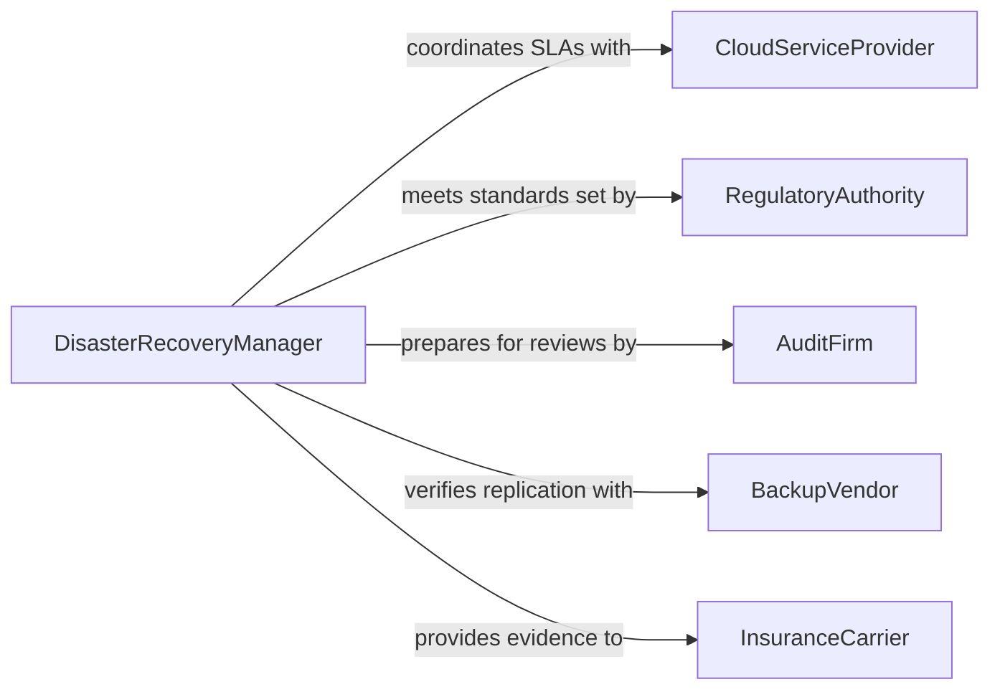

# Maintain Contingency Plans Disaster Recovery

> Business-as-Code definition for maintaining contingency plans for disaster recovery. Models the ongoing lifecycle of keeping disaster recovery plans current, tested, and aligned with evolving organizational needs.

## Overview

Maintaining contingency plans for disaster recovery involves the continuous review, updating, and validation of documented procedures that enable an organization to restore critical systems and operations after a disruptive event. This includes revising recovery procedures when infrastructure changes, updating contact rosters, validating backup integrity, scheduling periodic tests, and ensuring alignment with current regulatory requirements and business priorities.

## Actors

| Actor | Description |
|-------|-------------|
| CloudServiceProvider | Hosts infrastructure and provides recovery tools and SLAs |
| RegulatoryAuthority | Mandates disaster recovery compliance standards and audit requirements |
| AuditFirm | Conducts independent assessments of disaster recovery readiness |
| BackupVendor | Provides offsite storage, replication, and data protection services |
| InsuranceCarrier | Requires evidence of maintained recovery plans for coverage eligibility |

## Roles

| Role | Description |
|------|-------------|
| DisasterRecoveryManager | Owns the end-to-end maintenance of disaster recovery plans |
| ITInfrastructureLead | Ensures technical recovery procedures match current system configurations |
| ComplianceOfficer | Validates that plans meet regulatory and contractual obligations |
| TestCoordinator | Schedules and oversees disaster recovery testing exercises |

## Entities

| Entity | Description |
|--------|-------------|
| DisasterRecoveryPlan | A documented set of procedures for restoring systems after a disaster |
| RecoveryTest | A scheduled exercise validating that recovery procedures work as intended |
| ChangeLog | A record of modifications made to a disaster recovery plan over time |
| ContactRoster | A maintained list of personnel and vendors with emergency contact details |
| BackupVerification | A record confirming that backup data is complete, current, and restorable |
| ComplianceAudit | A formal review of disaster recovery plan adherence to regulatory standards |

## Actions

| Action | Description |
|--------|-------------|
| reviewPlan | Assess a disaster recovery plan against current infrastructure and requirements |
| updateProcedures | Revise recovery steps to reflect system or process changes |
| validateBackups | Confirm backup data integrity and restorability |
| scheduleTest | Plan a disaster recovery test exercise for a specific date and scope |
| executeTest | Run a disaster recovery test and record outcomes |
| updateRoster | Refresh emergency contact lists for personnel and vendors |
| certifyCompliance | Document that a plan meets current regulatory requirements |

## Events

| Event | Description |
|-------|-------------|
| planReviewed | A disaster recovery plan review cycle has been completed |
| proceduresUpdated | Recovery procedures have been revised to reflect changes |
| backupsValidated | Backup data integrity has been confirmed |
| testScheduled | A disaster recovery test has been placed on the calendar |
| testExecuted | A disaster recovery test has been completed with results recorded |
| rosterUpdated | Emergency contact information has been refreshed |
| complianceCertified | Plan compliance with regulatory standards has been documented |

## Searches

| Search | Description |
|--------|-------------|
| findPlans | List disaster recovery plans by system, department, or review status |
| getTestHistory | Retrieve past test results filtered by plan, outcome, or date range |
| getChangeLogs | List plan modifications by date, author, or change type |
| getPendingReviews | Find plans due for scheduled review or overdue for update |

## Entity Relationships



## State Diagram



## Workflow



## Actor Relationships



## Usage

### Calling Actions

```typescript
import { maintainContingencyPlansDisasterRecovery } from '@headlessly/maintain-contingency-plans-disaster-recovery'

const drMaintenance = maintainContingencyPlansDisasterRecovery()

// Review an existing disaster recovery plan
const review = await drMaintenance.reviewPlan({
  planId: 'dr-plan-primary-datacenter',
  reviewType: 'quarterly',
  changesDetected: ['new-database-cluster', 'migrated-to-kubernetes']
})

// Update procedures based on infrastructure changes
await drMaintenance.updateProcedures({
  planId: 'dr-plan-primary-datacenter',
  sections: [
    { step: 'database-restore', procedure: 'Use pg_restore from S3 replicated backup' },
    { step: 'container-orchestration', procedure: 'Redeploy via Helm charts to DR cluster' }
  ]
})

// Validate backup integrity
await drMaintenance.validateBackups({
  planId: 'dr-plan-primary-datacenter',
  backupSets: ['daily-incremental', 'weekly-full'],
  verificationMethod: 'test-restore'
})
```

### Event-Driven Automation

```typescript
// Alert when a test fails and trigger plan revision
drMaintenance.testExecuted(async ({ planId, outcome, failures }) => {
  if (outcome === 'failed') {
    await notify({
      to: 'disaster-recovery-team',
      message: `DR test failed for ${planId}: ${failures.join(', ')}`
    })
    await drMaintenance.reviewPlan({ planId, reviewType: 'remediation' })
  }
})

// Auto-schedule next test when compliance is certified
drMaintenance.complianceCertified(async ({ planId, certifiedAt }) => {
  const nextTestDate = addMonths(certifiedAt, 3)
  await drMaintenance.scheduleTest({
    planId,
    scheduledDate: nextTestDate,
    scope: 'full-failover'
  })
})
```
