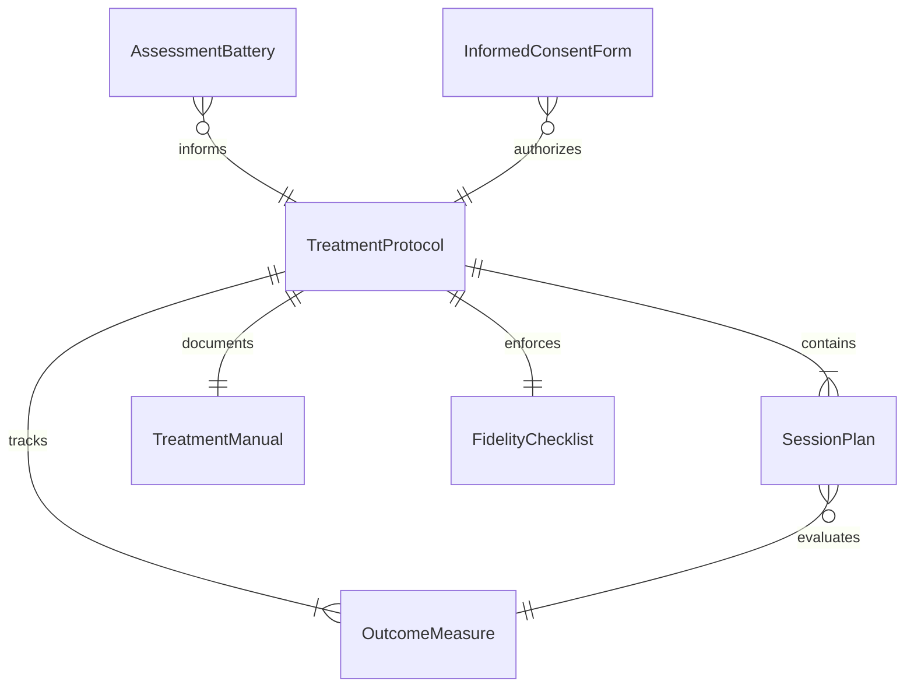
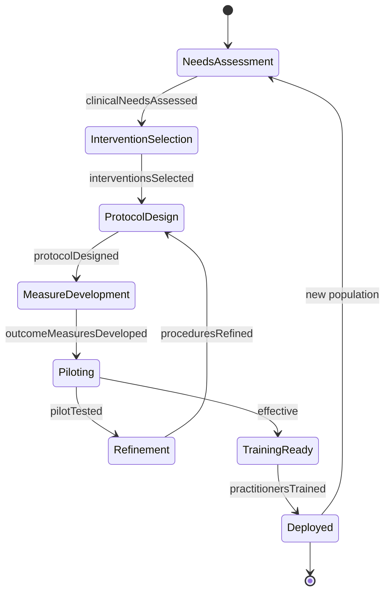
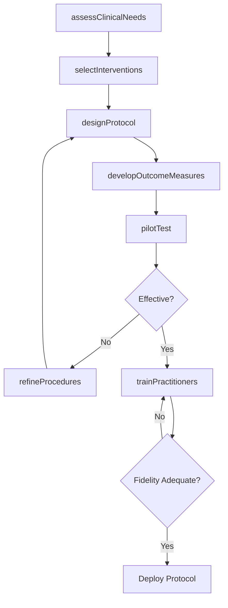
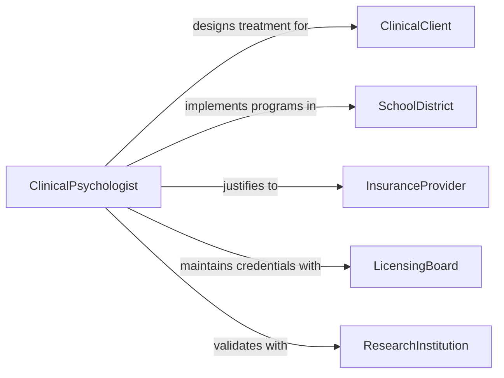

# Design Psychological or Educational Treatment Procedures

> Business-as-Code definition for designing psychological and educational treatment procedures including behavioral interventions, cognitive therapy protocols, and therapeutic education programs for clinical and school settings.

## Overview

Designing psychological and educational treatment procedures involves selecting evidence-based therapeutic approaches, structuring session sequences, defining outcome measures, and creating manualized protocols that can be consistently delivered by practitioners. This definition models the process from clinical needs assessment through intervention design, protocol development, pilot testing, and practitioner training.

## Actors

| Actor | Description |
|-------|-------------|
| ClinicalClient | Individual or group receiving psychological treatment |
| SchoolDistrict | Educational institution requesting treatment programs |
| InsuranceProvider | Payer requiring evidence-based treatment justification |
| LicensingBoard | Authority governing practitioner credentials and scope |
| ResearchInstitution | Academic partner validating treatment effectiveness |

## Roles

| Role | Description |
|------|-------------|
| ClinicalPsychologist | Designs evidence-based treatment protocols |
| BehavioralSpecialist | Develops behavioral intervention procedures |
| ProgramEvaluator | Measures treatment outcomes and effectiveness |
| ClinicalSupervisor | Trains practitioners in protocol delivery |

## Entities

| Entity | Description |
|--------|-------------|
| TreatmentProtocol | Manualized sequence of therapeutic interventions |
| AssessmentBattery | Set of diagnostic instruments measuring baseline and progress |
| SessionPlan | Structured outline for an individual treatment session |
| OutcomeMeasure | Quantified metric tracking treatment effectiveness |
| FidelityChecklist | Tool ensuring protocol adherence by practitioners |
| InformedConsentForm | Document authorizing treatment participation |
| TreatmentManual | Comprehensive guide for delivering the intervention |

## Actions

| Action | Description |
|--------|-------------|
| assessClinicalNeeds | Evaluate the target population and presenting concerns |
| selectInterventions | Choose evidence-based therapeutic approaches |
| designProtocol | Structure the treatment sequence and session plans |
| developOutcomeMeasures | Create metrics for tracking treatment effectiveness |
| pilotTest | Trial the protocol with a small group |
| refineProcedures | Adjust the protocol based on pilot feedback |
| trainPractitioners | Prepare clinicians to deliver the treatment |

## Events

| Event | Description |
|-------|-------------|
| clinicalNeedsAssessed | Target population and concerns have been evaluated |
| interventionsSelected | Therapeutic approaches have been chosen |
| protocolDesigned | Treatment sequence has been structured |
| outcomeMeasuresDeveloped | Effectiveness metrics have been created |
| pilotTested | Protocol has been trialed with a sample group |
| proceduresRefined | Protocol has been adjusted from pilot feedback |
| practitionersTrained | Clinicians are prepared to deliver the treatment |

## Searches

| Search | Description |
|--------|-------------|
| findProtocols | Search treatment protocols by condition or modality |
| getOutcomeData | Retrieve effectiveness metrics for a protocol |
| listSessionPlans | Enumerate session outlines for a treatment |
| getFidelityData | Look up protocol adherence scores by practitioner |

## Entity Relationships



## State Diagram



## Workflow



## Actor Relationships



## Usage

### Calling Actions

```typescript
import { designPsychologicalEducationalTreatmentProcedures } from '@headlessly/design-psychological-educational-treatment-procedures'

const treatment = designPsychologicalEducationalTreatmentProcedures()

// Assess clinical needs
const needs = await treatment.assessClinicalNeeds({
  population: 'adolescents-with-anxiety',
  setting: 'school-based',
  ageRange: { min: 12, max: 17 },
  referralSource: 'school-counselor'
})

// Design the protocol
const protocol = await treatment.designProtocol({
  needsId: needs.id,
  modality: 'cognitive-behavioral-therapy',
  sessions: 12,
  frequency: 'weekly',
  groupSize: { min: 4, max: 8 },
  components: ['psychoeducation', 'cognitive-restructuring', 'exposure-hierarchy', 'relapse-prevention']
})

// Develop outcome measures
await treatment.developOutcomeMeasures({
  protocolId: protocol.id,
  instruments: ['SCARED', 'PHQ-A', 'behavioral-observation'],
  measurementPoints: ['pre-treatment', 'mid-treatment', 'post-treatment', '3-month-followup']
})
```

### Event-Driven Automation

```typescript
// Notify supervisors when pilot results are ready
treatment.pilotTested(async ({ protocolId, effectSize }) => {
  await notify({
    to: 'clinical-supervisor',
    message: `Pilot for protocol ${protocolId} complete - effect size: ${effectSize}`
  })
})

// Schedule training after protocol refinement
treatment.proceduresRefined(async ({ protocolId }) => {
  await treatment.trainPractitioners({ protocolId })
})
```
