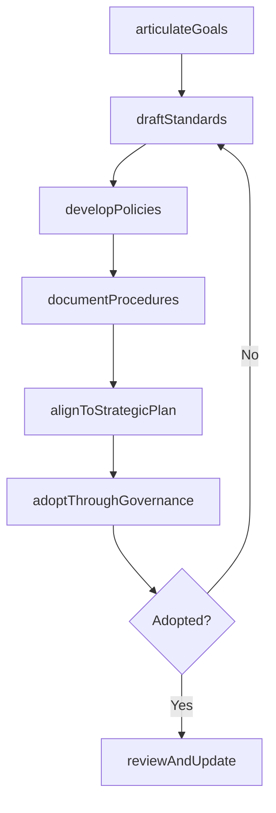
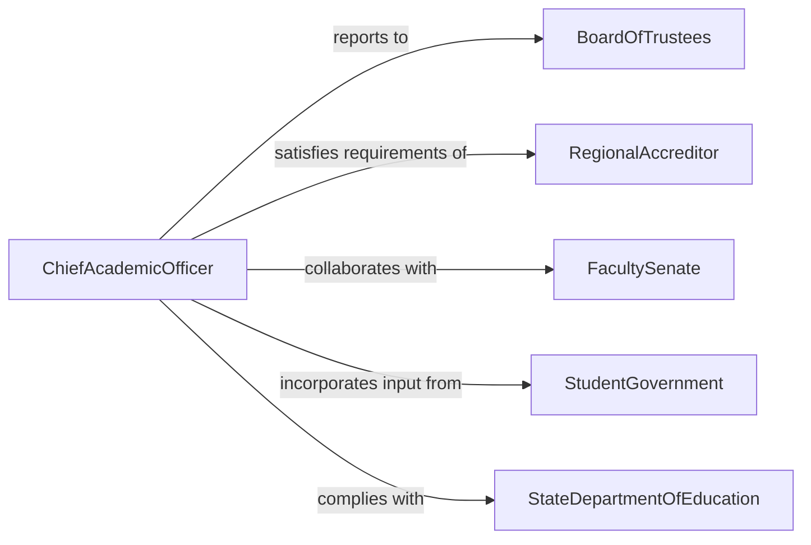

# Develop Educational Goals, Standards, Policies, or Procedures

> Business-as-Code definition for developing institutional educational goals, academic standards, governance policies, and procedural guidelines that shape curriculum quality, student outcomes, and institutional effectiveness.

## Overview

Educational goals and standards development involves articulating institutional learning outcomes, establishing academic rigor benchmarks, drafting governance policies, and documenting procedures that ensure consistent educational quality across programs and departments. This definition models the process from strategic vision articulation through standards drafting, policy development, stakeholder adoption, and continuous improvement review.

## Actors

| Actor | Description |
|-------|-------------|
| BoardOfTrustees | Governing body setting institutional strategic direction |
| RegionalAccreditor | Agency evaluating institutional educational quality |
| FacultySenate | Academic body governing curricular standards |
| StudentGovernment | Student representatives providing learner perspective |
| StateDepartmentOfEducation | Government authority overseeing K-12 or higher education |

## Roles

| Role | Description |
|------|-------------|
| ChiefAcademicOfficer | Leads institutional academic planning and standards |
| StandardsWriter | Drafts measurable academic standards and benchmarks |
| PolicyAdministrator | Develops and maintains governance policy documents |
| InstitutionalResearcher | Provides data supporting goals and standards development |

## Entities

| Entity | Description |
|--------|-------------|
| InstitutionalGoal | High-level outcome defining the institution's educational mission |
| AcademicStandard | Measurable benchmark for student learning or program quality |
| GovernancePolicy | Rule governing academic operations and decision-making |
| ProcedureManual | Step-by-step guide for implementing policies |
| StrategicPlan | Multi-year document linking goals to initiatives |
| AssessmentFramework | System for measuring goal and standard attainment |

## Actions

| Action | Description |
|--------|-------------|
| articulateGoals | Define institutional educational outcomes |
| draftStandards | Write measurable academic benchmarks |
| developPolicies | Create governance rules for academic operations |
| documentProcedures | Write implementation guides for policies |
| alignToStrategicPlan | Map goals and standards to institutional strategy |
| adoptThroughGovernance | Secure faculty and board approval |
| reviewAndUpdate | Conduct periodic assessment and revision |

## Events

| Event | Description |
|-------|-------------|
| goalsArticulated | Institutional educational outcomes have been defined |
| standardsDrafted | Academic benchmarks have been written |
| policiesDeveloped | Governance rules have been created |
| proceduresDocumented | Implementation guides have been written |
| strategicPlanAligned | Goals are mapped to institutional strategy |
| governanceAdopted | Faculty and board have approved the standards |
| reviewCompleted | Periodic assessment and revision are done |

## Searches

| Search | Description |
|--------|-------------|
| findGoals | Search institutional goals by theme or strategic priority |
| getStandards | Retrieve academic benchmarks by program or level |
| listPolicies | Enumerate governance policies by category |
| getReviewStatus | Check the revision cycle status for a standard |

## Workflow



## Actor Relationships



## Usage

### Calling Actions

```typescript
import { developEducationalGoalsStandardsPolicies } from '@headlessly/develop-educational-goals-standards-policies'

const edGoals = developEducationalGoalsStandardsPolicies()

// Articulate institutional goals
const goals = await edGoals.articulateGoals({
  institution: 'Westfield University',
  strategicPriorities: ['student-success', 'research-excellence', 'community-engagement'],
  outcomes: [
    'All graduates demonstrate critical thinking proficiency',
    'Retention rates exceed 85% by 2028',
    'Research expenditures grow 10% annually'
  ]
})

// Draft academic standards
const standards = await edGoals.draftStandards({
  goalsId: goals.id,
  area: 'general-education',
  standards: [
    { competency: 'written-communication', benchmark: 'score-4-on-AAC&U-VALUE-rubric' },
    { competency: 'quantitative-reasoning', benchmark: 'pass-QR-assessment-at-70%' },
    { competency: 'information-literacy', benchmark: 'complete-IL-portfolio' }
  ]
})

// Develop supporting policy
await edGoals.developPolicies({
  standardsId: standards.id,
  policy: 'General Education Assessment Policy',
  sections: ['purpose', 'scope', 'assessment-cycle', 'reporting-requirements', 'use-of-results']
})
```

### Event-Driven Automation

```typescript
// Notify accreditor liaison when standards are adopted
edGoals.governanceAdopted(async ({ standardsId }) => {
  await notify({
    to: 'accreditation-liaison',
    message: `Academic standards ${standardsId} adopted - update accreditation evidence files`
  })
})

// Schedule periodic review
edGoals.reviewCompleted(async ({ standardsId }) => {
  await scheduleReminder({
    date: addYears(new Date(), 3),
    to: 'chief-academic-officer',
    message: `Three-year review due for standards ${standardsId}`
  })
})
```
