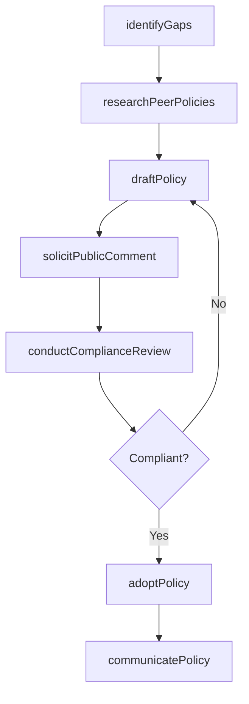
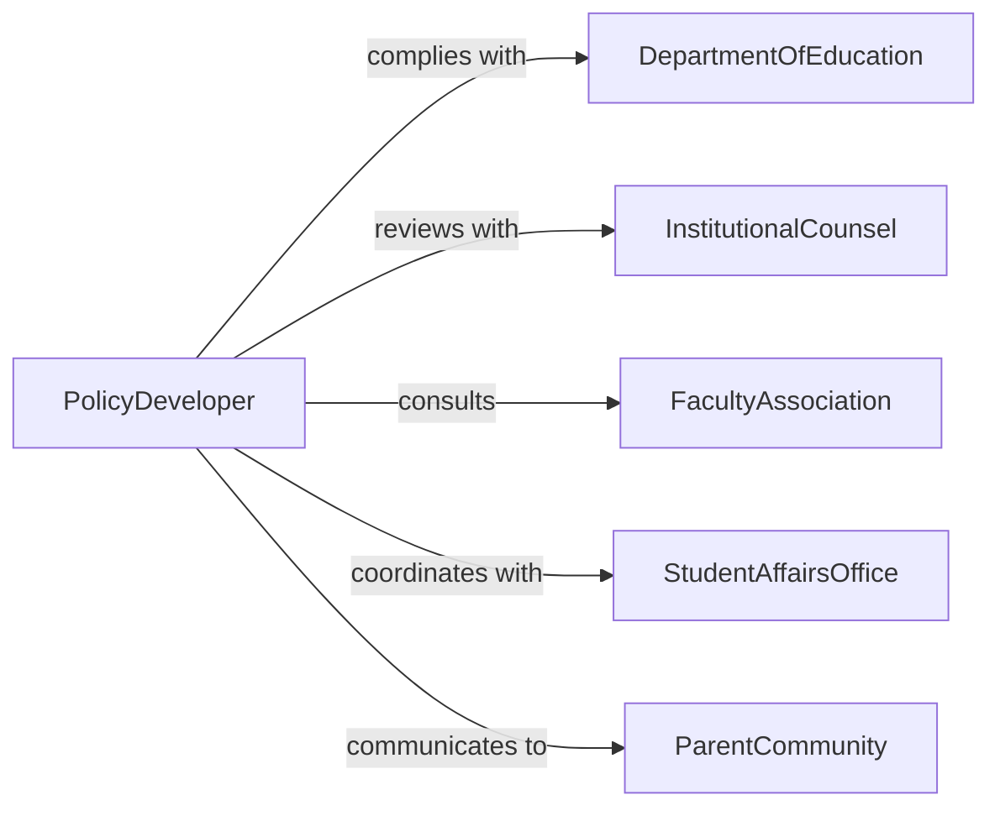

# Develop Educational Policies

> Business-as-Code definition for developing educational policies including academic integrity, grading, attendance, student conduct, and Title IX policies that govern the educational environment.

## Overview

Educational policy development involves identifying regulatory requirements, researching peer practices, drafting policy language, conducting stakeholder review, and implementing policies that ensure fair, equitable, and legally compliant educational operations. This definition models the process from policy gap analysis through drafting, community input, legal review, adoption, and communication.

## Actors

| Actor | Description |
|-------|-------------|
| DepartmentOfEducation | Federal or state agency setting educational regulations |
| InstitutionalCounsel | Attorney advising on legal compliance of policies |
| FacultyAssociation | Organized faculty body providing policy input |
| StudentAffairsOffice | Department managing student life and conduct |
| ParentCommunity | Families affected by educational policies |

## Roles

| Role | Description |
|------|-------------|
| PolicyDeveloper | Researches and drafts educational policy documents |
| ComplianceDirector | Ensures policies meet federal and state regulations |
| DeanOfStudents | Oversees student-facing policy implementation |
| PolicyReviewCommittee | Cross-functional group evaluating draft policies |

## Entities

| Entity | Description |
|--------|-------------|
| EducationalPolicy | Formal rule governing educational operations |
| RegulatoryRequirement | Federal or state mandate the policy must address |
| PolicyDraft | Working version of the policy under review |
| PublicCommentRecord | Stakeholder feedback collected during review period |
| ImplementationGuide | Instructions for putting the policy into practice |
| PolicyArchive | Historical record of all policy versions |

## Actions

| Action | Description |
|--------|-------------|
| identifyGaps | Analyze existing policies against regulatory requirements |
| researchPeerPolicies | Survey comparable institutions for best practices |
| draftPolicy | Write the educational policy document |
| solicitPublicComment | Open a review period for stakeholder input |
| conductComplianceReview | Verify alignment with federal and state regulations |
| adoptPolicy | Formally approve and codify the policy |
| communicatePolicy | Distribute and educate the community on new rules |

## Events

| Event | Description |
|-------|-------------|
| gapsIdentified | Policy deficiencies have been documented |
| peerPoliciesResearched | Best practices have been surveyed |
| policyDrafted | Working document has been written |
| publicCommentSolicited | Stakeholder review period has been opened |
| complianceReviewConducted | Regulatory alignment has been verified |
| policyAdopted | Policy has been formally approved |
| policyCommunicated | Community has been notified and educated |

## Searches

| Search | Description |
|--------|-------------|
| findPolicies | Search educational policies by category or topic |
| getComments | Retrieve public comment submissions for a policy |
| listDrafts | Enumerate policies currently under development |
| getComplianceStatus | Check regulatory alignment for active policies |

## Workflow



## Actor Relationships



## Usage

### Calling Actions

```typescript
import { developEducationalPolicies } from '@headlessly/develop-educational-policies'

const policies = developEducationalPolicies()

// Identify policy gaps
const gaps = await policies.identifyGaps({
  area: 'academic-integrity',
  regulations: ['FERPA', 'state-education-code'],
  currentPolicyDate: '2019-08-01',
  triggers: ['AI-generated-content', 'remote-proctoring']
})

// Draft the policy
const draft = await policies.draftPolicy({
  gapAnalysisId: gaps.id,
  title: 'Academic Integrity and AI-Assisted Work Policy',
  sections: [
    'definitions',
    'prohibited-conduct',
    'permitted-AI-use',
    'reporting-procedures',
    'adjudication-process',
    'sanctions'
  ]
})

// Solicit public comment
await policies.solicitPublicComment({
  draftId: draft.id,
  period: { start: '2026-03-01', end: '2026-03-31' },
  audiences: ['faculty', 'students', 'parents']
})
```

### Event-Driven Automation

```typescript
// Notify community when policy is adopted
policies.policyAdopted(async ({ policyId, title }) => {
  await notify({
    to: 'campus-community',
    message: `New policy adopted: ${title} - effective next semester`
  })
})

// Close comment period and trigger compliance review
policies.publicCommentSolicited(async ({ draftId, endDate }) => {
  await scheduleTask({
    date: endDate,
    action: () => policies.conductComplianceReview({ draftId })
  })
})
```
