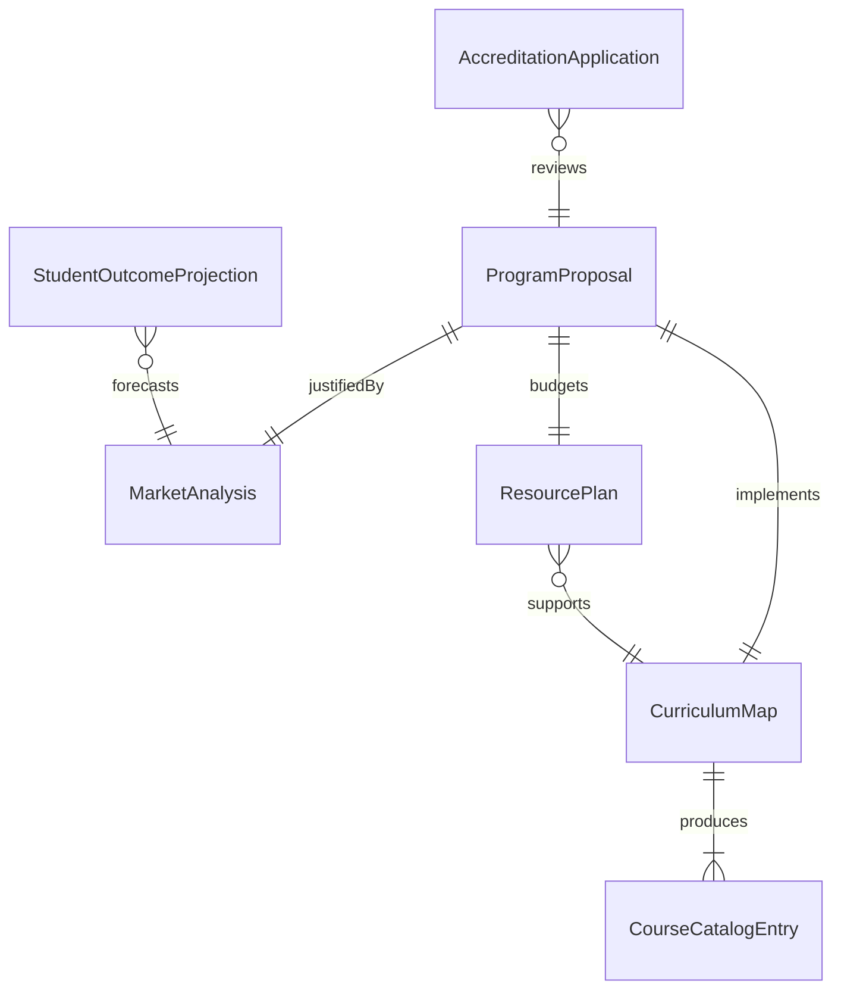
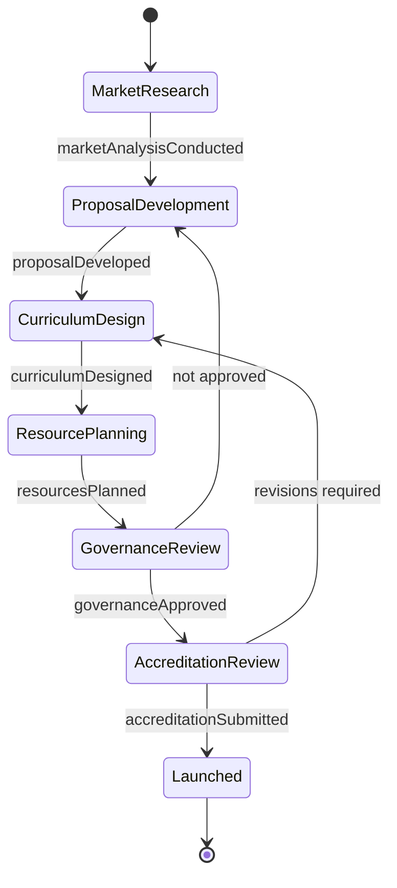
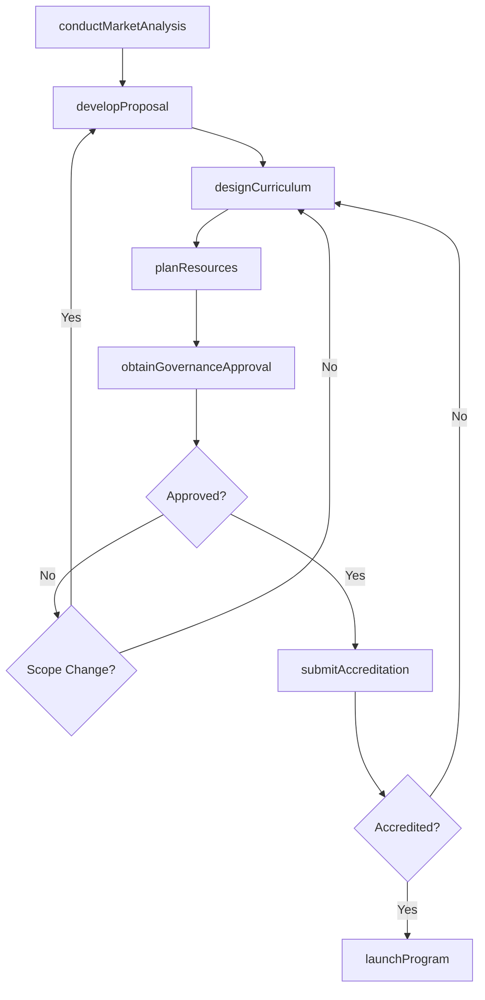
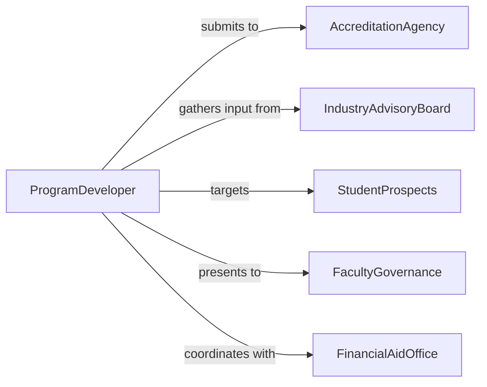

# Develop Educational Programs

> Business-as-Code definition for developing comprehensive educational programs including degree curricula, certificate programs, and continuing education offerings from needs analysis through accreditation and launch.

## Overview

Educational program development involves conducting market and workforce analyses, designing curriculum sequences, establishing learning outcomes, securing accreditation, and managing program launch logistics. This definition models the complete lifecycle from feasibility study through curriculum design, resource planning, accreditation review, and student enrollment.

## Actors

| Actor | Description |
|-------|-------------|
| AccreditationAgency | Body reviewing and approving academic programs |
| IndustryAdvisoryBoard | Employers informing workforce skill requirements |
| StudentProspects | Target learners for the new program |
| FacultyGovernance | Academic senate approving curricular additions |
| FinancialAidOffice | Department administering student funding eligibility |

## Roles

| Role | Description |
|------|-------------|
| ProgramDeveloper | Designs the overall program structure and curriculum |
| MarketAnalyst | Researches demand and competitive landscape |
| CurriculumDesigner | Sequences courses and maps learning outcomes |
| AccreditationLiaison | Manages the program approval process |

## Entities

| Entity | Description |
|--------|-------------|
| ProgramProposal | Formal document justifying the new program |
| MarketAnalysis | Research on student demand and employment outcomes |
| CurriculumMap | Sequenced course plan with prerequisite relationships |
| AccreditationApplication | Submission package for program approval |
| ResourcePlan | Budget and staffing requirements for the program |
| StudentOutcomeProjection | Estimated graduation rates and employment statistics |
| CourseCatalogEntry | Published description of the approved program |

## Actions

| Action | Description |
|--------|-------------|
| conductMarketAnalysis | Research demand, competition, and employment outlook |
| developProposal | Write the formal program justification document |
| designCurriculum | Sequence courses and map learning outcomes |
| planResources | Estimate faculty, facilities, and budget needs |
| submitAccreditation | File the program for external approval review |
| obtainGovernanceApproval | Secure internal academic senate approval |
| launchProgram | Open enrollment and deliver the first cohort |

## Events

| Event | Description |
|-------|-------------|
| marketAnalysisConducted | Demand and competitive research is complete |
| proposalDeveloped | Formal program document has been written |
| curriculumDesigned | Course sequence and outcomes map are finalized |
| resourcesPlanned | Budget and staffing estimates are ready |
| accreditationSubmitted | Program has been filed for external approval |
| governanceApproved | Academic senate has approved the program |
| programLaunched | First cohort enrollment has opened |

## Searches

| Search | Description |
|--------|-------------|
| findPrograms | Search educational programs by discipline or level |
| getMarketData | Retrieve demand and employment projections |
| listCourses | Enumerate courses within a program curriculum |
| getAccreditationStatus | Check the approval stage of a program |

## Entity Relationships



## State Diagram



## Workflow



## Actor Relationships



## Usage

### Calling Actions

```typescript
import { developEducationalPrograms } from '@headlessly/develop-educational-programs'

const programs = developEducationalPrograms()

// Conduct market analysis
const market = await programs.conductMarketAnalysis({
  discipline: 'cybersecurity',
  level: 'masters',
  region: 'midwest',
  competitors: 5,
  employmentProjection: 'BLS-SOC-15-1212'
})

// Design curriculum
const curriculum = await programs.designCurriculum({
  proposalId: market.proposalId,
  credits: 36,
  courses: [
    { title: 'Network Security Fundamentals', credits: 3, semester: 1 },
    { title: 'Cryptography and Secure Communications', credits: 3, semester: 1 },
    { title: 'Incident Response and Forensics', credits: 3, semester: 2 },
    { title: 'Capstone: Security Architecture Design', credits: 6, semester: 4 }
  ],
  prerequisites: ['undergraduate-CS-or-IT']
})

// Plan resources
await programs.planResources({
  curriculumId: curriculum.id,
  faculty: { fullTime: 3, adjunct: 4 },
  facilities: ['cyber-lab', 'simulation-range'],
  annualBudget: 850000
})
```

### Event-Driven Automation

```typescript
// Notify marketing when program is accredited
programs.programLaunched(async ({ programId, discipline }) => {
  await notify({
    to: 'enrollment-marketing',
    message: `${discipline} program ${programId} is live - begin recruitment campaign`
  })
})

// Alert leadership when governance review completes
programs.governanceApproved(async ({ programId }) => {
  await programs.submitAccreditation({ programId })
})
```
