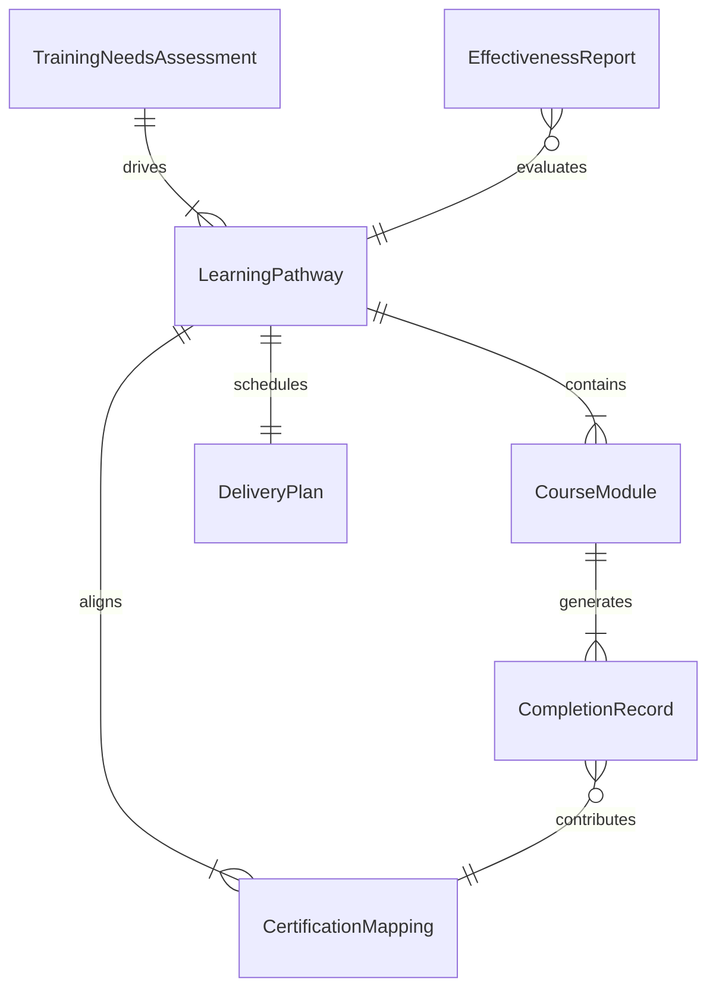
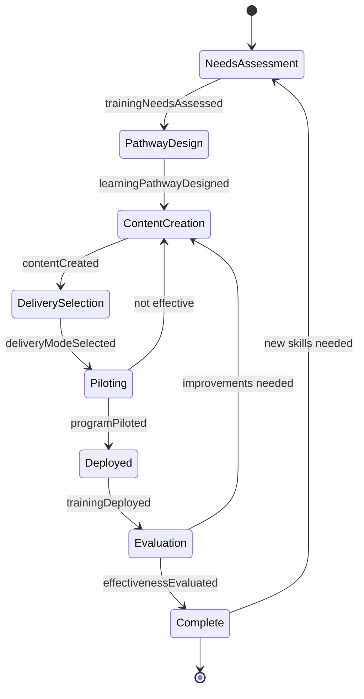
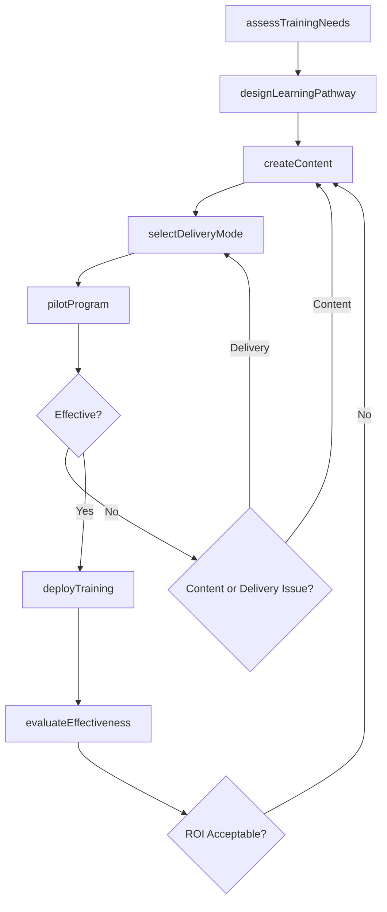
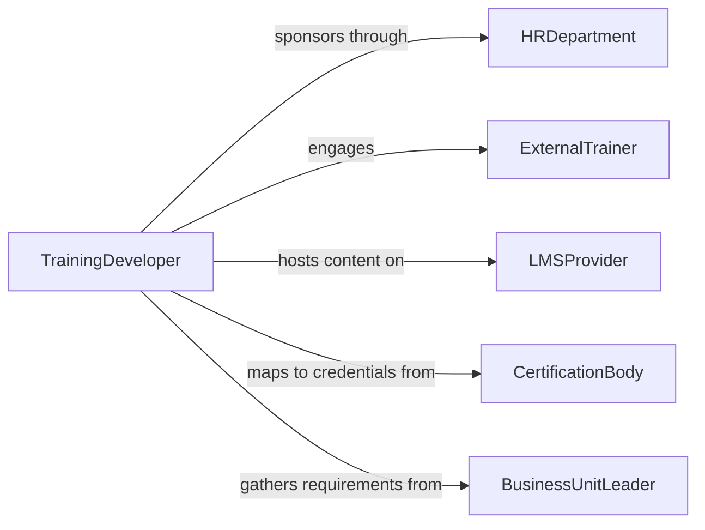

# Develop Educational or Training Programs

> Business-as-Code definition for developing corporate and professional training programs including onboarding, skills development, compliance training, and leadership development initiatives.

## Overview

Training program development involves identifying skill gaps, designing learning pathways, creating instructional content, selecting delivery modalities, and measuring return on investment for workforce development initiatives. This definition models the process from training needs assessment through program design, content creation, pilot delivery, and effectiveness evaluation.

## Actors

| Actor | Description |
|-------|-------------|
| HRDepartment | Human resources team sponsoring training initiatives |
| ExternalTrainer | Third-party facilitator delivering specialized programs |
| LMSProvider | Learning management system vendor hosting content |
| CertificationBody | Organization issuing professional credentials |
| BusinessUnitLeader | Manager identifying team skill gaps and priorities |

## Roles

| Role | Description |
|------|-------------|
| TrainingDeveloper | Designs and builds training program content |
| LearningExperienceDesigner | Creates engaging instructional experiences |
| FacilitationLead | Delivers training sessions and workshops |
| TrainingEvaluator | Measures program effectiveness and ROI |

## Entities

| Entity | Description |
|--------|-------------|
| TrainingNeedsAssessment | Analysis identifying workforce skill gaps |
| LearningPathway | Sequenced set of courses and experiences for a role |
| CourseModule | Self-contained unit of instructional content |
| DeliveryPlan | Schedule and modality for training delivery |
| CompletionRecord | Documentation of participant training completion |
| EffectivenessReport | Analysis of training impact on performance |
| CertificationMapping | Alignment of training to professional credentials |

## Actions

| Action | Description |
|--------|-------------|
| assessTrainingNeeds | Identify skill gaps through surveys and performance data |
| designLearningPathway | Structure the course sequence for target roles |
| createContent | Build instructional modules and assessment items |
| selectDeliveryMode | Choose between classroom, virtual, or self-paced formats |
| pilotProgram | Trial the training with a test group |
| deployTraining | Launch the program across the target audience |
| evaluateEffectiveness | Measure impact using Kirkpatrick or similar frameworks |

## Events

| Event | Description |
|-------|-------------|
| trainingNeedsAssessed | Skill gaps have been identified |
| learningPathwayDesigned | Course sequence has been structured |
| contentCreated | Instructional modules have been built |
| deliveryModeSelected | Training format has been chosen |
| programPiloted | Test group has completed the trial |
| trainingDeployed | Program has been launched organization-wide |
| effectivenessEvaluated | Impact measurement is complete |

## Searches

| Search | Description |
|--------|-------------|
| findPrograms | Search training programs by skill or department |
| getCompletionRates | Retrieve participation and completion data |
| listModules | Enumerate course modules within a pathway |
| getEffectivenessData | Look up ROI and impact metrics |

## Entity Relationships



## State Diagram



## Workflow



## Actor Relationships



## Usage

### Calling Actions

```typescript
import { developEducationalTrainingPrograms } from '@headlessly/develop-educational-training-programs'

const training = developEducationalTrainingPrograms()

// Assess training needs
const needs = await training.assessTrainingNeeds({
  department: 'engineering',
  method: 'skills-gap-survey',
  competencies: ['cloud-architecture', 'CI-CD-pipelines', 'security-best-practices'],
  participants: 120
})

// Design learning pathway
const pathway = await training.designLearningPathway({
  needsId: needs.id,
  role: 'senior-software-engineer',
  modules: [
    { title: 'Cloud Infrastructure Fundamentals', hours: 8, format: 'self-paced' },
    { title: 'CI/CD Pipeline Design Workshop', hours: 16, format: 'instructor-led' },
    { title: 'Application Security Bootcamp', hours: 24, format: 'hybrid' }
  ],
  certification: 'AWS-Solutions-Architect'
})

// Deploy training
await training.deployTraining({
  pathwayId: pathway.id,
  cohorts: [
    { name: 'Cohort-A', startDate: '2026-04-01', size: 30 },
    { name: 'Cohort-B', startDate: '2026-05-01', size: 30 }
  ]
})
```

### Event-Driven Automation

```typescript
// Notify managers when training completes
training.trainingDeployed(async ({ pathwayId, cohort }) => {
  await notify({
    to: 'engineering-managers',
    message: `${cohort} enrolled in training pathway ${pathwayId} - completion expected in 6 weeks`
  })
})

// Auto-evaluate after deployment
training.effectivenessEvaluated(async ({ pathwayId, roi }) => {
  await notify({
    to: 'hr-leadership',
    message: `Training pathway ${pathwayId} ROI: ${roi}% - ${roi > 100 ? 'exceeds' : 'below'} investment threshold`
  })
})
```
