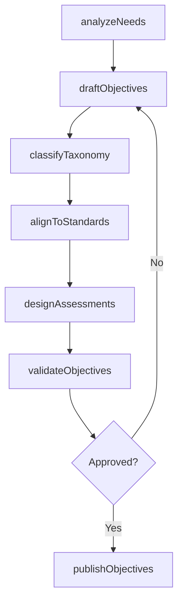
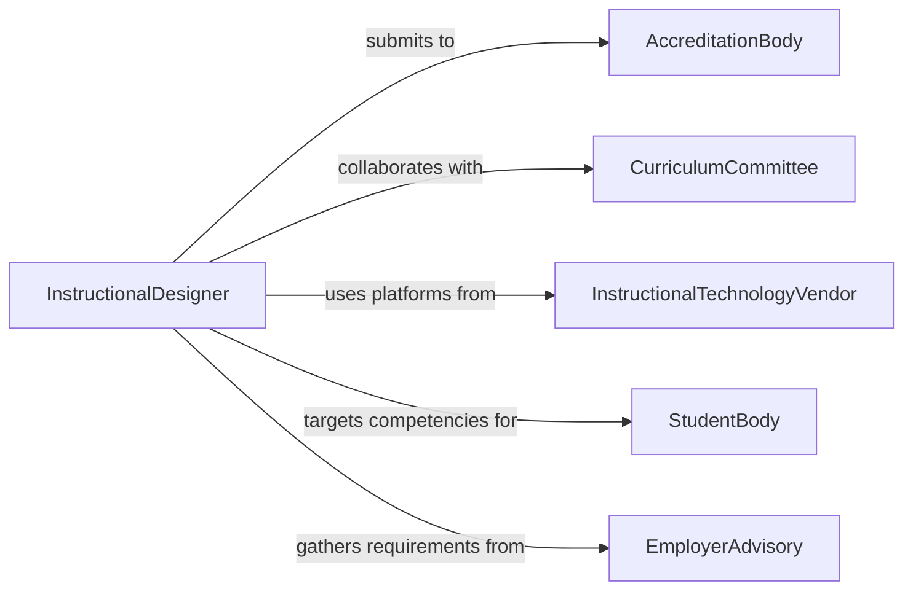

# Develop Instructional Objectives

> Business-as-Code definition for developing instructional objectives that define measurable learning outcomes, competency standards, and assessment criteria aligned with educational goals and curriculum frameworks.

## Overview

Instructional objective development involves analyzing learner needs, aligning outcomes with curriculum standards, writing measurable performance statements using taxonomic frameworks such as Bloom's taxonomy, and designing assessment instruments that verify objective attainment. This definition models the process from needs analysis through objective drafting, alignment verification, and assessment design.

## Actors

| Actor | Description |
|-------|-------------|
| AccreditationBody | Organization evaluating program quality against standards |
| CurriculumCommittee | Faculty group governing course content and standards |
| InstructionalTechnologyVendor | Provider of learning management and assessment platforms |
| StudentBody | Learners whose competencies the objectives target |
| EmployerAdvisory | Industry representatives defining workplace competencies |

## Roles

| Role | Description |
|------|-------------|
| InstructionalDesigner | Crafts measurable learning objectives |
| SubjectMatterExpert | Provides content knowledge for objective accuracy |
| AssessmentSpecialist | Designs instruments measuring objective attainment |
| CurriculumCoordinator | Aligns objectives across courses and programs |

## Entities

| Entity | Description |
|--------|-------------|
| LearningObjective | Measurable statement of expected learner performance |
| CompetencyFramework | Structured set of knowledge, skills, and abilities |
| AssessmentRubric | Scoring guide mapping performance to objective levels |
| AlignmentMatrix | Table mapping objectives to standards and assessments |
| BloomsTaxonomyLevel | Cognitive complexity classification of the objective |
| CourseOutline | Document listing all objectives for a course |

## Actions

| Action | Description |
|--------|-------------|
| analyzeNeeds | Identify learner gaps and competency requirements |
| draftObjectives | Write measurable performance statements |
| classifyTaxonomy | Assign cognitive complexity levels to each objective |
| alignToStandards | Map objectives to accreditation or curriculum standards |
| designAssessments | Create instruments measuring objective attainment |
| validateObjectives | Review objectives with stakeholders for clarity and rigor |
| publishObjectives | Distribute approved objectives to instructors |

## Events

| Event | Description |
|-------|-------------|
| needsAnalyzed | Learner gaps and requirements have been identified |
| objectivesDrafted | Performance statements have been written |
| taxonomyClassified | Cognitive levels have been assigned |
| standardsAligned | Objectives have been mapped to standards |
| assessmentsDesigned | Measurement instruments are complete |
| objectivesValidated | Stakeholder review and approval are complete |
| objectivesPublished | Approved objectives have been distributed |

## Searches

| Search | Description |
|--------|-------------|
| findObjectives | Search learning objectives by course or competency |
| getAlignmentData | Retrieve standards mapping for objectives |
| listAssessments | Enumerate instruments linked to objectives |
| getByTaxonomyLevel | Search objectives by Bloom's taxonomy classification |

## Workflow



## Actor Relationships



## Usage

### Calling Actions

```typescript
import { developInstructionalObjectives } from '@headlessly/develop-instructional-objectives'

const objectives = developInstructionalObjectives()

// Analyze learner needs
const needs = await objectives.analyzeNeeds({
  program: 'Data Science Certificate',
  level: 'graduate',
  prerequisites: ['statistics-fundamentals', 'programming-basics'],
  industryCompetencies: ['data-wrangling', 'statistical-modeling', 'visualization']
})

// Draft objectives
const drafted = await objectives.draftObjectives({
  needsId: needs.id,
  course: 'Applied Machine Learning',
  objectives: [
    'Given a labeled dataset, train and evaluate a supervised learning model achieving baseline accuracy',
    'Compare at least three model architectures using cross-validation metrics',
    'Deploy a trained model to a REST endpoint and validate predictions'
  ]
})

// Classify taxonomy levels
await objectives.classifyTaxonomy({
  objectivesId: drafted.id,
  framework: 'revised-blooms',
  classifications: [
    { objective: 0, level: 'apply' },
    { objective: 1, level: 'analyze' },
    { objective: 2, level: 'create' }
  ]
})
```

### Event-Driven Automation

```typescript
// Notify curriculum committee when objectives are ready for review
objectives.assessmentsDesigned(async ({ courseId }) => {
  await notify({
    to: 'curriculum-committee',
    message: `Objectives and assessments for course ${courseId} ready for validation review`
  })
})

// Auto-publish after validation
objectives.objectivesValidated(async ({ courseId, approved }) => {
  if (approved) {
    await objectives.publishObjectives({ courseId })
  }
})
```
