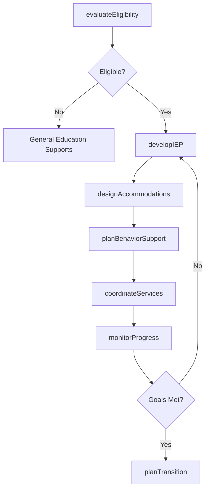
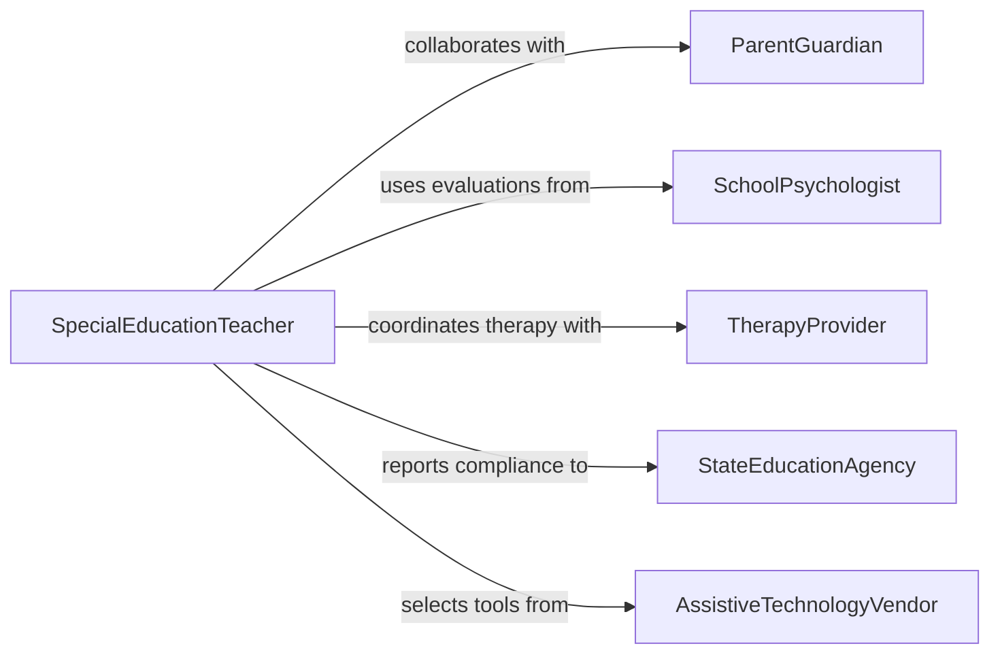

# Develop Strategies or Programs for Students with Special Needs

> Business-as-Code definition for developing educational strategies and programs that address the unique learning requirements of students with disabilities, gifted learners, and those requiring individualized accommodations under IDEA and Section 504.

## Overview

Special needs program development involves assessing individual student capabilities, designing individualized education programs, selecting adaptive technologies, and coordinating multidisciplinary support teams to ensure equitable access to education. This definition models the process from eligibility determination through IEP development, accommodation planning, service coordination, and progress monitoring.

## Actors

| Actor | Description |
|-------|-------------|
| ParentGuardian | Family member participating in IEP development |
| SchoolPsychologist | Professional conducting eligibility evaluations |
| TherapyProvider | Speech, occupational, or physical therapist |
| StateEducationAgency | Authority overseeing special education compliance |
| AssistiveTechnologyVendor | Supplier of adaptive devices and software |

## Roles

| Role | Description |
|------|-------------|
| SpecialEducationTeacher | Designs and delivers individualized instruction |
| IEPCoordinator | Manages the individualized education program process |
| BehaviorInterventionist | Develops behavioral support plans |
| InclusionSpecialist | Facilitates participation in general education settings |

## Entities

| Entity | Description |
|--------|-------------|
| IndividualizedEducationProgram | Legally mandated plan defining goals and services |
| EligibilityDetermination | Assessment confirming a student qualifies for services |
| AccommodationPlan | List of modifications to curriculum and environment |
| BehaviorSupportPlan | Strategy document for managing behavioral challenges |
| ProgressReport | Periodic assessment of goal attainment |
| TransitionPlan | Post-secondary preparation plan for older students |
| ServiceDeliveryLog | Record of therapy and support sessions provided |

## Actions

| Action | Description |
|--------|-------------|
| evaluateEligibility | Assess whether a student qualifies for special services |
| developIEP | Create the individualized education program with goals |
| designAccommodations | Define curriculum and environmental modifications |
| planBehaviorSupport | Develop strategies for behavioral challenges |
| coordinateServices | Schedule therapy and support sessions |
| monitorProgress | Track student advancement toward IEP goals |
| planTransition | Prepare post-secondary readiness for older students |

## Events

| Event | Description |
|-------|-------------|
| eligibilityEvaluated | Student qualification assessment is complete |
| iepDeveloped | Individualized education program has been created |
| accommodationsDesigned | Curriculum modifications have been specified |
| behaviorSupportPlanned | Behavioral strategies have been documented |
| servicesCoordinated | Therapy and support sessions have been scheduled |
| progressMonitored | Goal attainment data have been collected |
| transitionPlanned | Post-secondary preparation plan is in place |

## Searches

| Search | Description |
|--------|-------------|
| findIEPs | Search individualized education programs by student or school |
| getProgressData | Retrieve goal attainment metrics for a student |
| listAccommodations | Enumerate modifications for a specific student |
| getServiceLogs | Look up therapy and support session records |

## Workflow



## Actor Relationships



## Usage

### Calling Actions

```typescript
import { developStrategiesProgramsStudentsSpecial } from '@headlessly/develop-strategies-programs-students-special'

const specialEd = developStrategiesProgramsStudentsSpecial()

// Evaluate eligibility
const evaluation = await specialEd.evaluateEligibility({
  studentId: 'STU-2026-0442',
  assessments: ['cognitive-ability', 'academic-achievement', 'behavioral-observation'],
  category: 'specific-learning-disability'
})

// Develop IEP
const iep = await specialEd.developIEP({
  evaluationId: evaluation.id,
  annualGoals: [
    { area: 'reading-fluency', baseline: 65, target: 110, metric: 'words-per-minute' },
    { area: 'math-computation', baseline: 'grade-2', target: 'grade-4', metric: 'grade-equivalent' }
  ],
  services: [
    { type: 'specialized-instruction', hours: 5, frequency: 'weekly' },
    { type: 'speech-therapy', hours: 1, frequency: 'weekly' }
  ]
})

// Design accommodations
await specialEd.designAccommodations({
  iepId: iep.id,
  accommodations: [
    { type: 'extended-time', percentage: 50, applies: 'assessments' },
    { type: 'text-to-speech', applies: 'reading-assignments' },
    { type: 'preferential-seating', location: 'front-row' }
  ]
})
```

### Event-Driven Automation

```typescript
// Alert team when progress monitoring shows insufficient growth
specialEd.progressMonitored(async ({ studentId, goal, growthRate }) => {
  if (growthRate < 0.5) {
    await notify({
      to: 'iep-team',
      message: `Student ${studentId} showing insufficient growth on ${goal} - IEP review recommended`
    })
  }
})

// Schedule annual IEP review
specialEd.iepDeveloped(async ({ iepId, studentId }) => {
  await scheduleReminder({
    date: addMonths(new Date(), 12),
    to: 'iep-coordinator',
    message: `Annual IEP review due for student ${studentId} - IEP ${iepId}`
  })
})
```
