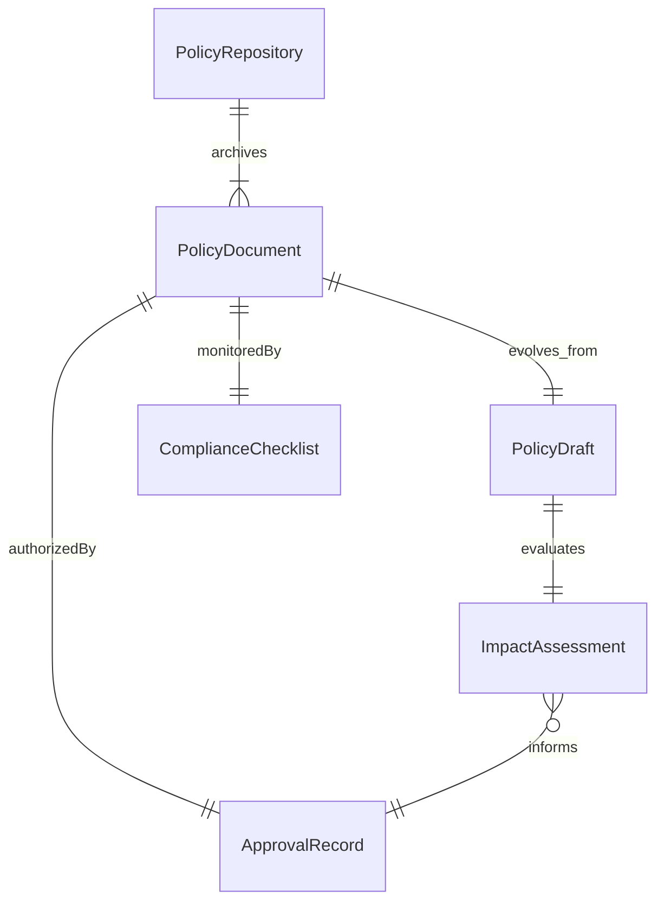
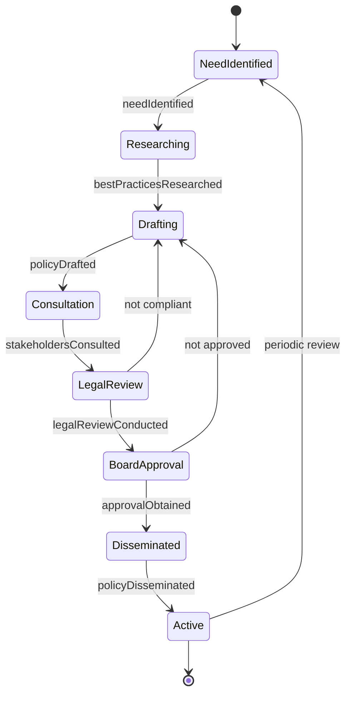
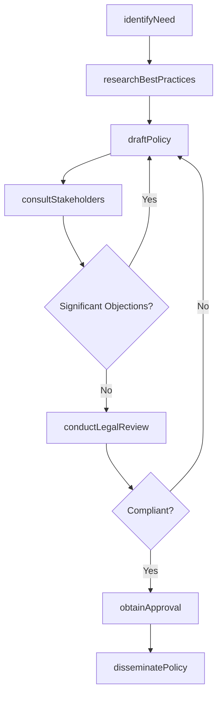
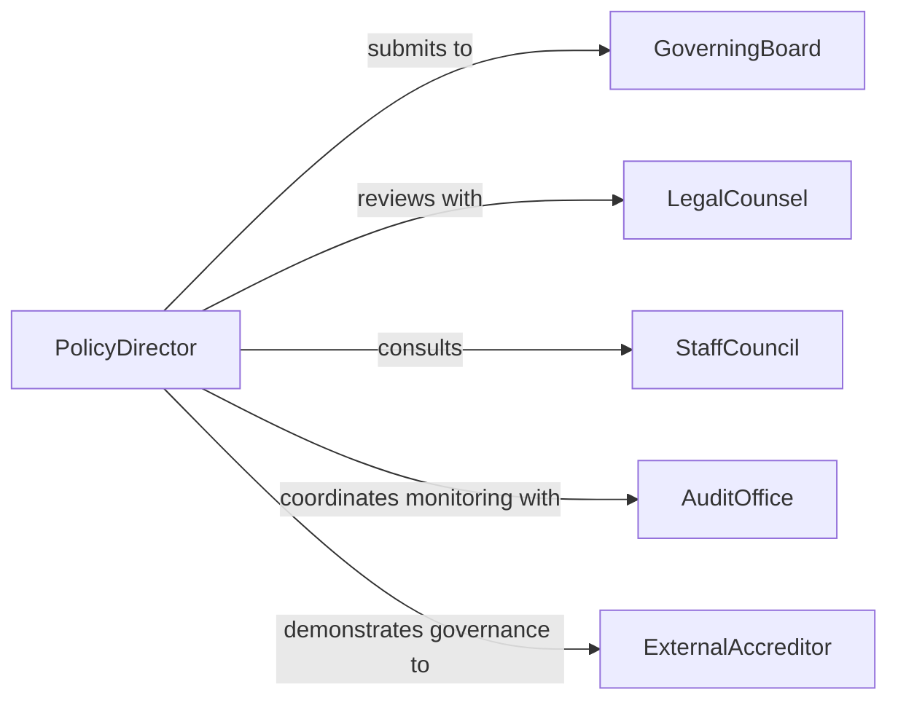

# Establish Operational Policies

> Business-as-Code definition for establishing operational policies that govern day-to-day organizational procedures, resource allocation, decision-making authority, and compliance requirements in educational and institutional settings.

## Overview

Establishing operational policies involves drafting governance rules, approval workflows, resource management guidelines, and accountability structures that enable consistent organizational operations. This definition models the process from policy need identification through drafting, stakeholder consultation, legal review, board approval, and policy dissemination.

## Actors

| Actor | Description |
|-------|-------------|
| GoverningBoard | Authority body approving institutional policies |
| LegalCounsel | Attorney reviewing policy language for compliance |
| StaffCouncil | Employee representative body providing input |
| AuditOffice | Internal team monitoring policy adherence |
| ExternalAccreditor | Organization assessing institutional governance quality |

## Roles

| Role | Description |
|------|-------------|
| PolicyDirector | Leads the policy development and approval process |
| PolicyAnalyst | Researches best practices and drafts policy language |
| ComplianceOfficer | Ensures policies meet regulatory requirements |
| CommunicationsManager | Distributes and explains approved policies |

## Entities

| Entity | Description |
|--------|-------------|
| PolicyDocument | Formal statement of operational rules and procedures |
| PolicyDraft | Working version under development and review |
| ImpactAssessment | Analysis of how the policy affects stakeholders |
| ApprovalRecord | Documentation of board vote and effective date |
| ComplianceChecklist | Monitoring tool for policy adherence |
| PolicyRepository | Central archive of all active institutional policies |

## Actions

| Action | Description |
|--------|-------------|
| identifyNeed | Determine the operational area requiring a policy |
| researchBestPractices | Survey peer institutions and regulatory frameworks |
| draftPolicy | Write the policy document with procedures and scope |
| consultStakeholders | Gather input from affected staff and departments |
| conductLegalReview | Verify regulatory compliance of policy language |
| obtainApproval | Submit the policy for governing board vote |
| disseminatePolicy | Distribute and train staff on the approved policy |

## Events

| Event | Description |
|-------|-------------|
| needIdentified | An operational area requiring policy has been flagged |
| bestPracticesResearched | Peer and regulatory research is complete |
| policyDrafted | Working policy document has been written |
| stakeholdersConsulted | Input from affected parties has been gathered |
| legalReviewConducted | Compliance review of policy language is done |
| approvalObtained | Governing board has voted to adopt the policy |
| policyDisseminated | Staff have been notified and trained |

## Searches

| Search | Description |
|--------|-------------|
| findPolicies | Search operational policies by category or department |
| getDraftStatus | Check the current stage of a policy in development |
| listApprovals | Enumerate recently adopted policies |
| getComplianceStatus | Look up adherence data for an active policy |

## Entity Relationships



## State Diagram



## Workflow



## Actor Relationships



## Usage

### Calling Actions

```typescript
import { establishOperationalPolicies } from '@headlessly/establish-operational-policies'

const policies = establishOperationalPolicies()

// Identify the policy need
const need = await policies.identifyNeed({
  area: 'remote-work-eligibility',
  trigger: 'post-pandemic-hybrid-transition',
  affectedDepartments: ['academic-affairs', 'student-services', 'facilities']
})

// Draft the policy
const draft = await policies.draftPolicy({
  needId: need.id,
  title: 'Flexible Work Arrangement Policy',
  scope: 'all-full-time-staff',
  sections: ['eligibility', 'schedule-requirements', 'equipment-provision', 'performance-expectations'],
  effectiveDate: '2026-07-01'
})

// Conduct legal review
await policies.conductLegalReview({
  draftId: draft.id,
  regulations: ['FLSA', 'ADA', 'state-labor-code'],
  reviewer: 'general-counsel'
})
```

### Event-Driven Automation

```typescript
// Notify all staff when policy is adopted
policies.policyDisseminated(async ({ policyId, title }) => {
  await notify({
    to: 'all-staff',
    message: `New policy adopted: ${title} - review in the policy portal`
  })
})

// Flag overdue compliance reviews
policies.approvalObtained(async ({ policyId, reviewDate }) => {
  await scheduleReminder({
    date: reviewDate,
    to: 'compliance-officer',
    message: `Annual review due for policy ${policyId}`
  })
})
```
