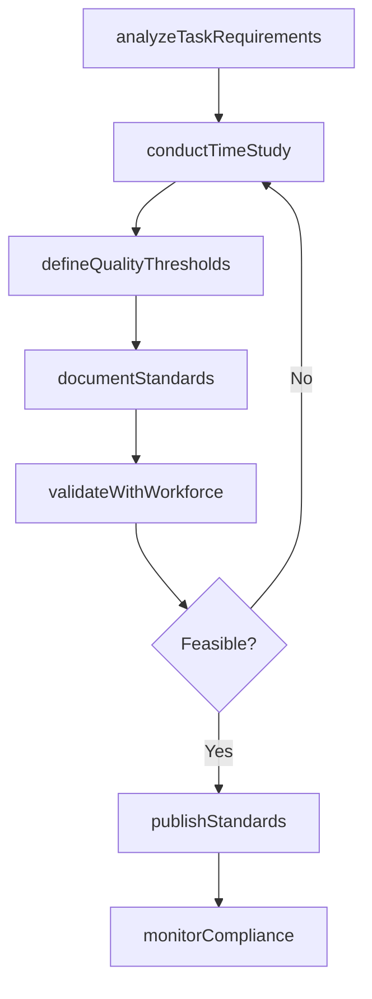
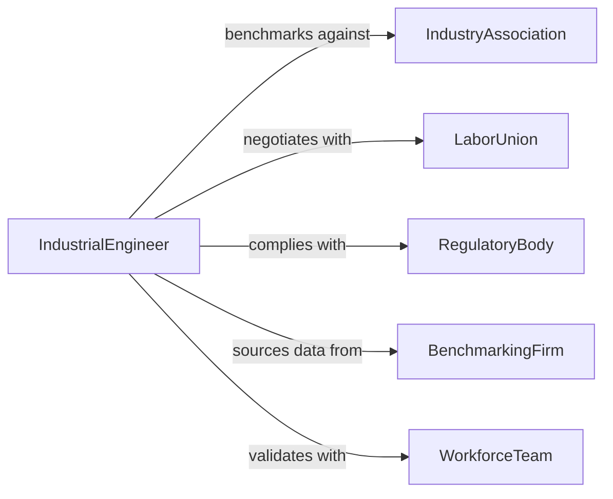

# Establish Work Standards

> Business-as-Code definition for establishing work standards that define performance expectations, quality benchmarks, and productivity metrics for organizational roles and processes.

## Overview

Establishing work standards involves analyzing job tasks, measuring output rates, defining quality thresholds, and documenting standardized procedures that employees follow to achieve consistent results. This definition models the process from task analysis through time study, standard setting, documentation, and ongoing compliance monitoring.

## Actors

| Actor | Description |
|-------|-------------|
| IndustryAssociation | Organization publishing sector-specific performance benchmarks |
| LaborUnion | Worker representative negotiating fair workload standards |
| RegulatoryBody | Agency enforcing workplace safety and labor standards |
| BenchmarkingFirm | Consultant providing comparative productivity data |
| WorkforceTeam | Employees subject to the established standards |

## Roles

| Role | Description |
|------|-------------|
| IndustrialEngineer | Conducts time studies and designs work methods |
| QualityManager | Defines quality thresholds and inspection criteria |
| OperationsDirector | Approves and enforces work standards across units |
| TrainingCoordinator | Ensures employees understand and can meet standards |

## Entities

| Entity | Description |
|--------|-------------|
| WorkStandard | Documented performance expectation for a task or role |
| TimeStudy | Measured observation of task completion duration |
| QualityThreshold | Acceptable defect rate or quality level |
| StandardOperatingProcedure | Step-by-step instructions for task execution |
| ProductivityMetric | Quantified output rate per unit of time |
| ComplianceReport | Assessment of actual performance against standards |

## Actions

| Action | Description |
|--------|-------------|
| analyzeTaskRequirements | Break down job functions into measurable components |
| conductTimeStudy | Measure task duration under standard conditions |
| defineQualityThresholds | Set acceptable quality levels and defect rates |
| documentStandards | Write standard operating procedures and benchmarks |
| validateWithWorkforce | Test standards with employees for feasibility |
| publishStandards | Distribute approved standards across the organization |
| monitorCompliance | Track actual performance against established standards |

## Events

| Event | Description |
|-------|-------------|
| taskRequirementsAnalyzed | Job functions have been broken into components |
| timeStudyConducted | Task duration measurements are complete |
| qualityThresholdsDefined | Acceptable quality levels have been set |
| standardsDocumented | Procedures and benchmarks have been written |
| workforceValidated | Employees have confirmed standards are feasible |
| standardsPublished | Approved standards have been distributed |
| complianceMonitored | Performance tracking against standards is active |

## Searches

| Search | Description |
|--------|-------------|
| findStandards | Search work standards by department or task type |
| getTimeStudies | Retrieve time study data for a specific task |
| listQualityThresholds | Enumerate quality benchmarks by process |
| getComplianceData | Look up performance-versus-standard reports |

## Workflow



## Actor Relationships



## Usage

### Calling Actions

```typescript
import { establishWorkStandards } from '@headlessly/establish-work-standards'

const standards = establishWorkStandards()

// Analyze task requirements
const tasks = await standards.analyzeTaskRequirements({
  department: 'warehouse-operations',
  roles: ['picker', 'packer', 'shipper'],
  tasks: ['order-picking', 'box-packing', 'label-printing', 'pallet-loading']
})

// Conduct time study
const study = await standards.conductTimeStudy({
  taskId: tasks.id,
  task: 'order-picking',
  observations: 30,
  allowances: { fatigue: 0.05, personal: 0.05, delay: 0.03 }
})

// Document standards
await standards.documentStandards({
  studyId: study.id,
  standardTime: { value: 45, unit: 'seconds-per-pick' },
  qualityTarget: { accuracy: 0.998, damageRate: 0.001 }
})
```

### Event-Driven Automation

```typescript
// Alert management when compliance drops
standards.complianceMonitored(async ({ department, complianceRate }) => {
  if (complianceRate < 0.85) {
    await notify({
      to: 'operations-director',
      message: `${department} compliance at ${(complianceRate * 100).toFixed(0)}% - below 85% threshold`
    })
  }
})

// Auto-schedule retraining when standards are updated
standards.standardsPublished(async ({ standardId, department }) => {
  await notify({
    to: 'training-coordinator',
    message: `Updated work standards ${standardId} published for ${department} - schedule retraining`
  })
})
```
