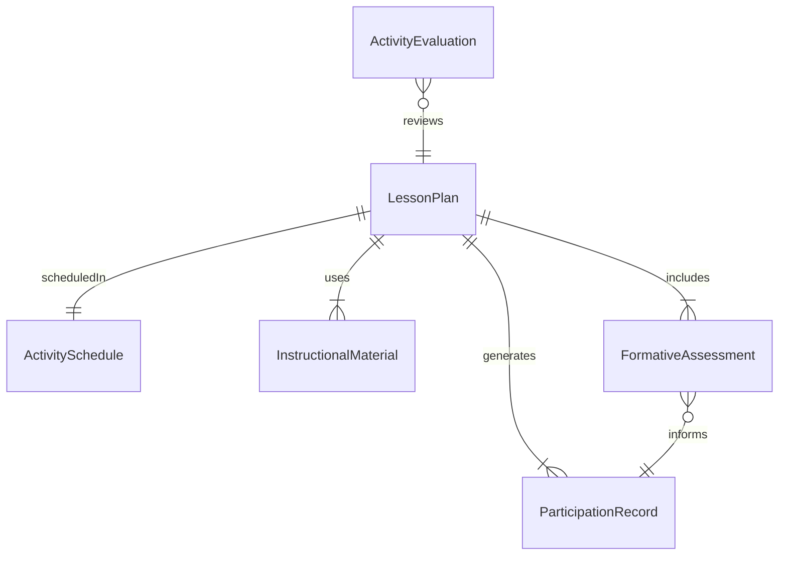
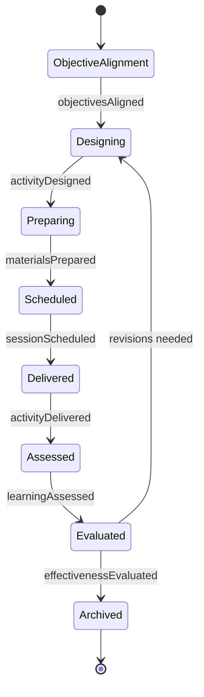
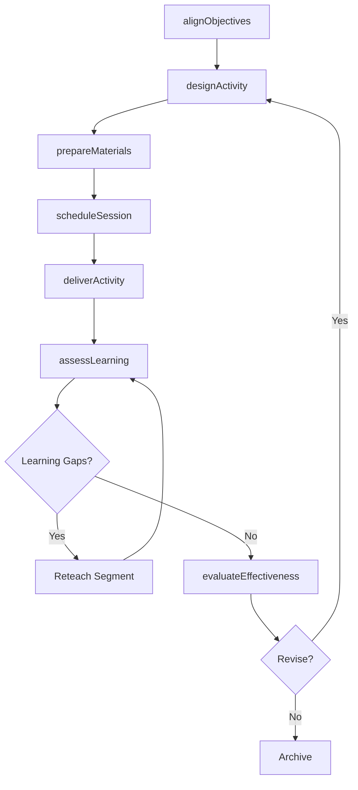
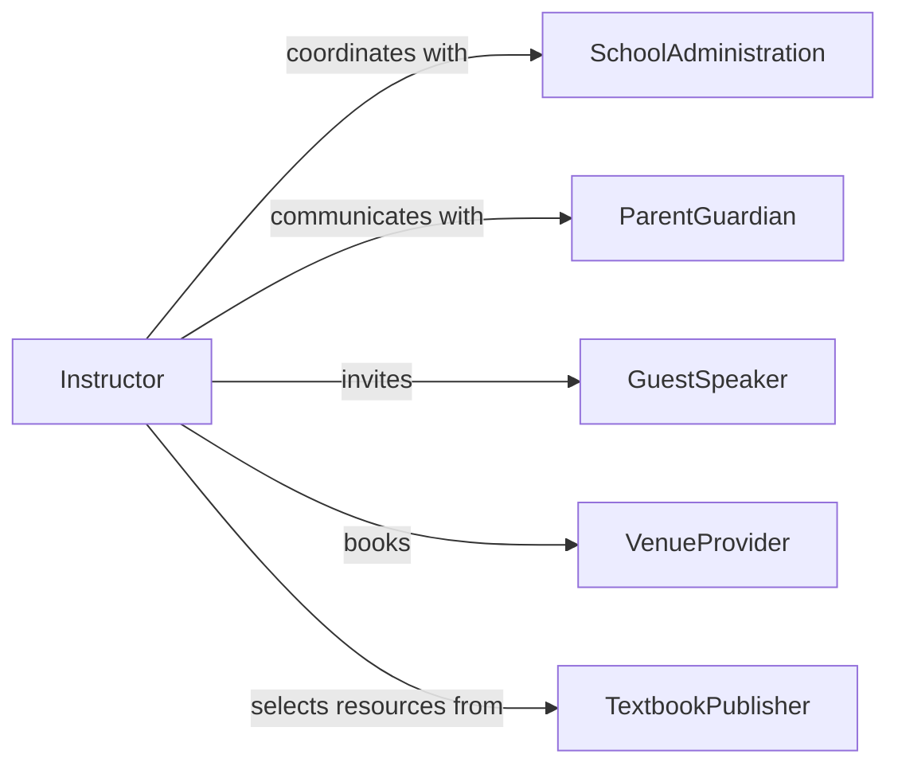

# Plan Educational Activities

> Business-as-Code definition for planning educational activities including lesson plans, workshops, seminars, field trips, and classroom exercises that deliver curriculum content and engage learners.

## Overview

Educational activity planning involves selecting instructional strategies, sequencing learning experiences, preparing materials, and scheduling sessions that achieve specific learning objectives within time and resource constraints. This definition models the process from objective alignment through activity design, material preparation, scheduling, delivery, and learner assessment.

## Actors

| Actor | Description |
|-------|-------------|
| SchoolAdministration | Institution providing scheduling and resource constraints |
| ParentGuardian | Family member authorizing student participation |
| GuestSpeaker | External expert contributing to educational sessions |
| VenueProvider | Facility hosting off-campus educational activities |
| TextbookPublisher | Supplier of instructional materials and resources |

## Roles

| Role | Description |
|------|-------------|
| Instructor | Designs and delivers educational activities |
| CurriculumPlanner | Aligns activities with program-level objectives |
| InstructionalAide | Supports activity preparation and delivery |
| AssessmentCoordinator | Designs formative and summative evaluations |

## Entities

| Entity | Description |
|--------|-------------|
| LessonPlan | Structured outline of an educational session |
| ActivitySchedule | Calendar of planned educational events |
| InstructionalMaterial | Handouts, slides, and resources for the activity |
| FormativeAssessment | In-session check for learner understanding |
| ParticipationRecord | Attendance and engagement data for each activity |
| ActivityEvaluation | Post-activity feedback from learners and observers |

## Actions

| Action | Description |
|--------|-------------|
| alignObjectives | Map activities to specific learning outcomes |
| designActivity | Structure the educational experience and flow |
| prepareMaterials | Create or gather instructional resources |
| scheduleSession | Reserve time, space, and participants |
| deliverActivity | Conduct the educational session |
| assessLearning | Evaluate learner understanding during and after |
| evaluateEffectiveness | Gather feedback on the activity quality |

## Events

| Event | Description |
|-------|-------------|
| objectivesAligned | Activities have been mapped to learning outcomes |
| activityDesigned | Educational experience has been structured |
| materialsPrepared | Instructional resources are ready |
| sessionScheduled | Time, space, and participants are reserved |
| activityDelivered | Educational session has been conducted |
| learningAssessed | Learner understanding has been evaluated |
| effectivenessEvaluated | Feedback on activity quality has been collected |

## Searches

| Search | Description |
|--------|-------------|
| findActivities | Search lesson plans by subject or objective |
| getSchedule | Retrieve upcoming educational sessions |
| listMaterials | Enumerate resources for a planned activity |
| getAssessmentResults | Look up learner performance data by activity |

## Entity Relationships



## State Diagram



## Workflow



## Actor Relationships



## Usage

### Calling Actions

```typescript
import { planEducationalActivities } from '@headlessly/plan-educational-activities'

const activities = planEducationalActivities()

// Align to objectives
const aligned = await activities.alignObjectives({
  course: 'AP-Biology',
  unit: 'cellular-respiration',
  objectives: ['explain-glycolysis-steps', 'compare-aerobic-anaerobic', 'analyze-ATP-yield']
})

// Design the activity
const activity = await activities.designActivity({
  alignmentId: aligned.id,
  type: 'laboratory-exercise',
  title: 'Measuring Cellular Respiration in Germinating Seeds',
  duration: { value: 90, unit: 'minutes' },
  groupSize: 4,
  materials: ['respirometer', 'germinating-peas', 'glass-beads', 'KOH-solution']
})

// Schedule the session
await activities.scheduleSession({
  activityId: activity.id,
  date: '2026-03-15',
  room: 'science-lab-204',
  period: 3
})
```

### Event-Driven Automation

```typescript
// Remind instructor to prepare materials
activities.sessionScheduled(async ({ activityId, date }) => {
  await scheduleReminder({
    date: subtractDays(date, 3),
    to: 'instructor',
    message: `Materials needed for activity ${activityId} in 3 days`
  })
})

// Collect effectiveness feedback after delivery
activities.activityDelivered(async ({ activityId }) => {
  await notify({
    to: 'students',
    message: `Please complete the feedback survey for today's activity ${activityId}`
  })
})
```
