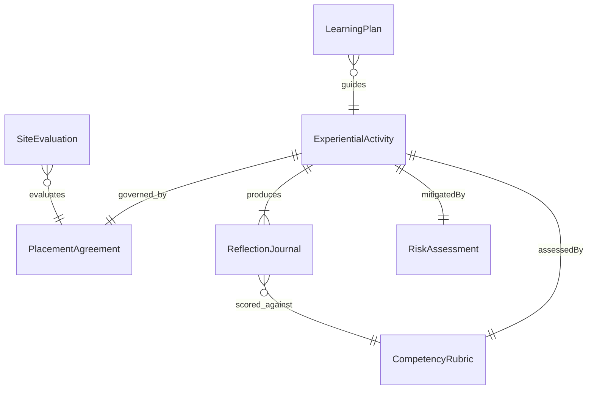
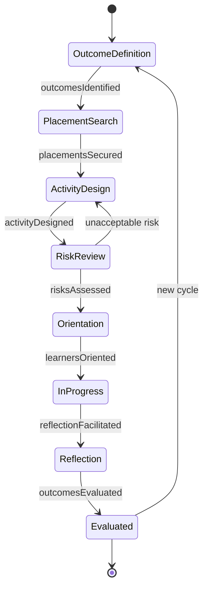
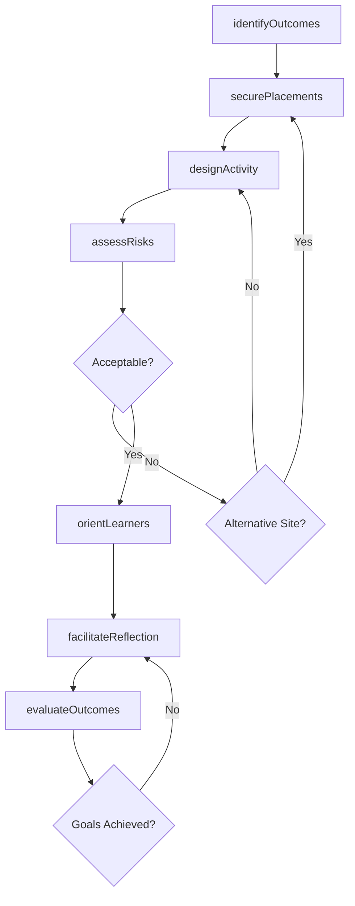
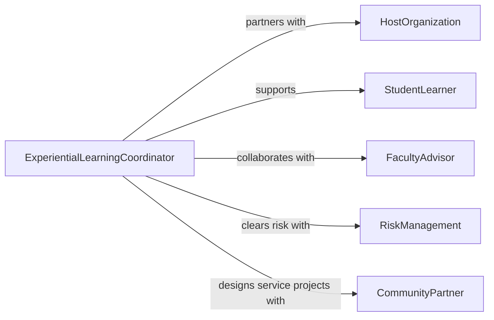

# Plan Experiential Learning Activities

> Business-as-Code definition for planning experiential learning activities including internships, field placements, simulations, service-learning projects, and laboratory exercises that connect theory to practice.

## Overview

Experiential learning activity planning involves designing hands-on educational experiences that engage learners in real-world problem solving, reflection, and skill application. This definition models the process from learning outcome identification through site partner coordination, activity design, risk management, and learner assessment within Kolb's experiential learning cycle.

## Actors

| Actor | Description |
|-------|-------------|
| HostOrganization | Employer or community partner providing placement sites |
| StudentLearner | Participant engaged in the experiential activity |
| FacultyAdvisor | Instructor overseeing academic integration of the experience |
| RiskManagement | Office evaluating liability and safety for off-campus activities |
| CommunityPartner | Nonprofit or agency collaborating on service-learning projects |

## Roles

| Role | Description |
|------|-------------|
| ExperientialLearningCoordinator | Designs and manages hands-on learning programs |
| SiteSupervisor | Mentors learners at the placement location |
| ReflectionFacilitator | Guides structured reflection on the experience |
| AssessmentDesigner | Creates rubrics linking experience to learning outcomes |

## Entities

| Entity | Description |
|--------|-------------|
| ExperientialActivity | Structured hands-on learning engagement |
| PlacementAgreement | Contract between the institution and host organization |
| ReflectionJournal | Learner documentation of observations and insights |
| CompetencyRubric | Assessment tool mapping experience to learning outcomes |
| RiskAssessment | Evaluation of safety and liability for the activity |
| LearningPlan | Individual objectives and milestones for the learner |
| SiteEvaluation | Feedback from the host organization on learner performance |

## Actions

| Action | Description |
|--------|-------------|
| identifyOutcomes | Define learning objectives achievable through experience |
| securePlacements | Establish agreements with host organizations |
| designActivity | Structure the hands-on learning engagement |
| assessRisks | Evaluate safety and liability considerations |
| orientLearners | Prepare students for the experiential setting |
| facilitateReflection | Guide structured analysis of the learning experience |
| evaluateOutcomes | Assess learner achievement against objectives |

## Events

| Event | Description |
|-------|-------------|
| outcomesIdentified | Learning objectives have been defined |
| placementsSecured | Host organization agreements are in place |
| activityDesigned | Hands-on engagement has been structured |
| risksAssessed | Safety and liability evaluation is complete |
| learnersOriented | Students have been prepared for the experience |
| reflectionFacilitated | Structured analysis sessions have been conducted |
| outcomesEvaluated | Learner achievement has been assessed |

## Searches

| Search | Description |
|--------|-------------|
| findActivities | Search experiential activities by type or discipline |
| getPlacements | Retrieve host organization agreements |
| listReflections | Enumerate learner journals by activity |
| getEvaluations | Look up site performance feedback |

## Entity Relationships



## State Diagram



## Workflow



## Actor Relationships



## Usage

### Calling Actions

```typescript
import { planExperientialLearningActivities } from '@headlessly/plan-experiential-learning-activities'

const experiential = planExperientialLearningActivities()

// Identify learning outcomes
const outcomes = await experiential.identifyOutcomes({
  program: 'Environmental Science',
  activity: 'field-research-placement',
  objectives: [
    'Collect and analyze water quality samples using standard protocols',
    'Communicate findings to non-technical stakeholders',
    'Apply GIS mapping tools to environmental data'
  ]
})

// Secure placements
const placement = await experiential.securePlacements({
  outcomesId: outcomes.id,
  host: 'Regional Conservation District',
  duration: { weeks: 10 },
  hoursPerWeek: 20,
  supervisorContact: 'field-director'
})

// Design the activity
await experiential.designActivity({
  placementId: placement.id,
  milestones: [
    { week: 2, deliverable: 'site-orientation-complete' },
    { week: 5, deliverable: 'midpoint-reflection-journal' },
    { week: 8, deliverable: 'data-analysis-report' },
    { week: 10, deliverable: 'final-presentation' }
  ]
})
```

### Event-Driven Automation

```typescript
// Notify faculty when reflection is due
experiential.learnersOriented(async ({ activityId, learnerIds }) => {
  await notify({
    to: 'faculty-advisor',
    message: `${learnerIds.length} learners oriented for activity ${activityId} - first reflection due in 2 weeks`
  })
})

// Collect site evaluations after activity completes
experiential.outcomesEvaluated(async ({ activityId }) => {
  await notify({
    to: 'site-supervisor',
    message: `Please complete the site evaluation for activity ${activityId}`
  })
})
```
