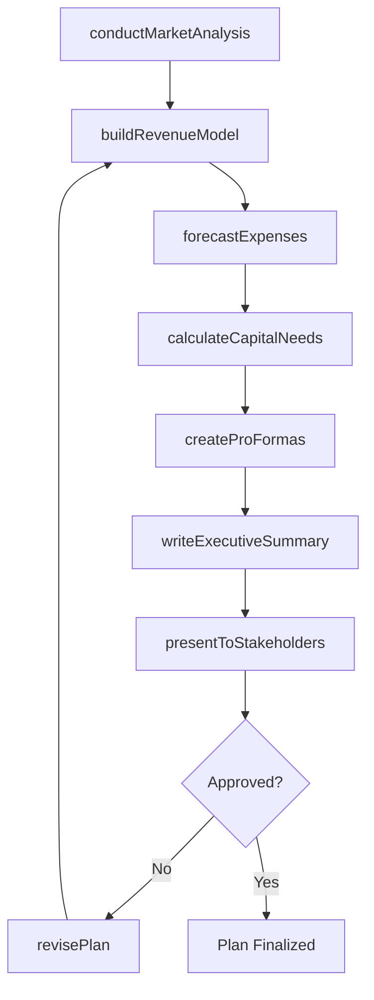
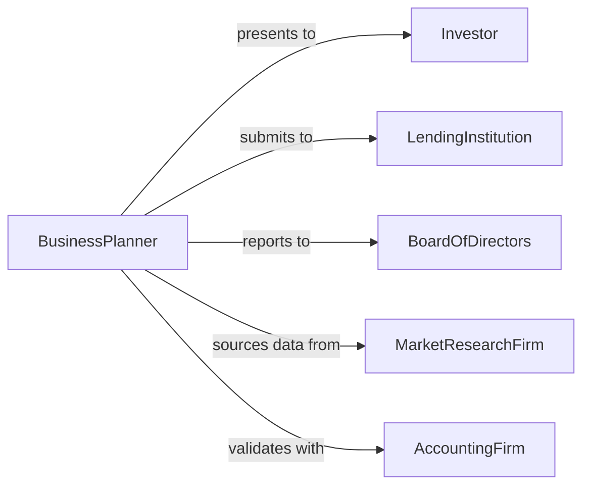

# Develop Financial or Business Plans

> Business-as-Code definition for developing comprehensive business plans and financial projections that guide organizational strategy, fundraising, and operational decision-making.

## Overview

Business and financial plan development involves market analysis, revenue modeling, expense forecasting, capital requirements planning, and strategic objective documentation. This definition models the creation of business plans used for startup fundraising, division planning, expansion initiatives, and annual operating budgets, covering every step from market research through financial modeling and stakeholder presentation.

## Actors

| Actor | Description |
|-------|-------------|
| Investor | Venture capital firm or angel investor evaluating the plan |
| LendingInstitution | Bank or credit union considering financing |
| BoardOfDirectors | Governance body approving strategic plans |
| MarketResearchFirm | Organization providing industry and competitive data |
| AccountingFirm | External auditor validating financial projections |
| StrategicPartner | Organization with potential joint venture interest |

## Roles

| Role | Description |
|------|-------------|
| BusinessPlanner | Authors the comprehensive business plan |
| FinancialModeler | Builds revenue and expense projection models |
| MarketAnalyst | Researches industry trends and competitive landscape |
| CFO | Approves financial projections and capital strategy |

## Entities

| Entity | Description |
|--------|-------------|
| BusinessPlan | Comprehensive strategic and financial planning document |
| MarketAnalysis | Research on industry size, trends, and competition |
| RevenueModel | Projection of income streams over time |
| ExpenseForecast | Projected operating and capital expenditures |
| CapitalRequirement | Funding needed to execute the plan |
| ProFormaStatement | Projected income statement, balance sheet, or cash flow |
| ExecutiveSummary | Concise overview of the business plan |
| MilestoneSchedule | Key achievements and target dates |

## Actions

| Action | Description |
|--------|-------------|
| conductMarketAnalysis | Research industry, competition, and target market |
| buildRevenueModel | Create projections for revenue streams |
| forecastExpenses | Model operating and capital costs |
| calculateCapitalNeeds | Determine funding requirements |
| createProFormas | Build projected financial statements |
| writeExecutiveSummary | Author the plan overview for stakeholders |
| presentToStakeholders | Deliver the business plan to investors or board |
| revisePlan | Update the plan based on feedback or new data |

## Events

| Event | Description |
|-------|-------------|
| marketAnalysisCompleted | Industry and competitive research is finished |
| revenueModelBuilt | Income projections have been created |
| expensesForecasted | Cost projections have been modeled |
| capitalNeedsCalculated | Funding requirements have been determined |
| proFormasCreated | Projected financial statements are ready |
| executiveSummaryWritten | The plan overview has been authored |
| planPresented | The business plan has been delivered to stakeholders |
| planRevised | The plan has been updated with new information |

## Searches

| Search | Description |
|--------|-------------|
| findBusinessPlans | Search plans by division, year, or status |
| getRevenueModels | Retrieve revenue projections by scenario |
| listMilestones | Enumerate key milestones and target dates |
| getCapitalRequirements | Look up funding needs by phase |
| getProFormas | Retrieve projected financial statements |

## Workflow



## Actor Relationships



## Usage

### Calling Actions

```typescript
import { developFinancialBusinessPlans } from '@headlessly/develop-financial-business-plans'

const bizPlan = developFinancialBusinessPlans()

// Conduct market analysis
const market = await bizPlan.conductMarketAnalysis({
  industry: 'enterprise-saas',
  targetSegment: 'mid-market',
  geography: 'north-america',
  competitors: ['competitor-a', 'competitor-b', 'competitor-c']
})

// Build revenue model
const revenue = await bizPlan.buildRevenueModel({
  marketId: market.id,
  streams: [
    { name: 'subscription', pricing: 'per-seat', avgDealSize: 24000, growthRate: 0.35 },
    { name: 'professional-services', avgEngagement: 15000, growthRate: 0.20 }
  ],
  projectionYears: 5
})

// Calculate capital needs
await bizPlan.calculateCapitalNeeds({
  revenueModelId: revenue.id,
  phases: [
    { name: 'seed', amount: 2000000, purpose: 'product-development' },
    { name: 'series-a', amount: 10000000, purpose: 'go-to-market' }
  ]
})
```

### Event-Driven Automation

```typescript
// Notify board when plan is ready for review
bizPlan.executiveSummaryWritten(async ({ planId }) => {
  await notify({
    to: 'board-of-directors',
    message: `Business plan ${planId} is ready for board review`
  })
})

// Auto-generate pro formas after revenue model is built
bizPlan.revenueModelBuilt(async ({ revenueModelId }) => {
  await bizPlan.createProFormas({
    revenueModelId,
    statements: ['income-statement', 'balance-sheet', 'cash-flow'],
    periods: ['monthly', 'annual']
  })
})
```
