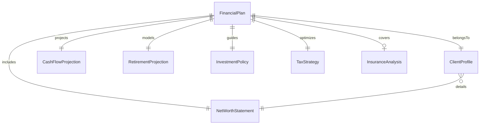
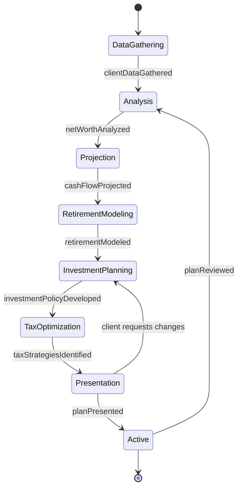
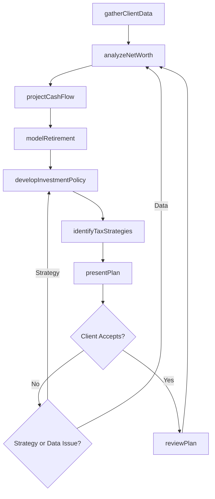
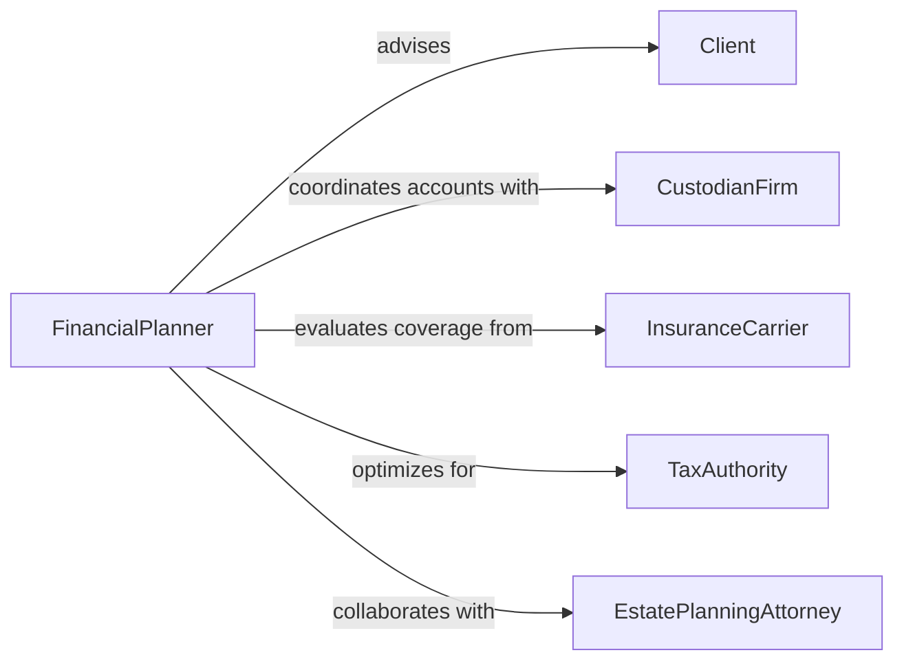

# Develop Financial Plans for Clients

> Business-as-Code definition for developing personalized financial plans that address client goals including retirement, investment, tax optimization, and estate planning.

## Overview

Client financial plan development involves gathering personal financial data, analyzing current assets and liabilities, projecting future income and expenses, and recommending strategies for wealth accumulation, risk management, and tax efficiency. This definition models the advisory process from initial client intake through plan creation, presentation, and ongoing review.

## Actors

| Actor | Description |
|-------|-------------|
| Client | Individual or household seeking financial planning services |
| CustodianFirm | Institution holding client investment accounts |
| InsuranceCarrier | Provider of life, disability, and property insurance products |
| TaxAuthority | Government agency governing tax obligations |
| EstatePlanningAttorney | Legal professional advising on trusts and wills |
| MortgageLender | Financial institution providing real estate financing |

## Roles

| Role | Description |
|------|-------------|
| FinancialPlanner | Develops comprehensive financial plans for clients |
| InvestmentAdvisor | Recommends portfolio allocation and securities |
| TaxStrategist | Identifies tax optimization opportunities |
| ParaPlanner | Prepares financial analyses and plan documents |

## Entities

| Entity | Description |
|--------|-------------|
| FinancialPlan | Comprehensive document outlining client financial strategy |
| ClientProfile | Demographic, income, and risk tolerance information |
| NetWorthStatement | Summary of client assets minus liabilities |
| CashFlowProjection | Forecast of income and expenses over time |
| InvestmentPolicy | Guidelines for portfolio allocation and risk |
| RetirementProjection | Model of retirement income sufficiency |
| TaxStrategy | Recommendations for minimizing tax liability |
| InsuranceAnalysis | Assessment of coverage needs and gaps |

## Actions

| Action | Description |
|--------|-------------|
| gatherClientData | Collect financial information and goals from the client |
| analyzeNetWorth | Calculate current assets, liabilities, and net worth |
| projectCashFlow | Forecast income and expenses for planning horizon |
| modelRetirement | Simulate retirement income scenarios |
| developInvestmentPolicy | Define portfolio allocation guidelines |
| identifyTaxStrategies | Recommend tax optimization approaches |
| presentPlan | Deliver the financial plan to the client |
| reviewPlan | Conduct periodic review and update of the plan |

## Events

| Event | Description |
|-------|-------------|
| clientDataGathered | Financial information has been collected from the client |
| netWorthAnalyzed | Current financial position has been calculated |
| cashFlowProjected | Income and expense forecasts have been generated |
| retirementModeled | Retirement scenarios have been simulated |
| investmentPolicyDeveloped | Portfolio guidelines have been defined |
| taxStrategiesIdentified | Tax optimization recommendations are ready |
| planPresented | The financial plan has been delivered to the client |
| planReviewed | A periodic review and update has been completed |

## Searches

| Search | Description |
|--------|-------------|
| findClientPlans | Search financial plans by client or plan type |
| getNetWorth | Retrieve current net worth for a client |
| getCashFlowProjection | Look up income and expense forecasts |
| listInvestmentPolicies | Enumerate active investment guidelines |
| getRetirementReadiness | Check retirement projection status for a client |

## Entity Relationships



## State Diagram



## Workflow



## Actor Relationships



## Usage

### Calling Actions

```typescript
import { developFinancialPlansClients } from '@headlessly/develop-financial-plans-clients'

const planning = developFinancialPlansClients()

// Gather client data
const profile = await planning.gatherClientData({
  clientName: 'Sarah Johnson',
  age: 42,
  annualIncome: 185000,
  goals: ['retirement-at-62', 'college-funding', 'estate-planning'],
  riskTolerance: 'moderate'
})

// Analyze net worth
const netWorth = await planning.analyzeNetWorth({
  clientId: profile.id,
  assets: [
    { type: '401k', value: 420000 },
    { type: 'brokerage', value: 150000 },
    { type: 'real-estate', value: 650000 }
  ],
  liabilities: [
    { type: 'mortgage', balance: 380000 },
    { type: 'student-loans', balance: 25000 }
  ]
})

// Model retirement
await planning.modelRetirement({
  clientId: profile.id,
  retirementAge: 62,
  monthlyExpenses: 8500,
  socialSecurityAge: 67
})
```

### Event-Driven Automation

```typescript
// Schedule annual review after plan is presented
planning.planPresented(async ({ clientId, planId }) => {
  await scheduleReview({
    clientId,
    planId,
    frequency: 'annual',
    nextDate: addYears(new Date(), 1)
  })
})

// Alert planner when net worth changes significantly
planning.netWorthAnalyzed(async ({ clientId, currentNetWorth, previousNetWorth }) => {
  const change = Math.abs((currentNetWorth - previousNetWorth) / previousNetWorth)
  if (change > 0.15) {
    await notify({
      to: 'advisory-team',
      message: `Client ${clientId} net worth changed by ${(change * 100).toFixed(1)}%`
    })
  }
})
```
