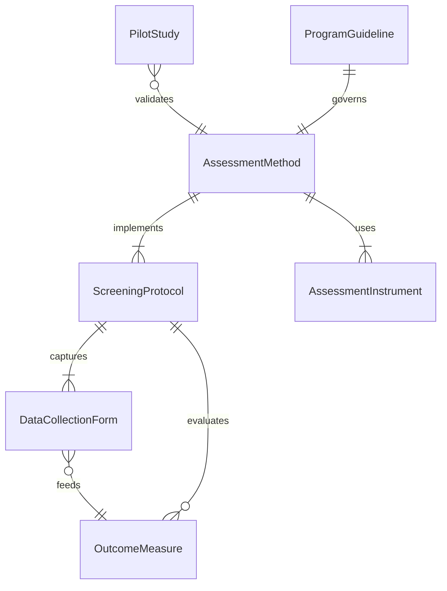
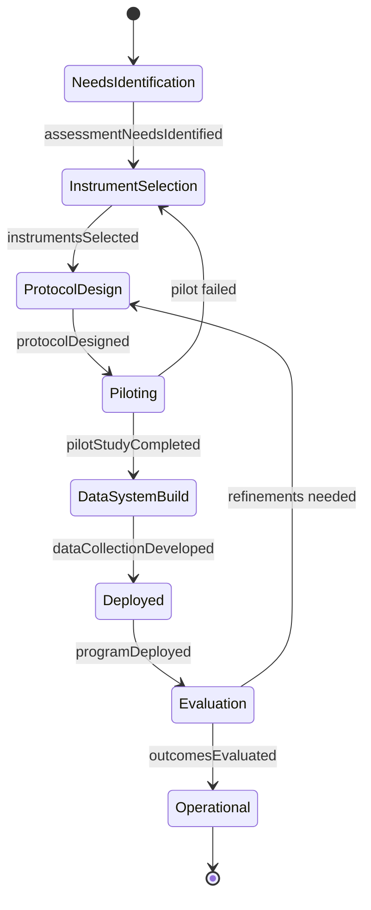
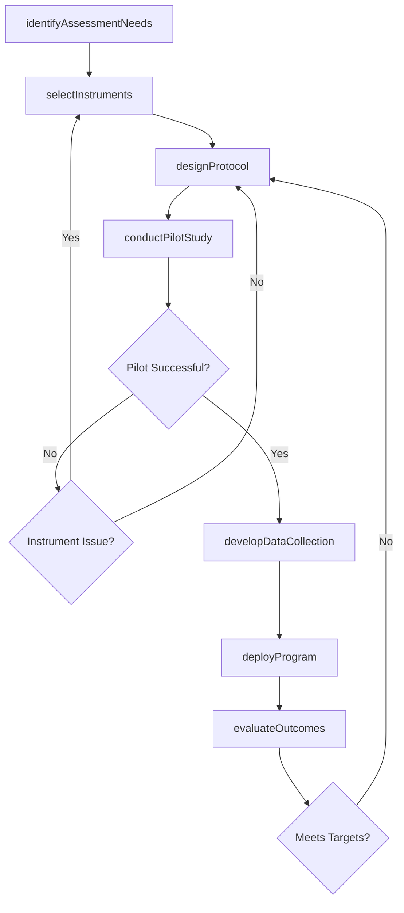
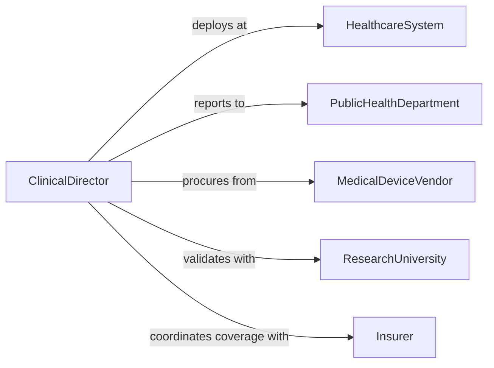

# Develop Health Assessment Methods or Programs

> Business-as-Code definition for developing systematic health assessment methodologies and screening programs that evaluate individual or population health status.

## Overview

Health assessment method and program development involves designing screening protocols, selecting validated instruments, establishing clinical workflows, and creating data collection systems for evaluating health conditions. This definition models the process from needs identification through instrument selection, protocol design, pilot testing, and program deployment, enabling healthcare organizations to standardize and scale their assessment capabilities.

## Actors

| Actor | Description |
|-------|-------------|
| HealthcareSystem | Hospital or clinic network deploying the assessment program |
| PublicHealthDepartment | Government agency overseeing population health screening |
| MedicalDeviceVendor | Supplier of diagnostic equipment and instruments |
| ResearchUniversity | Academic institution validating assessment instruments |
| Insurer | Health insurance company funding preventive programs |
| PatientPopulation | Community or group being assessed |

## Roles

| Role | Description |
|------|-------------|
| EpidemiologistLead | Designs population-level assessment methodologies |
| ClinicalDirector | Oversees clinical protocol development and validation |
| ProgramCoordinator | Manages assessment program logistics and staffing |
| Biostatistician | Analyzes assessment data and validates instruments |

## Entities

| Entity | Description |
|--------|-------------|
| AssessmentMethod | Standardized procedure for evaluating health conditions |
| ScreeningProtocol | Step-by-step clinical workflow for health screening |
| AssessmentInstrument | Validated questionnaire or diagnostic tool |
| PilotStudy | Small-scale test of the assessment methodology |
| DataCollectionForm | Structured template for capturing assessment results |
| ProgramGuideline | Policy document governing program implementation |
| OutcomeMeasure | Metric for evaluating assessment program effectiveness |

## Actions

| Action | Description |
|--------|-------------|
| identifyAssessmentNeeds | Determine which health conditions to screen for |
| selectInstruments | Choose validated tools and questionnaires |
| designProtocol | Create the clinical workflow for assessments |
| conductPilotStudy | Test the methodology on a small sample |
| developDataCollection | Build forms and systems for capturing results |
| deployProgram | Roll out the assessment program at scale |
| evaluateOutcomes | Analyze program effectiveness and accuracy |

## Events

| Event | Description |
|-------|-------------|
| assessmentNeedsIdentified | Target health conditions have been determined |
| instrumentsSelected | Validated assessment tools have been chosen |
| protocolDesigned | The clinical assessment workflow has been created |
| pilotStudyCompleted | Methodology testing has been finished |
| dataCollectionDeveloped | Result capture systems have been built |
| programDeployed | The assessment program is operational |
| outcomesEvaluated | Program effectiveness analysis is complete |

## Searches

| Search | Description |
|--------|-------------|
| findAssessmentPrograms | Search programs by condition, population, or status |
| getInstruments | Retrieve validated instruments by health domain |
| listProtocols | Enumerate screening protocols by facility |
| getPilotResults | Look up pilot study findings |
| getOutcomeMeasures | Query program effectiveness metrics |

## Entity Relationships



## State Diagram



## Workflow



## Actor Relationships



## Usage

### Calling Actions

```typescript
import { developHealthAssessmentMethodsPrograms } from '@headlessly/develop-health-assessment-methods-programs'

const healthAssess = developHealthAssessmentMethodsPrograms()

// Identify assessment needs
const needs = await healthAssess.identifyAssessmentNeeds({
  population: 'adults-50-plus',
  conditions: ['colorectal-cancer', 'cardiovascular-risk', 'diabetes'],
  setting: 'primary-care'
})

// Select validated instruments
const instruments = await healthAssess.selectInstruments({
  needsId: needs.id,
  instruments: [
    { name: 'FIT', condition: 'colorectal-cancer', sensitivity: 0.79 },
    { name: 'ASCVD-Risk-Calculator', condition: 'cardiovascular-risk' },
    { name: 'HbA1c-Screening', condition: 'diabetes', threshold: 5.7 }
  ]
})

// Design the screening protocol
await healthAssess.designProtocol({
  instrumentIds: instruments.map(i => i.id),
  workflow: 'annual-wellness-visit',
  eligibilityCriteria: { ageMin: 50, frequencyMonths: 12 }
})
```

### Event-Driven Automation

```typescript
// Notify clinical staff when program is deployed
healthAssess.programDeployed(async ({ programId, facilities }) => {
  await notify({
    to: 'clinical-operations',
    message: `Health assessment program ${programId} deployed to ${facilities.length} facilities`
  })
})

// Schedule outcome evaluation after deployment
healthAssess.programDeployed(async ({ programId }) => {
  await scheduleEvaluation({
    programId,
    evaluationDate: addMonths(new Date(), 6),
    metrics: ['screening-rate', 'detection-rate', 'follow-up-compliance']
  })
})
```
