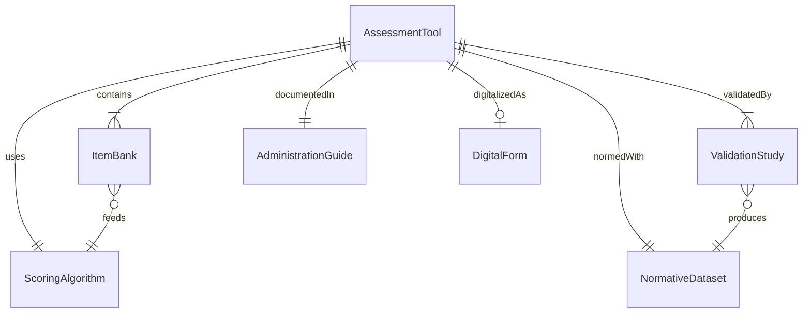
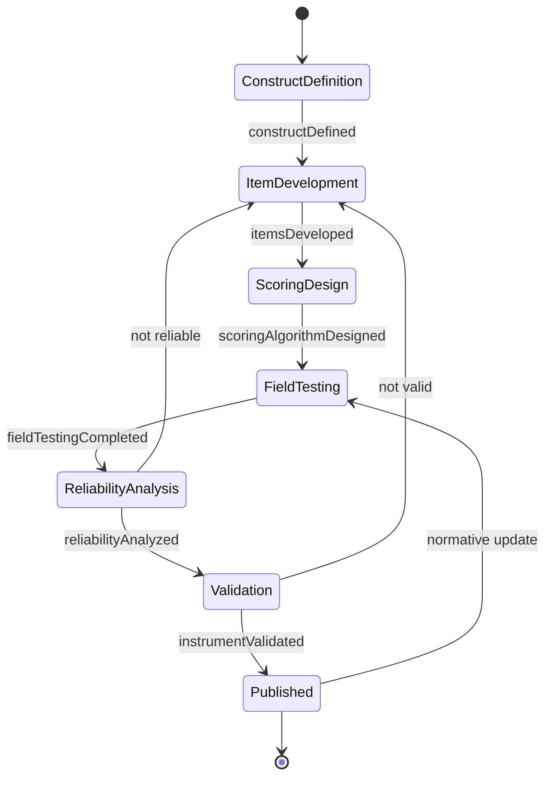
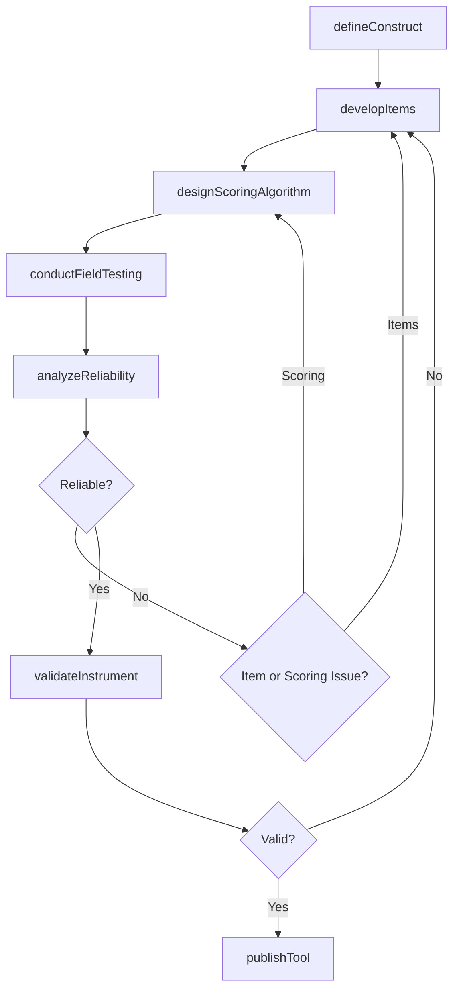
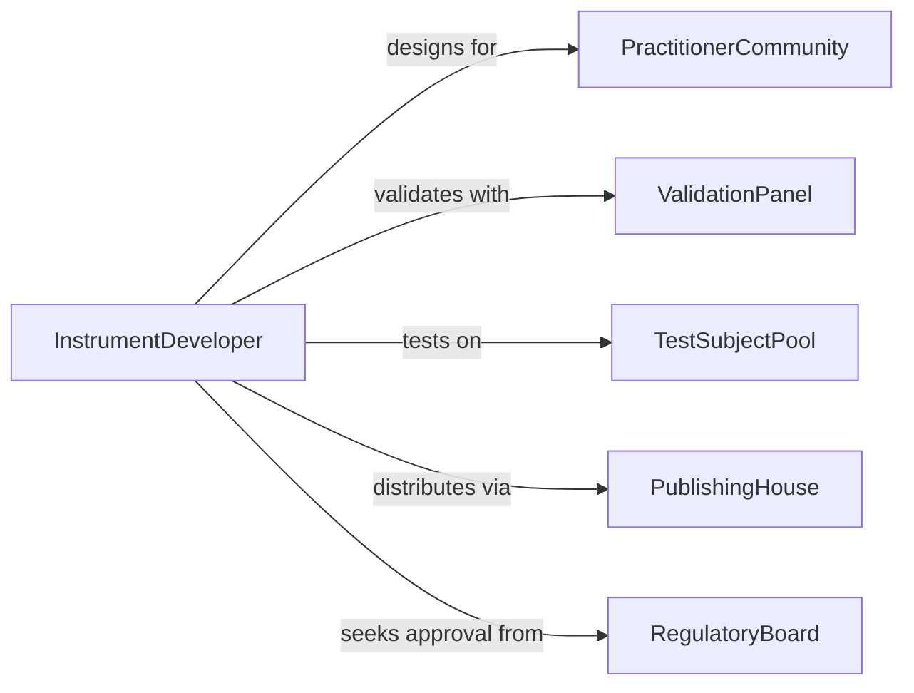

# Develop Tools to Diagnose or Assess Needs

> Business-as-Code definition for developing diagnostic and needs assessment tools including questionnaires, rubrics, checklists, and scoring instruments used across healthcare, education, and social services.

## Overview

Diagnostic and needs assessment tool development involves designing instruments that reliably measure conditions, competencies, or service needs. This includes item development, psychometric validation, scoring algorithm design, and deployment across clinical or organizational settings. This definition models the tool creation lifecycle from construct definition through field testing, reliability analysis, and production release.

## Actors

| Actor | Description |
|-------|-------------|
| PractitionerCommunity | Clinicians or professionals who will administer the tool |
| ValidationPanel | Expert group reviewing instrument validity |
| TestSubjectPool | Population participating in instrument validation |
| PublishingHouse | Organization distributing the finalized instrument |
| RegulatoryBoard | Body approving diagnostic tools for clinical use |
| SoftwareVendor | Provider of digital assessment platforms |

## Roles

| Role | Description |
|------|-------------|
| InstrumentDeveloper | Designs assessment items and scoring rubrics |
| Psychometrician | Validates reliability and validity of the instrument |
| ClinicalResearcher | Conducts field testing with target populations |
| UXDesigner | Creates digital interfaces for tool administration |

## Entities

| Entity | Description |
|--------|-------------|
| AssessmentTool | Complete diagnostic or needs assessment instrument |
| ItemBank | Collection of questions or prompts for the tool |
| ScoringAlgorithm | Method for calculating results from responses |
| ValidationStudy | Research confirming instrument reliability and validity |
| NormativeDataset | Reference data for interpreting scores against a population |
| AdministrationGuide | Instructions for proper tool use and scoring |
| DigitalForm | Electronic version of the assessment instrument |

## Actions

| Action | Description |
|--------|-------------|
| defineConstruct | Specify what the tool is designed to measure |
| developItems | Create questions, prompts, or observation criteria |
| designScoringAlgorithm | Build the calculation method for results |
| conductFieldTesting | Test the tool with a sample from the target population |
| analyzeReliability | Calculate internal consistency and test-retest reliability |
| validateInstrument | Confirm the tool measures what it claims to measure |
| publishTool | Release the finalized instrument for use |

## Events

| Event | Description |
|-------|-------------|
| constructDefined | The measurement target has been specified |
| itemsDeveloped | Assessment questions and criteria have been created |
| scoringAlgorithmDesigned | The calculation method has been built |
| fieldTestingCompleted | Sample-based testing has been finished |
| reliabilityAnalyzed | Consistency metrics have been calculated |
| instrumentValidated | Validity confirmation is complete |
| toolPublished | The finalized instrument has been released |

## Searches

| Search | Description |
|--------|-------------|
| findAssessmentTools | Search tools by domain, population, or validation status |
| getItemBank | Retrieve items for a specific assessment construct |
| listValidationStudies | Enumerate validation research by instrument |
| getNormativeData | Look up population reference scores |
| getScoringGuide | Retrieve scoring algorithm documentation |

## Entity Relationships



## State Diagram



## Workflow



## Actor Relationships



## Usage

### Calling Actions

```typescript
import { developToolsDiagnoseAssessNeeds } from '@headlessly/develop-tools-diagnose-assess-needs'

const toolDev = developToolsDiagnoseAssessNeeds()

// Define what the tool measures
const construct = await toolDev.defineConstruct({
  name: 'Early Childhood Developmental Screening',
  domains: ['cognitive', 'motor', 'language', 'social-emotional'],
  ageRange: { min: 12, max: 60, unit: 'months' }
})

// Develop assessment items
const items = await toolDev.developItems({
  constructId: construct.id,
  itemCount: 40,
  format: 'caregiver-reported',
  responseScale: 'yes-sometimes-not-yet'
})

// Conduct field testing
const fieldTest = await toolDev.conductFieldTesting({
  itemBankId: items.id,
  sampleSize: 500,
  demographics: { diverse: true, settings: ['urban', 'rural'] }
})

// Analyze reliability
await toolDev.analyzeReliability({
  fieldTestId: fieldTest.id,
  methods: ['cronbach-alpha', 'test-retest'],
  minimumAlpha: 0.80
})
```

### Event-Driven Automation

```typescript
// Notify review panel when field testing is complete
toolDev.fieldTestingCompleted(async ({ instrumentId, sampleSize }) => {
  await notify({
    to: 'validation-panel',
    message: `Field testing complete for instrument ${instrumentId} (n=${sampleSize})`
  })
})

// Auto-generate administration guide after publication
toolDev.toolPublished(async ({ instrumentId }) => {
  await generateGuide({
    instrumentId,
    sections: ['administration', 'scoring', 'interpretation', 'norms']
  })
})
```
