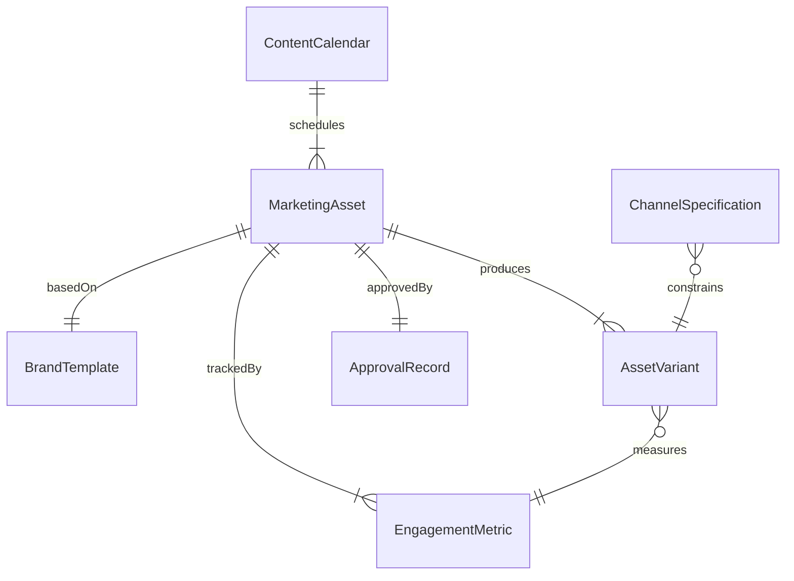
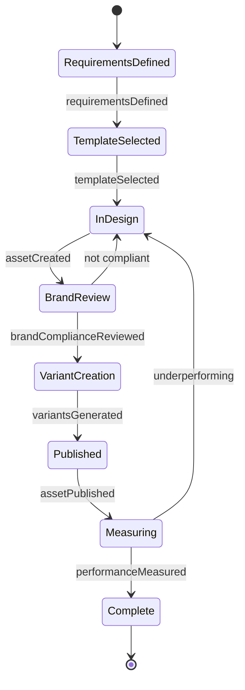
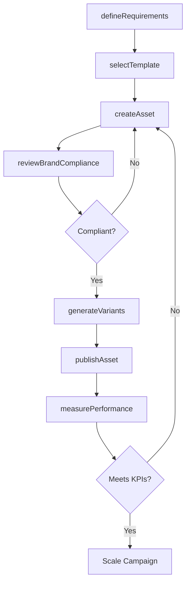
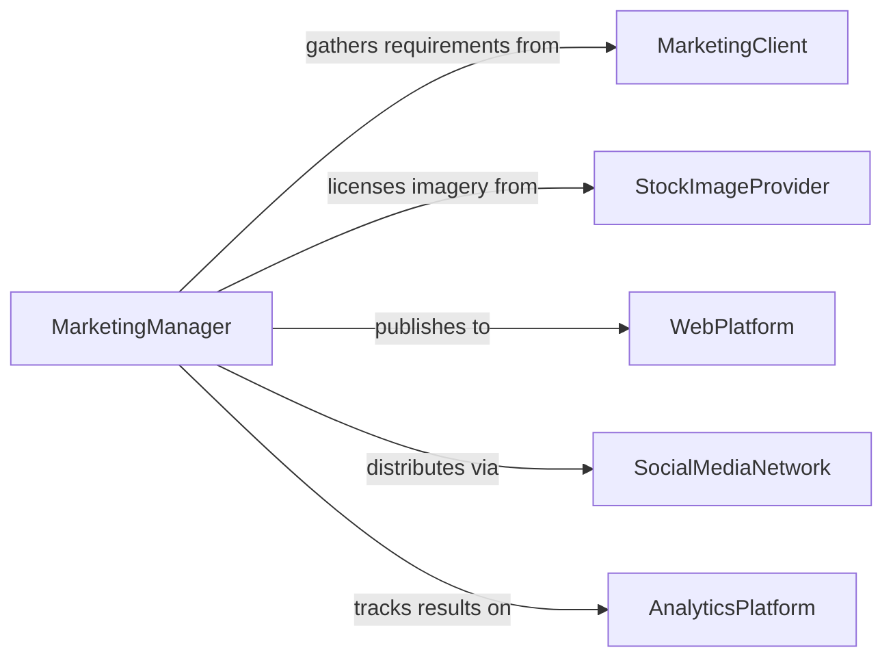

# Create Marketing Materials

> Business-as-Code definition for creating marketing materials including brand collateral, digital content, social media assets, email templates, and website landing pages that support lead generation and brand awareness.

## Overview

Marketing materials creation encompasses the design and production of brand-consistent assets used across digital and physical channels to attract, inform, and convert target audiences. This definition models the workflow from marketing strategy alignment through asset creation, brand compliance review, and multi-channel publishing.

## Actors

| Actor | Description |
|-------|-------------|
| MarketingClient | Business or department requesting marketing assets |
| StockImageProvider | Service supplying licensed photography and illustrations |
| WebPlatform | Digital publishing platform for landing pages and emails |
| SocialMediaNetwork | Channel for distributing social content |
| BrandGuidelines | Reference standards for visual and messaging consistency |
| AnalyticsPlatform | Service tracking engagement and conversion metrics |

## Roles

| Role | Description |
|------|-------------|
| MarketingManager | Defines strategy and approves final materials |
| ContentDesigner | Creates visual and written marketing assets |
| BrandCompliance | Reviews materials for adherence to brand standards |
| DigitalMarketer | Publishes and optimizes assets across channels |

## Entities

| Entity | Description |
|--------|-------------|
| MarketingAsset | A completed piece of marketing collateral |
| BrandTemplate | Pre-approved layout conforming to brand guidelines |
| ContentCalendar | Schedule of planned marketing material releases |
| AssetVariant | A/B test or channel-specific version of an asset |
| EngagementMetric | Performance data for a published marketing piece |
| ApprovalRecord | Documentation of stakeholder sign-off on materials |
| ChannelSpecification | Technical requirements for each publishing platform |

## Actions

| Action | Description |
|--------|-------------|
| defineRequirements | Specify objectives, audience, and channel for the material |
| selectTemplate | Choose a brand-approved layout or format |
| createAsset | Design and compose the marketing material |
| reviewBrandCompliance | Verify adherence to brand guidelines |
| generateVariants | Produce A/B test or channel-specific versions |
| publishAsset | Deploy the material to its target channel |
| measurePerformance | Track engagement and conversion metrics |

## Events

| Event | Description |
|-------|-------------|
| requirementsDefined | Material objectives and specifications have been set |
| templateSelected | A brand template has been chosen |
| assetCreated | The marketing material has been designed |
| brandComplianceReviewed | Brand guideline review is complete |
| variantsGenerated | A/B or channel variants have been produced |
| assetPublished | Material has been deployed to its channel |
| performanceMeasured | Engagement metrics have been collected |

## Searches

| Search | Description |
|--------|-------------|
| findAssets | Search marketing materials by campaign, type, or channel |
| getTemplates | Retrieve available brand templates by category |
| listVariants | Enumerate A/B test versions for an asset |
| getPerformance | Look up engagement metrics for published materials |
| findByCalendar | Search materials by scheduled publication date |

## Entity Relationships



## State Diagram



## Workflow



## Actor Relationships



## Usage

### Calling Actions

```typescript
import { createMarketingMaterials } from '@headlessly/create-marketing-materials'

const marketing = createMarketingMaterials()

// Define material requirements
const req = await marketing.defineRequirements({
  campaign: 'Q2 Lead Generation',
  type: 'landing-page',
  audience: 'enterprise-IT-directors',
  channel: 'web',
  objective: 'demo-request-conversion'
})

// Create the asset
const asset = await marketing.createAsset({
  requirementsId: req.id,
  templateId: 'enterprise-landing-v3',
  headline: 'Automate Your Infrastructure in Minutes',
  bodyContent: 'See how leading enterprises reduce deployment time by 80%...',
  callToAction: 'Request a Demo'
})

// Generate A/B variants
await marketing.generateVariants({
  assetId: asset.id,
  variations: [
    { element: 'headline', value: 'Ship Faster with Zero Downtime' },
    { element: 'callToAction', value: 'Start Free Trial' }
  ]
})
```

### Event-Driven Automation

```typescript
// Alert team when asset performance exceeds targets
marketing.performanceMeasured(async ({ assetId, conversionRate }) => {
  if (conversionRate > 0.05) {
    await notify({
      to: 'marketing-team',
      message: `Asset ${assetId} achieving ${(conversionRate * 100).toFixed(1)}% conversion - above 5% target`
    })
  }
})

// Auto-publish winning variant after A/B test concludes
marketing.variantsGenerated(async ({ assetId, variants }) => {
  await marketing.publishAsset({
    assetId,
    variants: variants.map(v => v.id),
    testDuration: '7d'
  })
})
```
