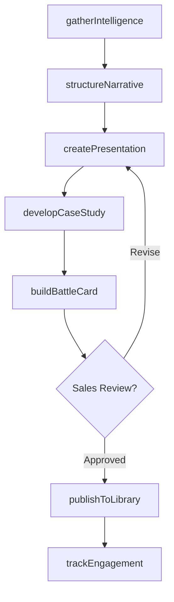
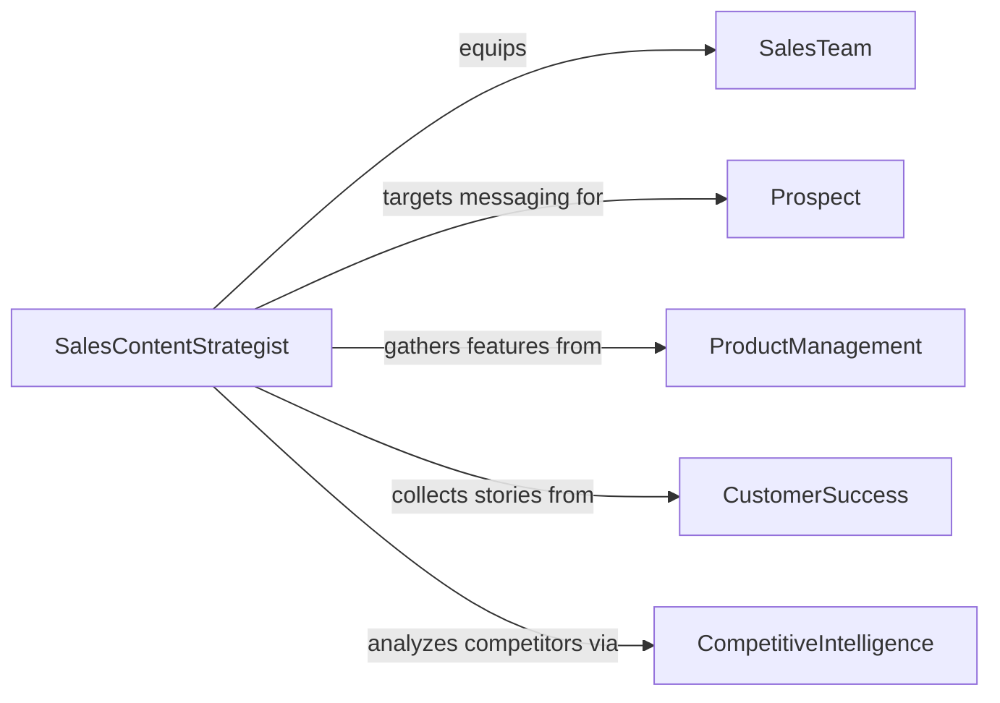

# Develop Content for Sales Presentations or Materials

> Business-as-Code definition for developing content used in sales presentations, pitch decks, product sheets, case studies, and proposal documents that support the revenue generation process.

## Overview

Sales content development involves crafting persuasive narratives, data-driven proof points, and visual storytelling assets that equip sales teams to communicate value effectively to prospects. This definition models the process from sales intelligence gathering through content structuring, design production, enablement distribution, and effectiveness tracking.

## Actors

| Actor | Description |
|-------|-------------|
| SalesTeam | Revenue-generating staff using the materials in the field |
| Prospect | Potential customer receiving sales presentations |
| ProductManagement | Team providing feature details and competitive positioning |
| CustomerSuccess | Department supplying case study data and testimonials |
| CompetitiveIntelligence | Group tracking market landscape and competitor offerings |
| SalesEnablementPlatform | System hosting and distributing sales content |

## Roles

| Role | Description |
|------|-------------|
| SalesContentStrategist | Plans content aligned with the buyer journey |
| PresentationDesigner | Creates visually compelling slide decks and documents |
| SalesEnablementManager | Distributes and maintains the sales content library |
| SubjectMatterExpert | Provides domain expertise for technical content |

## Entities

| Entity | Description |
|--------|-------------|
| PitchDeck | Slide presentation used in prospect meetings |
| ProductSheet | One-page document highlighting product features and benefits |
| CaseStudy | Customer success story with quantified outcomes |
| BattleCard | Competitive comparison reference for sales conversations |
| ProposalTemplate | Structured document for formal customer proposals |
| ContentPlaybook | Guide mapping content to buyer journey stages |
| EngagementAnalytics | Data on how prospects interact with shared content |

## Actions

| Action | Description |
|--------|-------------|
| gatherIntelligence | Collect product, competitive, and customer data |
| structureNarrative | Organize messaging for the target audience and stage |
| createPresentation | Design slide deck or document with visual assets |
| developCaseStudy | Write and format a customer success story |
| buildBattleCard | Compile competitive positioning and objection handling |
| publishToLibrary | Upload content to the sales enablement platform |
| trackEngagement | Monitor how prospects interact with shared materials |

## Events

| Event | Description |
|-------|-------------|
| intelligenceGathered | Product and competitive data have been collected |
| narrativeStructured | Messaging framework has been organized |
| presentationCreated | Slide deck or document has been designed |
| caseStudyDeveloped | Customer success story has been written |
| battleCardBuilt | Competitive positioning document is ready |
| contentPublished | Materials have been uploaded to the library |
| engagementTracked | Prospect interaction data has been collected |

## Searches

| Search | Description |
|--------|-------------|
| findPresentations | Search pitch decks by product, industry, or deal stage |
| getCaseStudies | Retrieve customer stories by outcome or vertical |
| listBattleCards | Enumerate competitive comparison documents |
| getEngagementData | Look up prospect interaction metrics |
| findByBuyerStage | Search content mapped to specific buyer journey phases |

## Workflow



## Actor Relationships



## Usage

### Calling Actions

```typescript
import { developContentSalesPresentationsMaterials } from '@headlessly/develop-content-sales-presentations-materials'

const salesContent = developContentSalesPresentationsMaterials()

// Gather intelligence for a new pitch
const intel = await salesContent.gatherIntelligence({
  product: 'Enterprise Data Platform',
  targetIndustry: 'financial-services',
  dealStage: 'evaluation',
  competitors: ['Snowflake', 'Databricks']
})

// Create the presentation
const deck = await salesContent.createPresentation({
  intelligenceId: intel.id,
  format: 'pitch-deck',
  slides: 12,
  sections: ['problem', 'solution', 'demo', 'ROI', 'next-steps'],
  branding: 'enterprise-dark'
})

// Develop a supporting case study
await salesContent.developCaseStudy({
  customer: 'Apex Financial Group',
  challenge: 'Legacy data warehouse migration',
  outcome: { metric: 'query-performance', improvement: '10x', timeframe: '3-months' }
})
```

### Event-Driven Automation

```typescript
// Alert sales team when new content is available
salesContent.contentPublished(async ({ contentType, product, industry }) => {
  await notify({
    to: 'sales-team',
    message: `New ${contentType} available for ${product} targeting ${industry}`
  })
})

// Flag high-engagement content for replication
salesContent.engagementTracked(async ({ contentId, viewDuration, shares }) => {
  if (viewDuration > 300 && shares > 10) {
    await notify({
      to: 'content-strategy',
      message: `Content ${contentId} is high-performing - consider creating similar materials`
    })
  }
})
```
