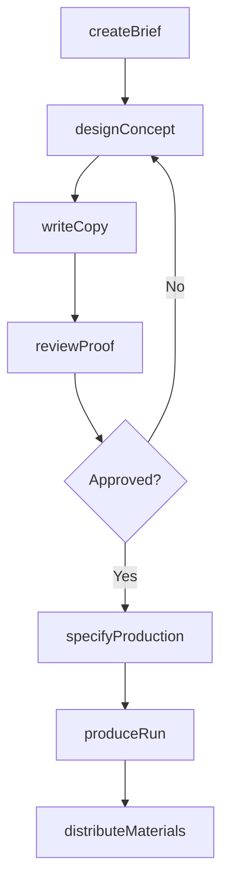
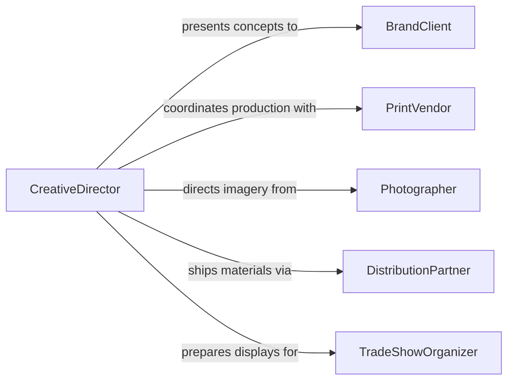

# Develop Promotional Materials

> Business-as-Code definition for developing promotional materials including brochures, flyers, direct mail pieces, trade show displays, and digital advertising assets that communicate brand value and drive customer engagement.

## Overview

Promotional materials development involves translating marketing strategy into tangible assets that reach target audiences through print, digital, and experiential channels. This definition models the process from creative brief development through concept design, copy writing, production management, and distribution across campaigns and channels.

## Actors

| Actor | Description |
|-------|-------------|
| BrandClient | Organization commissioning promotional materials |
| PrintVendor | Printing company producing physical materials |
| Photographer | Professional providing imagery for promotional pieces |
| DistributionPartner | Service handling mail, fulfillment, or delivery |
| TradeShowOrganizer | Event company managing exhibition opportunities |
| MediaBuyer | Agent purchasing advertising placements |

## Roles

| Role | Description |
|------|-------------|
| CreativeDirector | Oversees visual and messaging direction for materials |
| Copywriter | Develops written content for promotional pieces |
| GraphicDesigner | Creates visual layouts and production-ready artwork |
| ProductionManager | Coordinates printing, finishing, and fulfillment |

## Entities

| Entity | Description |
|--------|-------------|
| CreativeBrief | Document defining objectives, audience, and messaging |
| DesignConcept | Visual mockup or layout of the promotional piece |
| CopyDraft | Written content for headlines, body text, and calls to action |
| PrintSpecification | Technical details for paper stock, ink, and finishing |
| ProofApproval | Sign-off on final artwork before production |
| DistributionPlan | Schedule and channels for delivering materials |
| AssetLibrary | Repository of approved images, logos, and templates |

## Actions

| Action | Description |
|--------|-------------|
| createBrief | Define campaign objectives, audience, and key messages |
| designConcept | Develop visual layouts and mockups for the material |
| writeCopy | Draft headlines, body content, and calls to action |
| reviewProof | Submit artwork for stakeholder approval |
| specifyProduction | Define print specifications and finishing details |
| produceRun | Execute the print or digital production run |
| distributeMaterials | Ship or deploy materials through planned channels |

## Events

| Event | Description |
|-------|-------------|
| briefCreated | Campaign brief has been defined and approved |
| conceptDesigned | Visual layout has been developed |
| copyWritten | Written content has been drafted |
| proofReviewed | Artwork has been approved for production |
| productionSpecified | Print and finishing details have been set |
| runProduced | Materials have been printed or generated |
| materialsDistributed | Promotional pieces have been shipped or deployed |

## Searches

| Search | Description |
|--------|-------------|
| findMaterials | Search promotional pieces by campaign or type |
| getBriefs | Retrieve creative briefs by status or client |
| listProductions | Enumerate production runs by date or vendor |
| getDistributionStatus | Check delivery progress for a campaign |
| findAssets | Locate approved images and templates in the library |

## Workflow



## Actor Relationships



## Usage

### Calling Actions

```typescript
import { developPromotionalMaterials } from '@headlessly/develop-promotional-materials'

const promo = developPromotionalMaterials()

// Create a campaign brief
const brief = await promo.createBrief({
  campaign: 'Spring Product Launch',
  audience: 'retail-buyers',
  channels: ['direct-mail', 'trade-show', 'digital-ads'],
  keyMessages: ['New collection available', '15% early-order discount'],
  deadline: '2026-03-01'
})

// Design the concept
const concept = await promo.designConcept({
  briefId: brief.id,
  format: 'tri-fold-brochure',
  dimensions: { width: 11, height: 8.5, unit: 'inches' },
  colorProfile: 'CMYK'
})

// Specify production
await promo.specifyProduction({
  conceptId: concept.id,
  paperStock: '100lb-gloss-text',
  quantity: 10000,
  finishing: ['tri-fold', 'UV-coating'],
  vendor: 'premier-print-co'
})
```

### Event-Driven Automation

```typescript
// Notify production manager when proof is approved
promo.proofReviewed(async ({ conceptId, approved }) => {
  if (approved) {
    await notify({
      to: 'production-team',
      message: `Proof approved for concept ${conceptId} - ready for production`
    })
  }
})

// Track distribution completion
promo.materialsDistributed(async ({ campaignId, channel, quantity }) => {
  await notify({
    to: 'marketing-team',
    message: `${quantity} pieces distributed via ${channel} for campaign ${campaignId}`
  })
})
```
