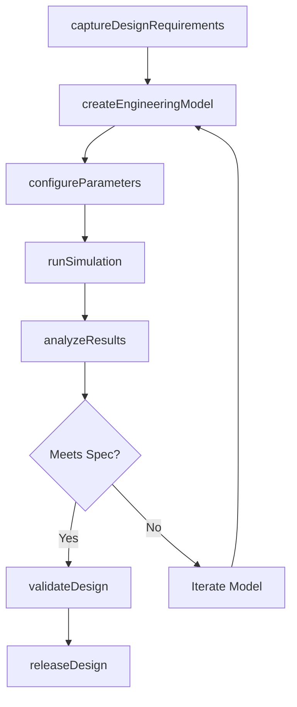
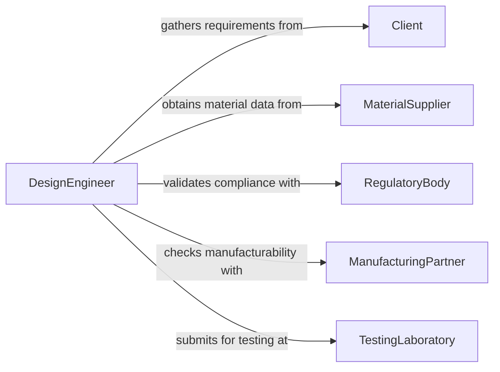

# Create Models Engineering Designs Methods

> Business-as-Code definition for creating models of engineering designs or methods. Models the full design lifecycle from concept development through simulation, validation, and design release.

## Overview

Creating models of engineering designs or methods involves translating requirements into conceptual designs, building mathematical or computational models, running simulations, and validating results against specifications. This definition exposes actions for each phase of the engineering modeling process, events for tracking design iterations, and searches for retrieving models, simulations, and validation records.

## Actors

| Actor | Description |
|-------|-------------|
| Client | Specifies requirements and constraints for the engineering design |
| MaterialSupplier | Provides data on material properties and availability |
| RegulatoryBody | Sets safety and performance standards the design must meet |
| ManufacturingPartner | Provides feedback on manufacturability and production constraints |
| TestingLaboratory | Conducts independent validation and certification testing |

## Roles

| Role | Description |
|------|-------------|
| DesignEngineer | Creates engineering models and iterates on design concepts |
| SimulationAnalyst | Runs computational models and interprets simulation results |
| ProjectEngineer | Manages the design process, timelines, and deliverables |
| QualityEngineer | Validates designs against specifications and standards |

## Entities

| Entity | Description |
|--------|-------------|
| EngineeringModel | A mathematical or computational representation of a design |
| DesignSpecification | Requirements and constraints the model must satisfy |
| SimulationRun | An execution of the model under defined conditions |
| ValidationReport | A document comparing model predictions to actual performance |
| DesignIteration | A versioned revision of the engineering model |
| ParameterSet | A collection of input variables used in the model |

## Actions

| Action | Description |
|--------|-------------|
| captureDesignRequirements | Document specifications, constraints, and performance targets |
| createEngineeringModel | Build a mathematical or computational model of the design |
| configureParameters | Define input variables and boundary conditions for the model |
| runSimulation | Execute the model under specified conditions |
| analyzeResults | Interpret simulation outputs and compare to requirements |
| validateDesign | Confirm the model meets all specifications and standards |
| releaseDesign | Finalize and publish the approved engineering model |

## Events

| Event | Description |
|-------|-------------|
| designRequirementsCaptured | Specifications and constraints have been documented |
| engineeringModelCreated | A new engineering model has been built |
| parametersConfigured | Input variables and conditions have been set |
| simulationCompleted | A simulation run has finished executing |
| resultsAnalyzed | Simulation outputs have been interpreted |
| designValidated | The model has been confirmed to meet specifications |
| designReleased | The final engineering model has been published |

## Searches

| Search | Description |
|--------|-------------|
| findEngineeringModels | List models by project, type, or status |
| getSimulationRuns | Retrieve simulation results by model or date range |
| getValidationReports | Find validation records by model or compliance status |
| findDesignIterations | Search version history for a given engineering model |

## Workflow



## Actor Relationships



## Usage

### Calling Actions

```typescript
import { createModelsEngineeringDesignsMethods } from '@headlessly/create-models-engineering-designs-methods'

const modeling = createModelsEngineeringDesignsMethods()

// Capture design requirements
const spec = await modeling.captureDesignRequirements({
  project: 'Lightweight Chassis Frame',
  constraints: { maxWeight: 120, material: 'aluminum-alloy' },
  performanceTargets: { loadCapacity: 5000, safetyFactor: 2.5 }
})

// Create the engineering model
const model = await modeling.createEngineeringModel({
  specId: spec.id,
  type: 'finite-element-analysis',
  software: 'ANSYS'
})

// Run simulation
const simulation = await modeling.runSimulation({
  modelId: model.id,
  conditions: { load: 5000, temperature: 25, duration: 3600 }
})
```

### Event-Driven Automation

```typescript
// Alert team when simulation completes
modeling.simulationCompleted(async ({ modelId, runId, status }) => {
  await notify({
    to: 'engineering-team',
    message: `Simulation ${runId} completed with status: ${status}`
  })
})

// Auto-trigger validation when results meet specifications
modeling.resultsAnalyzed(async ({ modelId, meetsSpec }) => {
  if (meetsSpec) {
    await modeling.validateDesign({ modelId })
  }
})
```
