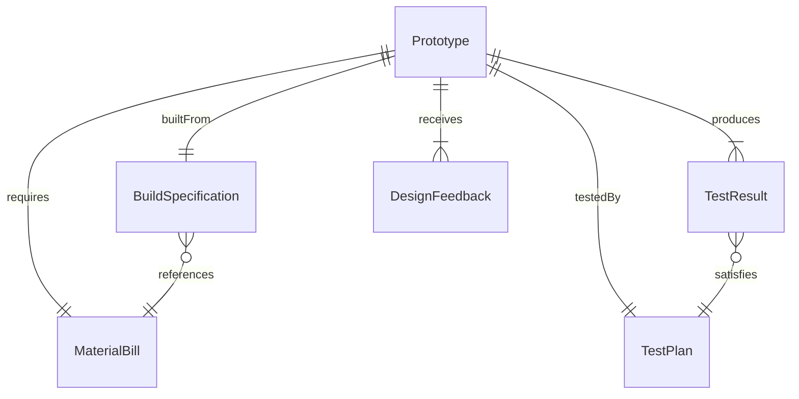
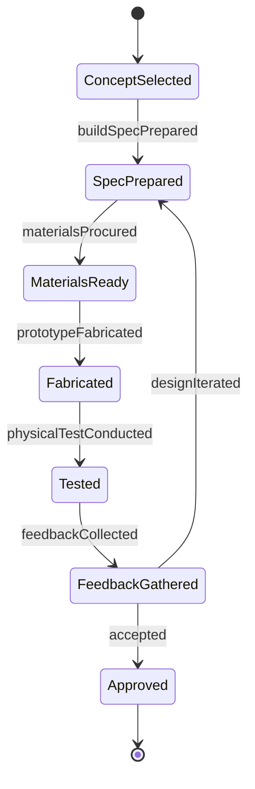
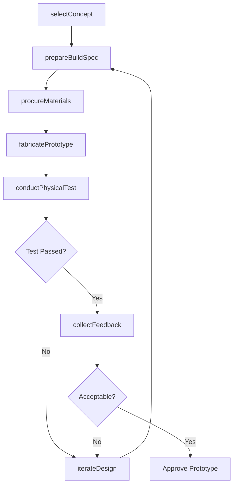
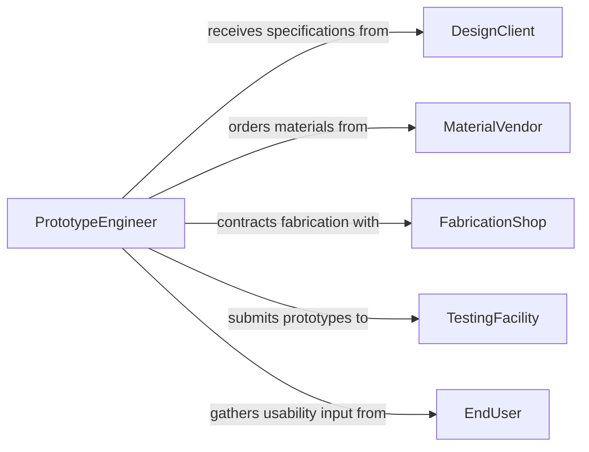

# Create Physical Models Prototypes

> Business-as-Code definition for creating physical models or prototypes. Models the prototyping lifecycle from concept selection through fabrication, testing, and design iteration.

## Overview

Creating physical models or prototypes involves translating designs into tangible representations for testing, evaluation, and stakeholder review. This definition exposes actions for managing the prototyping pipeline from material selection through fabrication and physical testing, events for tracking build progress and test outcomes, and searches for retrieving prototype records and test data.

## Actors

| Actor | Description |
|-------|-------------|
| DesignClient | Requests the prototype and provides design specifications |
| MaterialVendor | Supplies raw materials, components, and fabrication supplies |
| FabricationShop | External facility that manufactures prototype components |
| TestingFacility | Conducts physical testing and performance evaluation |
| EndUser | Provides usability feedback on the physical prototype |

## Roles

| Role | Description |
|------|-------------|
| PrototypeEngineer | Leads the physical build and manages fabrication processes |
| IndustrialDesigner | Translates concepts into buildable prototype specifications |
| TestEngineer | Plans and executes physical testing of the prototype |
| ProjectLead | Coordinates timeline, budget, and stakeholder communication |

## Entities

| Entity | Description |
|--------|-------------|
| Prototype | A physical representation of a design for testing and evaluation |
| BuildSpecification | Detailed instructions for fabricating the prototype |
| MaterialBill | A list of materials and components required for the build |
| TestPlan | A document defining physical tests and acceptance criteria |
| TestResult | Data from physical testing of the prototype |
| DesignFeedback | Observations and recommendations from prototype evaluation |

## Actions

| Action | Description |
|--------|-------------|
| selectConcept | Choose the design concept to prototype from available options |
| prepareBuildSpec | Create detailed fabrication instructions and material lists |
| procureMaterials | Order materials and components for the prototype build |
| fabricatePrototype | Manufacture the physical model according to specifications |
| conductPhysicalTest | Execute tests on the prototype to measure performance |
| collectFeedback | Gather evaluation input from stakeholders and end users |
| iterateDesign | Revise the prototype based on test results and feedback |

## Events

| Event | Description |
|-------|-------------|
| conceptSelected | A design concept has been chosen for prototyping |
| buildSpecPrepared | Fabrication instructions have been finalized |
| materialsProcured | All materials and components have been received |
| prototypeFabricated | The physical prototype has been built |
| physicalTestConducted | A test on the prototype has been completed |
| feedbackCollected | Stakeholder and user evaluation has been gathered |
| designIterated | The prototype design has been revised for another build cycle |

## Searches

| Search | Description |
|--------|-------------|
| findPrototypes | List prototypes by project, status, or build date |
| getTestResults | Retrieve test data by prototype or test type |
| getMaterialBills | Find material lists by prototype or project |
| getDesignFeedback | Search feedback records by prototype or reviewer |

## Entity Relationships



## State Diagram



## Workflow



## Actor Relationships



## Usage

### Calling Actions

```typescript
import { createPhysicalModelsPrototypes } from '@headlessly/create-physical-models-prototypes'

const prototyping = createPhysicalModelsPrototypes()

// Select a concept for prototyping
const concept = await prototyping.selectConcept({
  project: 'Ergonomic Office Chair',
  conceptId: 'concept-v3',
  rationale: 'Best balance of comfort, cost, and manufacturability'
})

// Prepare build specifications
const spec = await prototyping.prepareBuildSpec({
  conceptId: concept.id,
  materials: ['aluminum-frame', 'mesh-fabric', 'memory-foam'],
  tolerances: { dimensional: '0.5mm', weight: '10%' }
})

// Fabricate the prototype
await prototyping.fabricatePrototype({
  specId: spec.id,
  facility: 'internal-workshop',
  targetCompletionDate: '2026-04-15'
})
```

### Event-Driven Automation

```typescript
// Notify team when prototype is fabricated
prototyping.prototypeFabricated(async ({ prototypeId, project }) => {
  await notify({
    to: 'test-engineering',
    message: `Prototype ${prototypeId} for ${project} is ready for testing`
  })
})

// Auto-schedule user feedback session after testing
prototyping.physicalTestConducted(async ({ prototypeId, passed }) => {
  if (passed) {
    await scheduleSession({
      type: 'user-feedback',
      prototypeId,
      participants: ['end-users', 'design-team']
    })
  }
})
```
