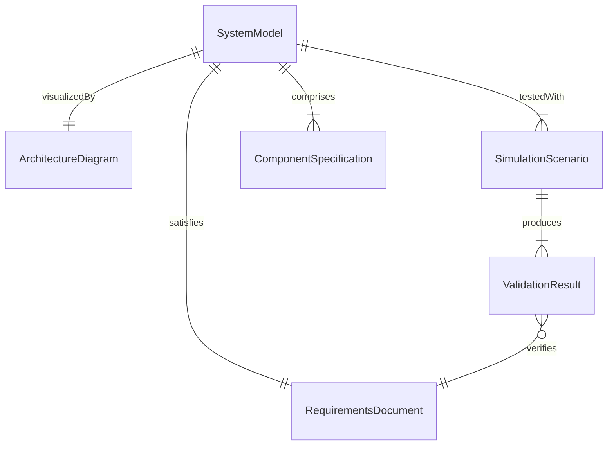
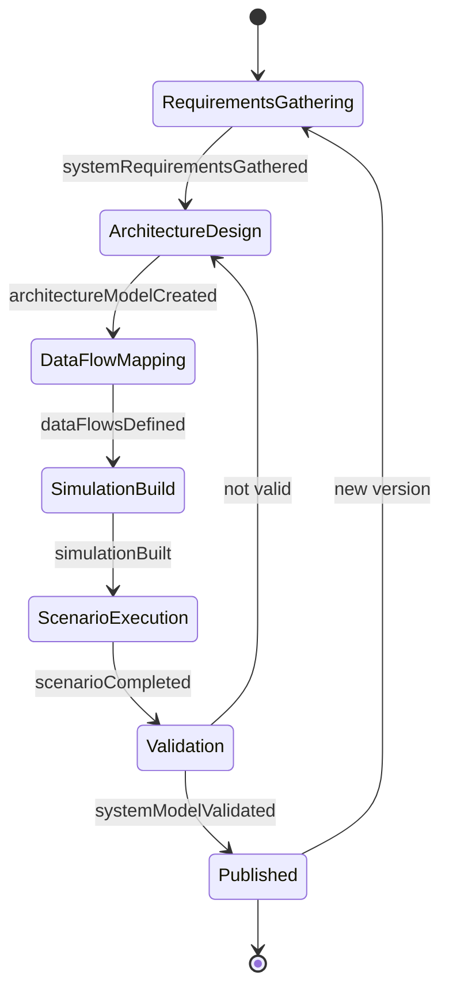
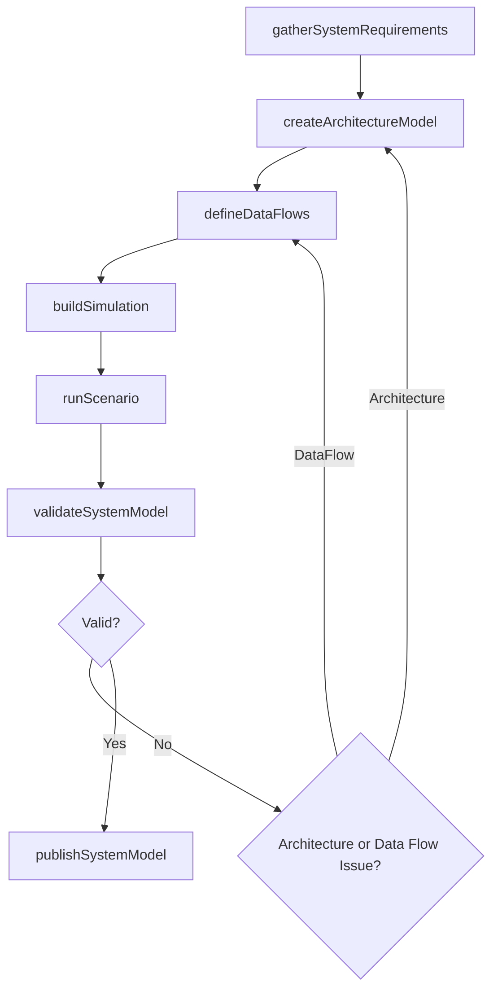
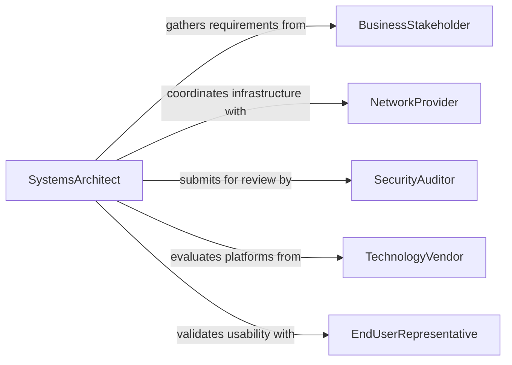

# Develop Models Information Communications Systems

> Business-as-Code definition for developing models of information or communications systems. Models the system design lifecycle from requirements analysis through architecture modeling, simulation, and validation.

## Overview

Developing models of information or communications systems involves analyzing requirements, creating architectural diagrams, building computational simulations, and validating system behavior against specifications. This definition exposes actions for each stage of the system modeling process, events for tracking design milestones, and searches for retrieving system models, architecture artifacts, and validation results.

## Actors

| Actor | Description |
|-------|-------------|
| BusinessStakeholder | Defines requirements and expected capabilities of the system |
| NetworkProvider | Supplies connectivity infrastructure and bandwidth specifications |
| SecurityAuditor | Reviews system models for compliance with security standards |
| TechnologyVendor | Provides platform, hardware, or software components |
| EndUserRepresentative | Provides input on usability and functional requirements |

## Roles

| Role | Description |
|------|-------------|
| SystemsArchitect | Designs the overall system architecture and component interactions |
| NetworkEngineer | Models communications pathways, protocols, and capacity |
| SolutionsModeler | Builds computational simulations and validates system behavior |
| RequirementsAnalyst | Captures and formalizes stakeholder requirements |

## Entities

| Entity | Description |
|--------|-------------|
| SystemModel | A representation of the information or communications system |
| ArchitectureDiagram | A visual depiction of components, interfaces, and data flows |
| RequirementsDocument | A formal specification of system capabilities and constraints |
| SimulationScenario | A defined set of conditions under which the model is tested |
| ValidationResult | An assessment of whether the model meets its requirements |
| ComponentSpecification | Technical details for an individual system component |

## Actions

| Action | Description |
|--------|-------------|
| gatherSystemRequirements | Capture functional and non-functional system requirements |
| createArchitectureModel | Design the system structure, components, and interfaces |
| defineDataFlows | Map information pathways between system components |
| buildSimulation | Construct a computational model for testing system behavior |
| runScenario | Execute the simulation under specified conditions |
| validateSystemModel | Compare model outputs against requirements and constraints |
| publishSystemModel | Release the validated model for downstream use |

## Events

| Event | Description |
|-------|-------------|
| systemRequirementsGathered | System requirements have been captured and documented |
| architectureModelCreated | The system architecture has been designed |
| dataFlowsDefined | Information pathways have been mapped |
| simulationBuilt | The computational model has been constructed |
| scenarioCompleted | A simulation scenario has finished executing |
| systemModelValidated | The model has been confirmed to meet requirements |
| systemModelPublished | The validated model has been released |

## Searches

| Search | Description |
|--------|-------------|
| findSystemModels | List system models by project, type, or status |
| getArchitectureDiagrams | Retrieve architecture artifacts by system or version |
| getSimulationResults | Find simulation outputs by scenario or date range |
| findComponentSpecs | Search component specifications by system or technology |

## Entity Relationships



## State Diagram



## Workflow



## Actor Relationships



## Usage

### Calling Actions

```typescript
import { developModelsInformationCommunicationsSystems } from '@headlessly/develop-models-information-communications-systems'

const systems = developModelsInformationCommunicationsSystems()

// Gather system requirements
const requirements = await systems.gatherSystemRequirements({
  project: 'Enterprise Messaging Platform',
  capabilities: ['real-time-messaging', 'file-sharing', 'video-conferencing'],
  constraints: { latency: '50ms', uptime: 0.9999 }
})

// Create architecture model
const architecture = await systems.createArchitectureModel({
  requirementsId: requirements.id,
  pattern: 'microservices',
  components: ['message-broker', 'media-server', 'api-gateway', 'identity-provider']
})

// Run simulation scenario
const result = await systems.runScenario({
  modelId: architecture.id,
  scenario: 'peak-load',
  concurrentUsers: 50000,
  messageThroughput: 100000
})
```

### Event-Driven Automation

```typescript
// Notify team when architecture model is created
systems.architectureModelCreated(async ({ modelId, project }) => {
  await notify({
    to: 'architecture-review-board',
    message: `New architecture model for ${project} ready for review`
  })
})

// Auto-publish when validation passes
systems.systemModelValidated(async ({ modelId, result }) => {
  if (result === 'passed') {
    await systems.publishSystemModel({ modelId })
  }
})
```
