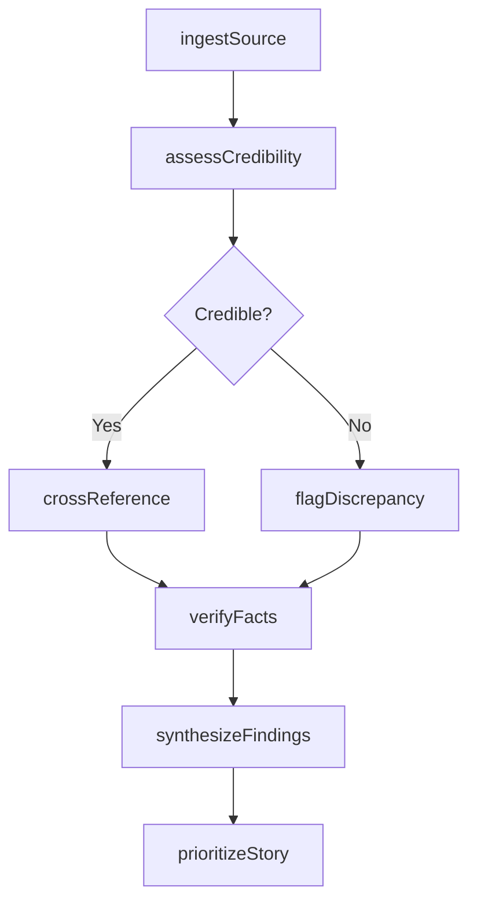
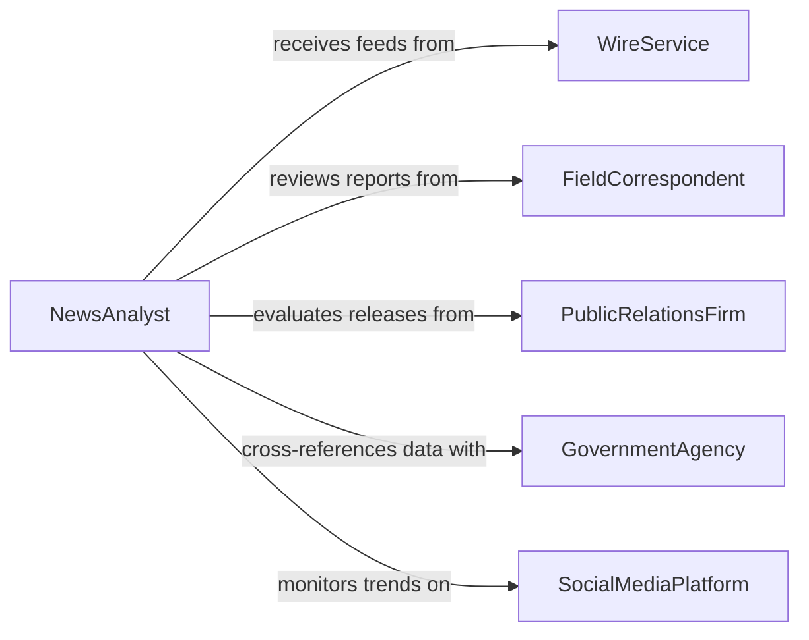

# Analyze Information Obtained News Sources

> Business-as-Code definition for analyzing information obtained from news sources. Models the complete news analysis lifecycle from source gathering through verification, synthesis, and editorial assessment.

## Overview

Analyzing information obtained from news sources involves evaluating raw material from wire services, field correspondents, press releases, social media, and public records to determine newsworthiness, accuracy, and relevance. This process includes cross-referencing multiple sources, assessing credibility, identifying bias, and distilling complex events into coherent narratives suitable for publication or broadcast.

## Actors

| Actor | Description |
|-------|-------------|
| WireService | Provides real-time news feeds and breaking story alerts |
| FieldCorrespondent | Supplies firsthand reports and interviews from event locations |
| PublicRelationsFirm | Issues press releases and official statements on behalf of organizations |
| GovernmentAgency | Publishes official data, reports, and regulatory filings |
| SocialMediaPlatform | Surfaces user-generated content and trending topics |

## Roles

| Role | Description |
|------|-------------|
| NewsAnalyst | Evaluates incoming information for accuracy and newsworthiness |
| EditorInChief | Makes final editorial decisions on story selection and framing |
| FactChecker | Verifies claims, statistics, and source credibility |
| AssignmentEditor | Prioritizes stories and assigns reporting resources |

## Entities

| Entity | Description |
|--------|-------------|
| NewsSource | An origin of information such as a wire service, correspondent, or document |
| StoryLead | A preliminary news tip or developing angle requiring investigation |
| FactCheckReport | A verification record documenting the accuracy of specific claims |
| AnalysisBrief | A summary document synthesizing findings from multiple sources |
| SourceCredibilityScore | A rating reflecting the historical reliability of a news source |

## Actions

| Action | Description |
|--------|-------------|
| ingestSource | Capture and catalog incoming information from a news source |
| assessCredibility | Evaluate the reliability and track record of a source |
| crossReference | Compare claims across multiple independent sources |
| verifyFacts | Confirm the accuracy of specific statements and data points |
| synthesizeFindings | Combine verified information into a coherent analysis brief |
| flagDiscrepancy | Mark conflicting information for editorial review |
| prioritizeStory | Rank a story lead based on newsworthiness and timeliness |

## Events

| Event | Description |
|-------|-------------|
| sourceIngested | New information from a news source has been captured |
| credibilityAssessed | A source reliability evaluation has been completed |
| factVerified | A specific claim has been confirmed or refuted |
| discrepancyFlagged | Conflicting information between sources has been identified |
| analysisSynthesized | A comprehensive analysis brief has been produced |
| storyPrioritized | A story lead has been ranked for editorial consideration |
| analysisBriefApproved | An analysis brief has been approved for publication use |

## Searches

| Search | Description |
|--------|-------------|
| findSources | Retrieve news sources by type, credibility score, or topic area |
| getStoryLeads | List story leads filtered by priority, status, or date range |
| getFactCheckReports | Retrieve verification reports by claim, source, or outcome |

## Workflow



## Actor Relationships



## Usage

### Calling Actions

```typescript
import { analyzeInformationObtainedNewsSources } from '@headlessly/analyze-information-obtained-news-sources'

const newsAnalysis = analyzeInformationObtainedNewsSources()

// Ingest a wire service report
const source = await newsAnalysis.ingestSource({
  type: 'wire-service',
  provider: 'Associated Press',
  headline: 'Federal Reserve Announces Rate Decision',
  content: 'The Federal Reserve held interest rates steady...',
  receivedAt: '2026-01-15T14:30:00Z'
})

// Cross-reference with government data
await newsAnalysis.crossReference({
  storyLeadId: source.storyLeadId,
  sources: ['federal-reserve-statement', 'treasury-data', 'bls-employment-report']
})

// Synthesize findings into a brief
const brief = await newsAnalysis.synthesizeFindings({
  storyLeadId: source.storyLeadId,
  format: 'editorial-brief'
})
```

### Event-Driven Automation

```typescript
// Alert editors when discrepancies are found
newsAnalysis.discrepancyFlagged(async ({ storyLeadId, sources, details }) => {
  await notify({
    to: 'assignment-desk',
    message: `Conflicting information detected on story ${storyLeadId}: ${details}`
  })
})

// Auto-prioritize stories when analysis is complete
newsAnalysis.analysisSynthesized(async ({ storyLeadId, brief }) => {
  await newsAnalysis.prioritizeStory({
    storyLeadId,
    newsworthiness: brief.impactScore,
    timeliness: brief.urgencyLevel
  })
})
```
