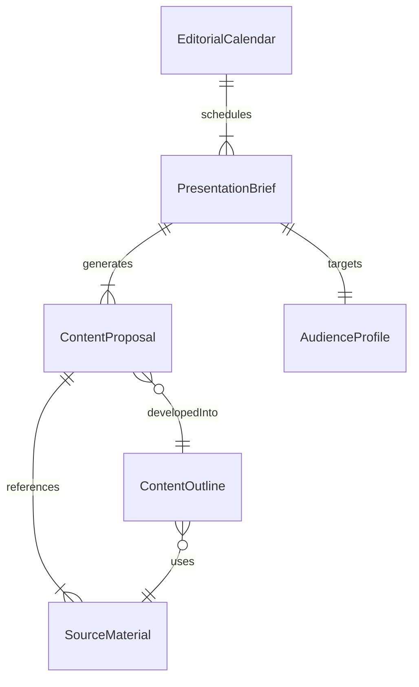
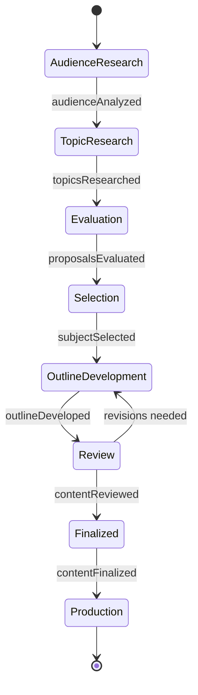
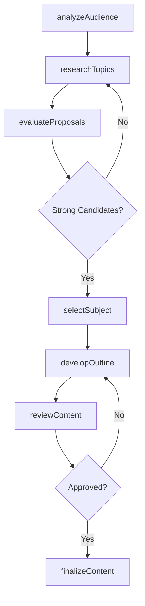
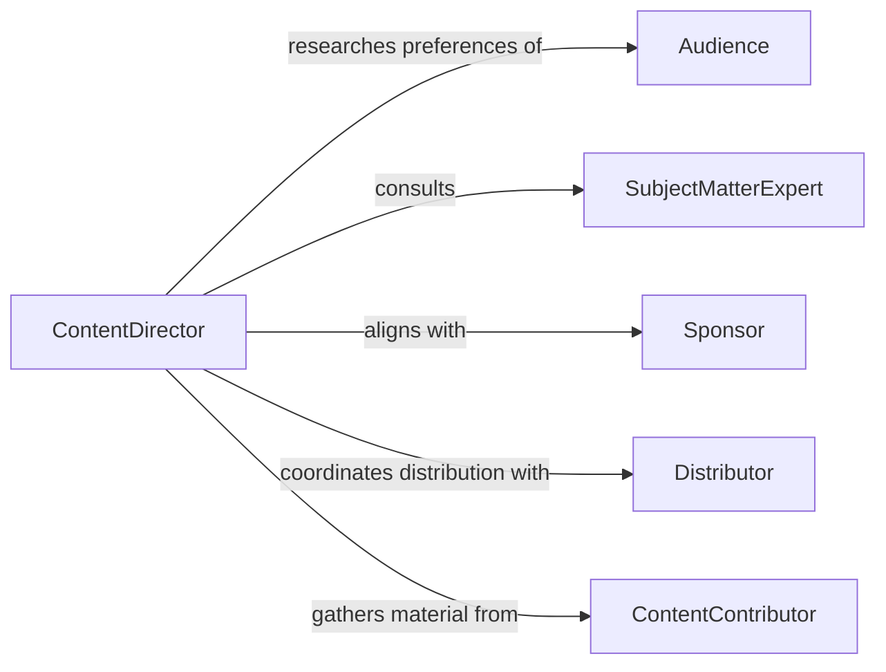

# Determine Presentation Subjects Content

> Business-as-Code definition for determining subjects and content for presentations, performances, exhibits, or media productions.

## Overview

Determining presentation subjects or content involves researching, evaluating, and selecting topics, themes, and material for public-facing communications including conferences, media broadcasts, exhibitions, and performances. Content creators assess audience demographics, current trends, organizational objectives, and available source material to shape compelling narratives. This process spans industries from journalism and entertainment to corporate communications and education.

## Actors

| Actor | Description |
|-------|-------------|
| Audience | The target viewers, listeners, or attendees who consume the content |
| SubjectMatterExpert | Provides domain knowledge and validates content accuracy |
| Sponsor | Funds the presentation and may influence content direction |
| Distributor | Channels through which the presentation reaches the audience |
| ContentContributor | Supplies source material, interviews, or creative assets |

## Roles

| Role | Description |
|------|-------------|
| ContentDirector | Makes final decisions on subjects and content selection |
| Researcher | Investigates topics, trends, and source material for content development |
| Editor | Refines and structures selected content for the target format |
| Producer | Manages the logistics and production of the presentation |

## Entities

| Entity | Description |
|--------|-------------|
| PresentationBrief | A document defining the subject, scope, and objectives of the presentation |
| ContentProposal | A pitched idea for a specific subject or theme |
| AudienceProfile | Demographic and psychographic data about the target audience |
| SourceMaterial | Research, data, interviews, or media assets informing content |
| ContentOutline | A structured plan of topics and segments for the presentation |
| EditorialCalendar | A schedule of upcoming presentation subjects and deadlines |

## Actions

| Action | Description |
|--------|-------------|
| analyzeAudience | Research target audience demographics, interests, and expectations |
| researchTopics | Investigate potential subjects using trends, data, and expert input |
| evaluateProposals | Assess content proposals against audience fit and organizational goals |
| selectSubject | Choose the final presentation subject or theme |
| developOutline | Create a structured content plan with key segments and talking points |
| reviewContent | Validate accuracy, relevance, and quality of selected content |
| finalizeContent | Approve the final presentation content for production |

## Events

| Event | Description |
|-------|-------------|
| audienceAnalyzed | Target audience research has been completed |
| topicsResearched | Potential subjects have been investigated and documented |
| proposalsEvaluated | Content proposals have been assessed against criteria |
| subjectSelected | The final presentation subject has been chosen |
| outlineDeveloped | The content structure and plan have been created |
| contentReviewed | Selected content has been validated for accuracy and quality |
| contentFinalized | The presentation content has been approved for production |

## Searches

| Search | Description |
|--------|-------------|
| findTrendingTopics | Retrieve current trending subjects relevant to the audience |
| getProposalsByStatus | List content proposals filtered by review stage |
| getEditorialCalendar | View scheduled presentation subjects and upcoming deadlines |
| findContentBySubject | Retrieve past presentations and source material for a topic |

## Entity Relationships



## State Diagram



## Workflow



## Actor Relationships



## Usage

### Calling Actions

```typescript
import { determinePresentationSubjectsContent } from '@headlessly/determine-presentation-subjects-content'

const content = determinePresentationSubjectsContent()

// Analyze audience for an upcoming conference keynote
const audience = await content.analyzeAudience({
  event: 'TechSummit 2026',
  demographics: { industry: 'technology', seniorityLevel: 'executive', size: 2500 },
  interests: ['artificialIntelligence', 'sustainability', 'workforceDevelopment']
})

// Research and evaluate topic proposals
const topics = await content.researchTopics({
  audienceProfileId: audience.id,
  sources: ['industryReports', 'socialTrends', 'competitorContent'],
  limit: 10
})

const selected = await content.selectSubject({
  proposals: topics.proposals,
  criteria: {
    audienceRelevance: 0.4,
    timeliness: 0.3,
    organizationalAlignment: 0.3
  }
})

// Develop content outline
await content.developOutline({
  subjectId: selected.id,
  format: 'keynote',
  duration: 45,
  segments: [
    { title: 'Industry Context', minutes: 10 },
    { title: 'Core Argument', minutes: 20 },
    { title: 'Case Studies', minutes: 10 },
    { title: 'Call to Action', minutes: 5 }
  ]
})
```

### Event-Driven Automation

```typescript
// Notify production team when content is finalized
content.contentFinalized(async ({ presentationId, subject, format }) => {
  await notify({
    to: 'production-team',
    message: `Content finalized for "${subject}" (${format}). Begin production planning.`
  })
})

// Auto-schedule review when outline is ready
content.outlineDeveloped(async ({ presentationId, outlineId }) => {
  await scheduleReview({
    reviewers: ['editor', 'subject-matter-expert'],
    outlineId,
    deadline: addDays(new Date(), 5)
  })
})
```
