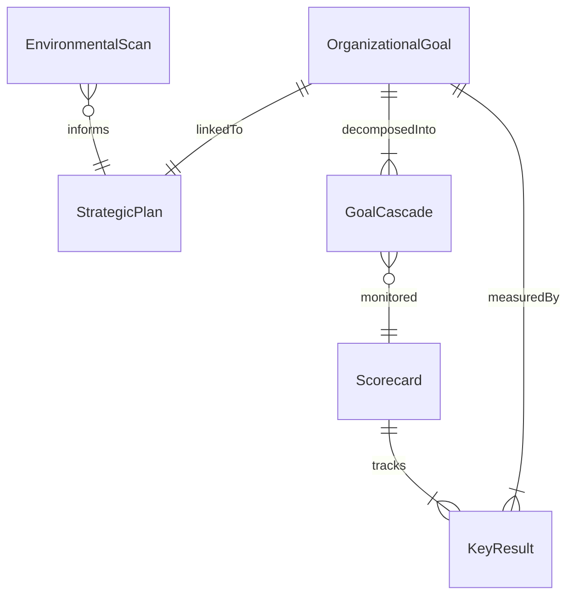
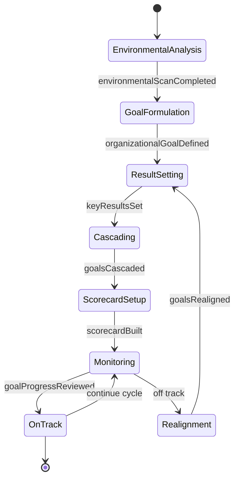
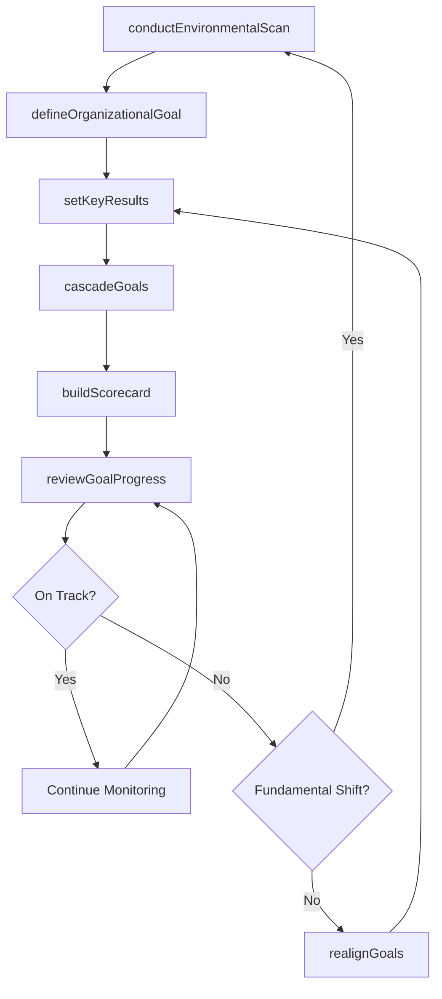
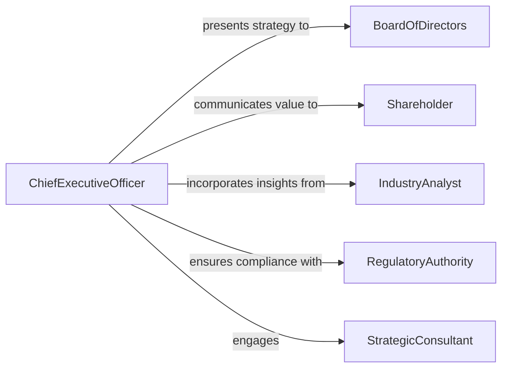

# Develop Organizational Goals Objectives

> Business-as-Code definition for developing organizational goals and objectives. Models the strategic planning lifecycle from environmental analysis through goal formulation, cascading, and performance tracking.

## Overview

Developing organizational goals and objectives involves conducting strategic assessments, defining mission-aligned objectives, cascading goals across business units, and establishing accountability frameworks. This definition exposes actions for each stage of the strategic goal-setting process, events for tracking alignment and progress, and searches for retrieving goals, scorecards, and strategic plans.

## Actors

| Actor | Description |
|-------|-------------|
| BoardOfDirectors | Sets organizational direction and approves strategic goals |
| Shareholder | Expects returns and influences long-term strategic priorities |
| IndustryAnalyst | Provides market intelligence that shapes organizational strategy |
| RegulatoryAuthority | Imposes compliance requirements that constrain or direct goals |
| StrategicConsultant | Advises on goal-setting frameworks and competitive positioning |

## Roles

| Role | Description |
|------|-------------|
| ChiefExecutiveOfficer | Drives vision and oversees strategic goal development |
| StrategyDirector | Facilitates the strategic planning process and goal cascading |
| BusinessUnitLeader | Translates organizational goals into unit-level objectives |
| PerformanceManager | Tracks goal achievement and reports on key results |

## Entities

| Entity | Description |
|--------|-------------|
| OrganizationalGoal | A high-level strategic objective aligned with the mission |
| StrategicPlan | A comprehensive document linking goals to initiatives and timelines |
| KeyResult | A measurable outcome that indicates goal achievement |
| Scorecard | A dashboard tracking performance against organizational goals |
| EnvironmentalScan | An analysis of external and internal factors informing strategy |
| GoalCascade | The hierarchical breakdown of goals from organization to team level |

## Actions

| Action | Description |
|--------|-------------|
| conductEnvironmentalScan | Analyze internal capabilities and external market conditions |
| defineOrganizationalGoal | Create a strategic goal aligned with mission and vision |
| setKeyResults | Establish measurable outcomes for each goal |
| cascadeGoals | Break organizational goals into business unit and team objectives |
| buildScorecard | Create a performance dashboard for tracking goal progress |
| reviewGoalProgress | Evaluate achievement against targets at defined intervals |
| realignGoals | Adjust goals in response to changing conditions or performance data |

## Events

| Event | Description |
|-------|-------------|
| environmentalScanCompleted | The strategic analysis has been finalized |
| organizationalGoalDefined | A new strategic goal has been created |
| keyResultsSet | Measurable outcomes have been established for a goal |
| goalsCascaded | Goals have been distributed to business units and teams |
| scorecardBuilt | A performance tracking dashboard has been created |
| goalProgressReviewed | A periodic review of goal achievement has been completed |
| goalsRealigned | Strategic goals have been adjusted based on new information |

## Searches

| Search | Description |
|--------|-------------|
| findOrganizationalGoals | List goals by status, business unit, or strategic priority |
| getScorecards | Retrieve scorecards by period, unit, or goal |
| getKeyResults | Find key results by goal, status, or owner |
| getEnvironmentalScans | Search past analyses by date or strategic theme |

## Entity Relationships



## State Diagram



## Workflow



## Actor Relationships



## Usage

### Calling Actions

```typescript
import { developOrganizationalGoalsObjectives } from '@headlessly/develop-organizational-goals-objectives'

const strategy = developOrganizationalGoalsObjectives()

// Conduct environmental scan
const scan = await strategy.conductEnvironmentalScan({
  scope: 'enterprise',
  frameworks: ['SWOT', 'PESTLE'],
  period: 'FY2026'
})

// Define an organizational goal
const goal = await strategy.defineOrganizationalGoal({
  scanId: scan.id,
  title: 'Achieve market leadership in APAC region',
  timeframe: { start: '2026-01-01', end: '2028-12-31' },
  priority: 'critical'
})

// Set key results
await strategy.setKeyResults({
  goalId: goal.id,
  keyResults: [
    { description: 'Grow APAC revenue to $50M', target: 50000000 },
    { description: 'Establish partnerships in 5 new markets', target: 5 },
    { description: 'Achieve 30% brand awareness', target: 0.30 }
  ]
})
```

### Event-Driven Automation

```typescript
// Notify leadership when goals are cascaded
strategy.goalsCascaded(async ({ goalId, units }) => {
  await notify({
    to: 'executive-team',
    message: `Goal ${goalId} cascaded to ${units.length} business units`
  })
})

// Trigger realignment review when progress is off track
strategy.goalProgressReviewed(async ({ goalId, status, variance }) => {
  if (status === 'behind' && variance > 0.15) {
    await scheduleReview({
      goalId,
      type: 'realignment',
      urgency: 'high'
    })
  }
})
```
